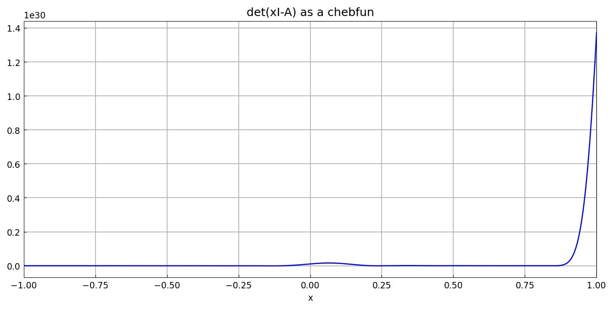
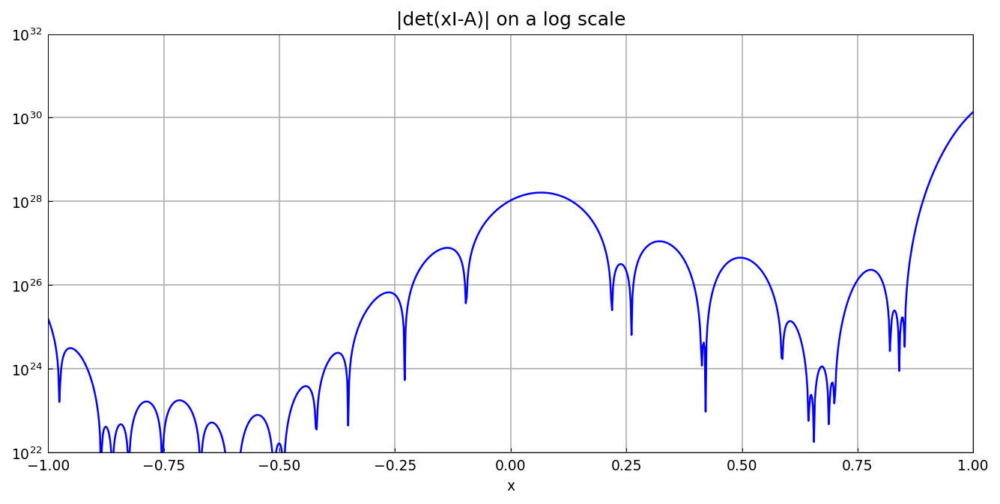
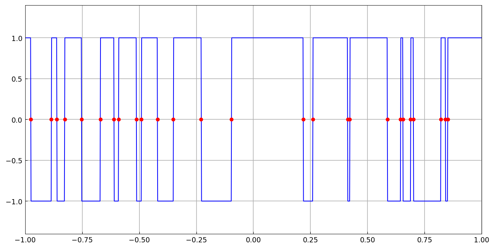

# Eigenvalues of a tridiagonal matrix via the determinant

*Nick Trefethen, December 2011*

[Original MATLAB Chebfun example](https://www.chebfun.org/examples/linalg/EigsViaDet.html)

(Chebfun example linalg/EigsViaDet.m)

Can you compute eigenvalues as roots of the characteristic
polynomial?  Usually a terrible idea — but for a tridiagonal matrix,
$\det(xI-A)$ can be evaluated stably by the three-term recurrence,
and the determinant becomes a chebfun whose roots are the
eigenvalues.  For a random tridiagonal $A$ with $N = 100$
(MATLAB's `rand` part of the matrix is bit-identical via the
`rng(2)` ≡ `RandomState(2)` mapping; the `randn` part is a different
draw, so the spectrum differs while all accuracy comparisons
replicate):



Comparing `roots(c)` against `eig`: the agreement is only ~10-11
digits, because the determinant varies over many orders of magnitude,



```text
   -0.975475360634168  -0.975475360633045  -0.000000000001123
   -0.885495231147706  -0.885495231117943  -0.000000000029763
   -0.861223207918618  -0.861223207893755  -0.000000000024863
```

Working on the smaller interval $[-1,0]$ improves the scaling and the
accuracy.  Best of all is to take the *sign* of the determinant and
find the jumps with Chebfun's edge detection — every eigenvalue then
comes out to machine precision:

```python
c2 = chebfun(lambda x: sign(fdet(x)), splitting=True,
             min_samples=100)
e = c2.roots()
```



```text
   -0.975475360634168  -0.975475360634168   0.000000000000000
   -0.885495231147706  -0.885495231147707   0.000000000000001
   -0.861223207918618  -0.861223207918619   0.000000000000001
```

The same three-tier accuracy pattern as the published MATLAB run
(~1e-11 global, ~1e-13 subinterval, ~1e-15 edge detection).

---

*Replicated with [chebfunjax](https://github.com/ma-gilles/chebfunjax); original
example copyright The University of Oxford and The Chebfun Developers.*
