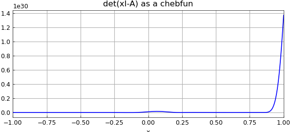
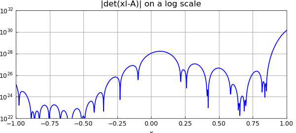
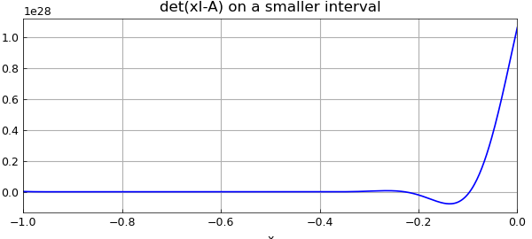
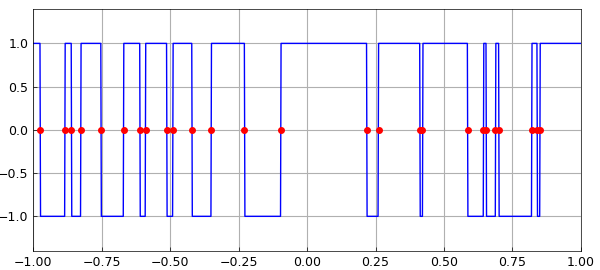

# Computing eigenvalues by sampling the determinant

*Jared Aurentz and Nick Trefethen, November 2014*

[Original MATLAB Chebfun example](https://www.chebfun.org/examples/linalg/EigsViaDet.html)

Python translation: [`examples/linalg/eigs_via_det.py`](https://github.com/ma-gilles/chebfunjax/blob/main/examples/linalg/eigs_via_det.py)

```matlab
function EigsViaDet()
```

The eigenvalues of a matrix $A$ are the roots of the determinant function, $f(x) = \det(xI-A)$. If $A$ is real symmetric and tridiagonal and of dimension $N$, then $f(x)$ can be computed in $O(N)$ operations by the method known as Sturm sequences, described in many texts such as on p. 229 of [2] or p. 423 of [3]. Let $d_k$ denote the determinant of the upper-left $k\times k$ block of $A$, and let the diagonal and superdiagonal entries of $A$ be $a_k$ and $b_k$, respectively. Then the key observation, easily derived, is that the determinants satisfy a 3-term recurrence relation,

$$ d_{n+1} = a_{n+1} d_n - b_n^2 d_{n-1} . $$

It is salutary to note that we can easily vectorize this recurrence, which means that Chebfun can use it very efficiently to construct chebfuns corresponding to $f(x)$ over a prescribed interval.

Here is our function for evaluating $f(x)$, which we will call `fdet`.

```matlab
     function fdet = fdet(x,a,b,N)
         dold = ones(size(x));
         d = x-a(1);
         for k = 1:N-1
             dnew = (x-a(k+1)).*d - b(k)^2.*dold;
             dold = d; d = dnew;
         end
         fdet = d;
     end
```

OK, let's try it. Here is a matrix whose eigenvalues lie roughly in the interval $[-5,5]$:

```matlab
tic
N = 100;
rng(2)
a = 10*rand(N,1)-5;
b = randn(N-1,1);
A = spdiags([[b;0] a [0;b]],-1:1,N,N);
```

Here, computed the usual way, are the "exact" eigenvalues in the interval $[-1,1]$:

```matlab
format long
e = eig(full(A)); e_exact = sort(e(abs(e)<=1))
```

```text
e_exact =
   -0.975475360634168
   -0.885495231147706
   -0.861223207918618
   -0.825839085079037
   -0.753305190961936
   -0.670382889281386
   -0.610641811256112
   -0.590070398461781
   -0.511902940951999
   -0.490913842231083
   -0.420350948023520
   -0.351174225985374
   -0.229107630970677
   -0.096240080383682
    0.218485905810282
    0.260987712464724
    0.412763962396419
    0.421471078986243
    0.586585770732767
    0.644195289357651
    0.655408912146807
    0.688124323925599
    0.700537592345160
    0.820332369347569
    0.840074633754089
    0.851482096110473
```

Here we make a chebfun of the determinant function:

```matlab
c = chebfun(@(x) fdet(x,a,b,N),[-1,1]);
plot(c), grid on
xlabel('x')
title('det(xI-A) as a chebfun')
```



Now we compute its roots and compare them with the true eigenvalues.

```matlab
e_inexact = roots(c);
disp('         exact              inexact            difference')
disp([e_exact e_inexact e_exact-e_inexact])
```

```text
         exact              inexact            difference
   -0.975475360634168  -0.975475360633045  -0.000000000001123
   -0.885495231147706  -0.885495231117943  -0.000000000029763
   -0.861223207918618  -0.861223207893755  -0.000000000024863
   -0.825839085079037  -0.825839084996616  -0.000000000082422
   -0.753305190961936  -0.753305191029997   0.000000000068061
   -0.670382889281386  -0.670382889172082  -0.000000000109304
   -0.610641811256112  -0.610641811277499   0.000000000021387
   -0.590070398461781  -0.590070398101064  -0.000000000360717
   -0.511902940951999  -0.511902941042714   0.000000000090715
   -0.490913842231083  -0.490913842097007  -0.000000000134077
   -0.420350948023520  -0.420350948025967   0.000000000002447
   -0.351174225985374  -0.351174225987277   0.000000000001902
   -0.229107630970677  -0.229107630970595  -0.000000000000082
   -0.096240080383682  -0.096240080383674  -0.000000000000007
    0.218485905810282   0.218485905810277   0.000000000000005
    0.260987712464724   0.260987712464783  -0.000000000000059
    0.412763962396419   0.412763962396048   0.000000000000371
    0.421471078986243   0.421471078986792  -0.000000000000549
    0.586585770732767   0.586585770732596   0.000000000000171
    0.644195289357651   0.644195289373080  -0.000000000015429
    0.655408912146807   0.655408912129324   0.000000000017483
    0.688124323925599   0.688124323918508   0.000000000007092
    0.700537592345160   0.700537592344708   0.000000000000451
    0.820332369347569   0.820332369347384   0.000000000000185
    0.840074633754089   0.840074633753958   0.000000000000131
    0.851482096110473   0.851482096110655  -0.000000000000182
```

Is this good agreement? Well things look pretty good, but for many of the eigenvalues we are losing up to five digits of accuracy, and in fact, this method faces difficulties and would quickly fail for larger values of $N$. A plot of the absolute value of `c` on a log scale gives an indication of what is going on.

```matlab
semilogy(abs(c)), ylim([1e22 1e32]), grid on
xlabel('x')
title('|det(xI-A)| on a log scale')
```



The first thing we note in this figure is that the scale of the data is a long way from $1$. This has something to do with the scaling of the problem to the interval $[-5,5]$, and could be alleviated to some extent by a rescaling. It could only be alleviated partially, however, for the more fundamental problem is the exponential variation of scales across the interval, a phenomenon associated with the subject of potential theory [1]. This is a mathematical fact about the determinant function. Wilkinson pointed out that in fact the determinant function can be computed with high relative accuracy, despite the bad scaling [3, p. 228], so the problem in our method is not its reliance on $det(xI-A)$. Rather, it is in making a chebfun representation of this function over a broad interval.

To confirm this, note how much better the accuracy becomes if we restrict attention to $[-1,0]$:

```matlab
e_exact = sort(e(e<0 & abs(e)<1));
c = chebfun(@(x) fdet(x,a,b,N),[-1,0]);
plot(c), grid on, ylim([-5e26 1e27])
xlabel('x')
title('det(xI-A) on a smaller interval')
e_inexact = roots(c);
disp('         exact              inexact            difference')
size(e_exact), size(e_inexact)
disp([e_exact e_inexact e_exact-e_inexact])
```

```text
         exact              inexact            difference
ans =
    14     1
ans =
    14     1
   -0.975475360634168  -0.975475360634165  -0.000000000000003
   -0.885495231147706  -0.885495231147798   0.000000000000092
   -0.861223207918618  -0.861223207918236  -0.000000000000381
   -0.825839085079037  -0.825839085079261   0.000000000000224
   -0.753305190961936  -0.753305190961631  -0.000000000000305
   -0.670382889281386  -0.670382889281648   0.000000000000263
   -0.610641811256112  -0.610641811254887  -0.000000000001225
   -0.590070398461781  -0.590070398461695  -0.000000000000087
   -0.511902940951999  -0.511902940951891  -0.000000000000108
   -0.490913842231083  -0.490913842230523  -0.000000000000560
   -0.420350948023520  -0.420350948023518  -0.000000000000002
   -0.351174225985374  -0.351174225985389   0.000000000000015
   -0.229107630970677  -0.229107630970674  -0.000000000000003
   -0.096240080383682  -0.096240080383681  -0.000000000000000
```



Another amusing approach is to use Chebfun's edge detector to count eigenvalues! The accuracy is magnificent, showing that Chebfun's edge detector is not thrown off by bad scaling.

```matlab
c2 = chebfun(@(x) sign(fdet(x,a,b,N)),[-1,1],'splitting','on','minSamples',100);
plot(c2,'jumpline','-'), grid on, ylim([-1.4 1.4]);
e_edgedetect = roots(c2);
hold on, plot(e_edgedetect,0*e_edgedetect,'.r'), hold off
disp('         exact        via edge detection      difference')
e_exact = sort(e(abs(e)<=1));
size(e_exact), size(e_edgedetect)
disp([e_exact e_edgedetect e_exact-e_edgedetect])
```

```text
         exact        via edge detection      difference
ans =
    26     1
ans =
    26     1
   -0.975475360634168  -0.975475360610289  -0.000000000023879
   -0.885495231147706  -0.885495231137611  -0.000000000010095
   -0.861223207918618  -0.861223207903095  -0.000000000015523
   -0.825839085079037  -0.825839085067855  -0.000000000011182
   -0.753305190961936  -0.753305190941319  -0.000000000020617
   -0.670382889281386  -0.670382889220491  -0.000000000060895
   -0.610641811256112  -0.610641811217647  -0.000000000038465
   -0.590070398461781  -0.590070398451644  -0.000000000010137
   -0.511902940951999  -0.511902940925211  -0.000000000026789
   -0.490913842231083  -0.490913842222653  -0.000000000008430
   -0.420350948023520  -0.420350947999395  -0.000000000024124
   -0.351174225985374  -0.351174225972500  -0.000000000012875
   -0.229107630970677  -0.229107630904764  -0.000000000065914
   -0.096240080383682  -0.096240080310963  -0.000000000072719
    0.218485905810282   0.218485905810282  -0.000000000000000
    0.260987712464724   0.260987712464724   0.000000000000000
    0.412763962396419   0.412763962396418   0.000000000000000
    0.421471078986243   0.421471078986240   0.000000000000003
    0.586585770732767   0.586585770732768  -0.000000000000001
    0.644195289357651   0.644195289357653  -0.000000000000002
    0.655408912146807   0.655408912146806   0.000000000000000
    0.688124323925599   0.688124323925597   0.000000000000002
    0.700537592345160   0.700537592345160  -0.000000000000000
    0.820332369347569   0.820332369347569   0.000000000000000
    0.840074633754089   0.840074633754090  -0.000000000000001
    0.851482096110473   0.851482096110474  -0.000000000000000
Elapsed time is 174.786177 seconds.
```



Here is the total time for this Example:

```matlab
toc
```

```text

```

```matlab
end
```

## References

1. L. N. Trefethen, *Approximation Theory and Approximation Practice*, SIAM, 2013.
2. L. N. Trefethen and D. Bau, III, *Numerical Linear Algebra*, SIAM, 1997.
3. J. H. Wilkinson, *The Algebraic Eigenvalue Problem*, Clarendon Press, 1965.

---

*Translated with [chebfunjax](https://github.com/ma-gilles/chebfunjax); prose and MATLAB code from the original example, copyright The University of Oxford and The Chebfun Developers.  Printed outputs and figures are chebfunjax's.*
