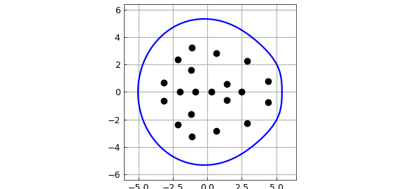
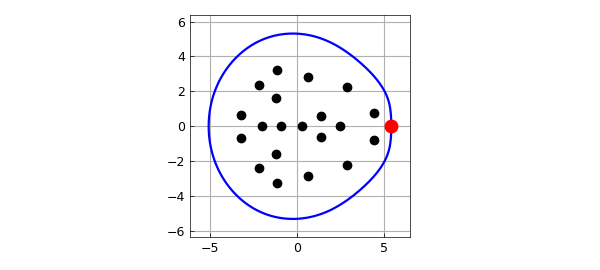
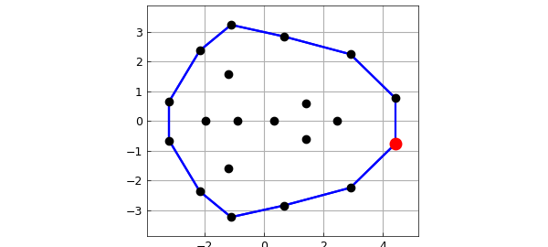
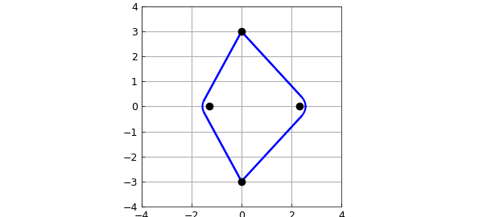

# Field of values and numerical abscissa

*Nick Trefethen, November 2010*

[Original MATLAB Chebfun example](https://www.chebfun.org/examples/linalg/FieldOfValues.html)

Python translation: [`examples/linalg/field_of_values.py`](https://github.com/ma-gilles/chebfunjax/blob/main/examples/linalg/field_of_values.py)

If A is a matrix, the field of values F(A) is the nonempty bounded convex set in the complex plane consisting of all the Rayleigh quotients of A, that is, all the numbers q'Aq, where q is a unit vector and q' is its conjugate transpose.

The standard method for computing the field of values numerically is an algorithm due to C. R. Johnson in 1978 based on finding the maximum and minimum eigenvalues of (A+A')/2, then "rotating" this computation around in the complex plane [1]. This algorithm is implemented in the Chebfun command FOV, which is listed at the end of this Example.

Generically the boundary of the field of values is smooth, but it is not always smooth. Chebfun's 'splitting' feature enables FOV to compute this boundary in either situation, smooth or not.

For example, here are the eigenvalues and field of values of a random matrix of dimension 20. This is a case where the boundary is smooth.

```matlab
rng(1), A = randn(20);
LW = 'linewidth'; lw = 1.6; MS = 'markersize'; ms = 18;
FA = fov(A);
figure, plot(FA,LW,lw), axis equal, grid on
ax = axis; axis(1.1*ax)
hold on, plot(eig(A),'.k',MS,ms)
```



The numerical abscissa of A is the maximum real part of its field of values:

```matlab
[alpha,maxtheta] = max(real(FA))
```

```text
alpha =
   5.423505100596419
maxtheta =
     0
```

Here we add it to the plot as a red dot:

```matlab
plot(real(FA(maxtheta)),imag(FA(maxtheta)),'.r',MS,24)
```



You can also find the numerical abscissa without Chebfun:

```matlab
alpha = max(eig((A+A')/2))
```

```text
alpha =
   5.423505100596421
```

Now let's consider a matrix B defined as a diagonal matrix with the same eigenvalues as A. In this case the boundary of the field of values is a polygon:

```matlab
B = diag(eig(A));
FB = fov(B);
hold off, plot(real(FB),imag(FB),'b',LW,lw,'jumpline',{'b',LW,lw})
hold on, plot(eig(B),'.k',MS,ms), axis(1.1*ax), axis equal, grid on
[alpha,maxtheta] = max(real(FB));
plot(real(FB(maxtheta)),imag(FB(maxtheta)),'.r',MS,24)
```



Since the field of values is not smooth, its boundary is a chebfun with several pieces:

```matlab
FB
```

```text
FB =
   chebfun column (12 smooth pieces)
       interval       length     endpoint values
[       0,     0.8]        1     complex values
[     0.8,     1.3]        1     complex values
[     1.3,     1.4]        1     complex values
[     1.4,     2.3]        1     complex values
[     2.3,     2.6]        1     complex values
[     2.6,     3.1]        1     complex values
[     3.1,     3.7]        1     complex values
[     3.7,       4]        1     complex values
[       4,     4.9]        1     complex values
[     4.9,       5]        1     complex values
[       5,     5.5]        1     complex values
[     5.5,     6.3]        1     complex values
vertical scale = 4.5    Total length = 12
```

Finally, here's an example where the boundary of the field of values mixes smooth curves with straight segments:

```matlab
C = [0 3 0 0; -3 0 0 0; 0 0 0 3; 0 0 1 1]
FC = fov(C);
hold off, plot(real(FC),imag(FC),'b',LW,lw,'jumpline',{'b',LW,lw})
axis(4*[-1 1 -1 1]), axis square, grid on
hold on, plot(eig(C),'.k',MS,ms)
```

```text
C =
       0     3     0     0
      -3     0     0     0
       0     0     0     3
       0     0     1     1
```



Here is a listing of FOV. Note that the numerical computations are carried out in just about 10 lines of code.

```matlab
type fov
```

```text

```

## References

1. C. R. Johnson, Numerical determination of the field of values of a general complex matrix, *SIAM Journal on Numerical Analysis*, 15 (1978), 595-602.
2. L. N. Trefethen and M. Embree, *Spectra and Pseudospectra: The Behavior of Nonnormal Matrices and Operators*, Princeton U. Press, 2005, chapter 17 on Numerical range, abscissa, and radius.

---

*Translated with [chebfunjax](https://github.com/ma-gilles/chebfunjax); prose and MATLAB code from the original example, copyright The University of Oxford and The Chebfun Developers.  Printed outputs and figures are chebfunjax's.*
