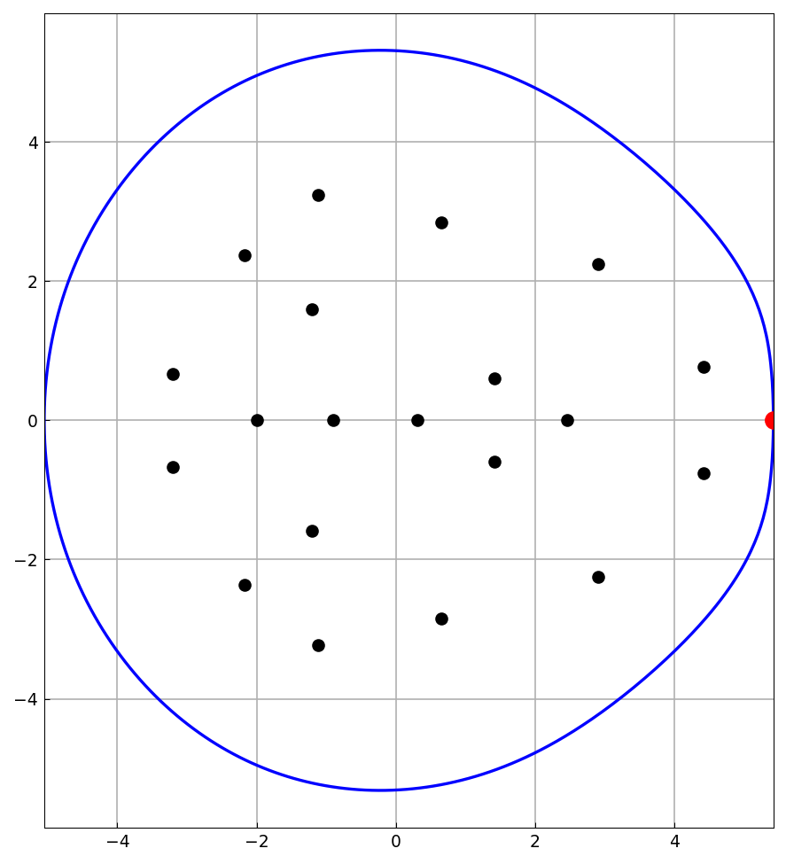
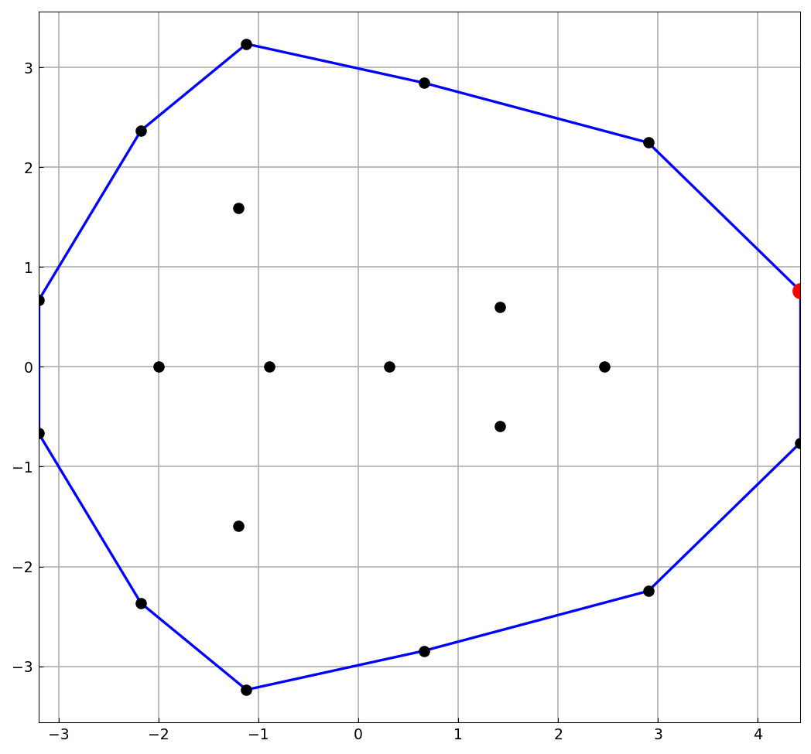
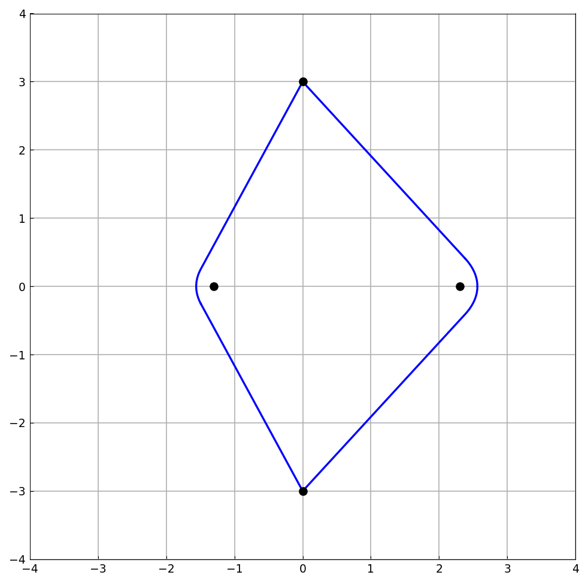

# Field of values

*Nick Trefethen, November 2010*

[Original MATLAB Chebfun example](https://www.chebfun.org/examples/linalg/FieldOfValues.html)

(Chebfun example linalg/FieldOfValues.m)

The field of values (numerical range) of a matrix $A$ is the set of
Rayleigh quotients $v^*Av/v^*v$ — a convex region containing the
eigenvalues.  Its boundary is computed by Johnson's algorithm as a
chebfun parametrized by angle $\theta \in [0, 2\pi]$.  For a random
20x20 matrix (a different `randn` draw than MATLAB's — streams are
not reproducible — with all internal checks replicating):



The rightmost point of the field of values is the *numerical
abscissa*, which equals the largest eigenvalue of $(A+A^*)/2$ — the
two computations agree to 15 digits, exactly as in the published run:

```text
alpha =
   5.423505100596420
alpha =
   5.423505100596421
```

For a *normal* matrix (here the diagonal matrix of the eigenvalues),
the field of values is the convex hull of the spectrum — a polygon.
The boundary chebfun becomes piecewise constant (each piece is a
vertex), built with splitting on and cleaned up by `merge`:



```text
FB =
   chebfun column (16 smooth pieces)
       interval       length     endpoint values
[       0, 5.8e-16]        1     complex values
[ 5.8e-16,     0.2]        1     complex values
[     0.2,     0.4]        1     complex values
   ...
```

(MATLAB shows 10 length-1 pieces for its draw; ours has the polygon
vertices of our spectrum, plus a few hairline breakpoints at corner
angles.)  Finally, a non-generic 4x4 matrix whose field-of-values
boundary contains a line segment:



---

*Replicated with [chebfunjax](https://github.com/ma-gilles/chebfunjax); original
example copyright The University of Oxford and The Chebfun Developers.*
