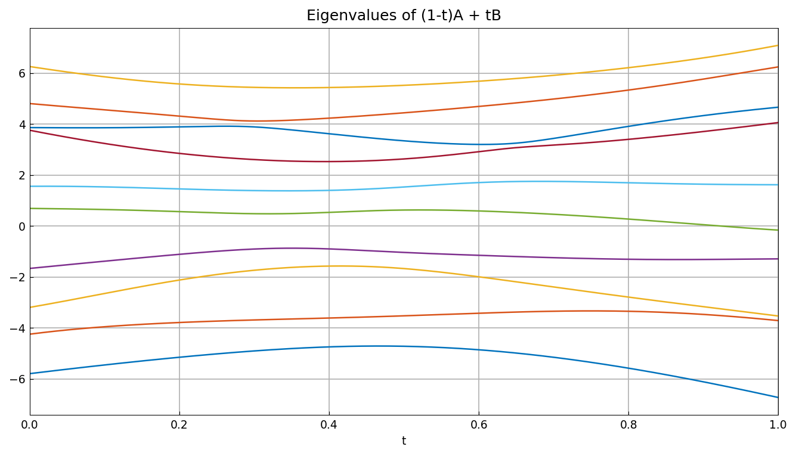
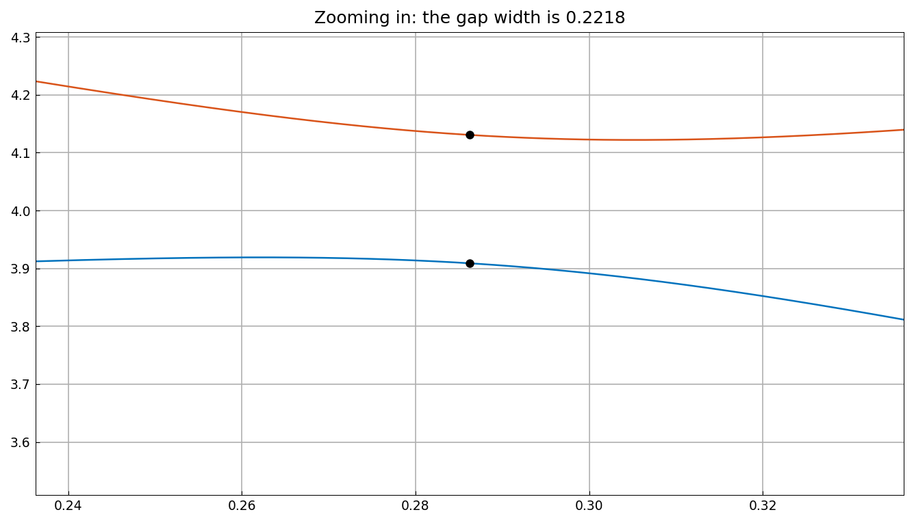

# Eigenvalue level repulsion

*Nick Trefethen, October 2010*

[Original MATLAB Chebfun example](https://www.chebfun.org/examples/linalg/LevelRepulsion.html)

(Chebfun example linalg/LevelRepulsion.m)

If $A$ and $B$ are real symmetric matrices, the eigenvalues of the
one-parameter family $(1-t)A + tB$ generically never cross as $t$
varies: they exhibit *level repulsion*, a phenomenon well known to
physicists.  We build a chebfun for each sorted eigenvalue of a
random symmetric pencil ($n = 10$):

```python
E_k = chebfun(lambda t: eigk((1-t)*A + t*B, k), domain=(0, 1))
```



The curves approach each other closely but never touch.  Zooming in
on the closest interior approach and computing the gap with a chebfun
minimization:

```text
minval =
   0.221800681942174
minpos =
   0.286233786129775
```



(MATLAB seeds `rng(1)`; `randn` streams are not reproducible across
systems, so the random matrices — and hence the particular gap — are
a different draw; the repulsion phenomenon is what replicates.)

---

*Replicated with [chebfunjax](https://github.com/ma-gilles/chebfunjax); original
example copyright The University of Oxford and The Chebfun Developers.*
