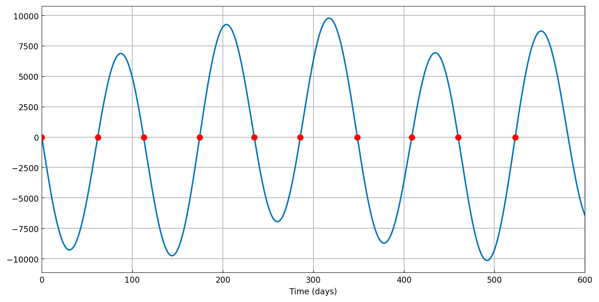
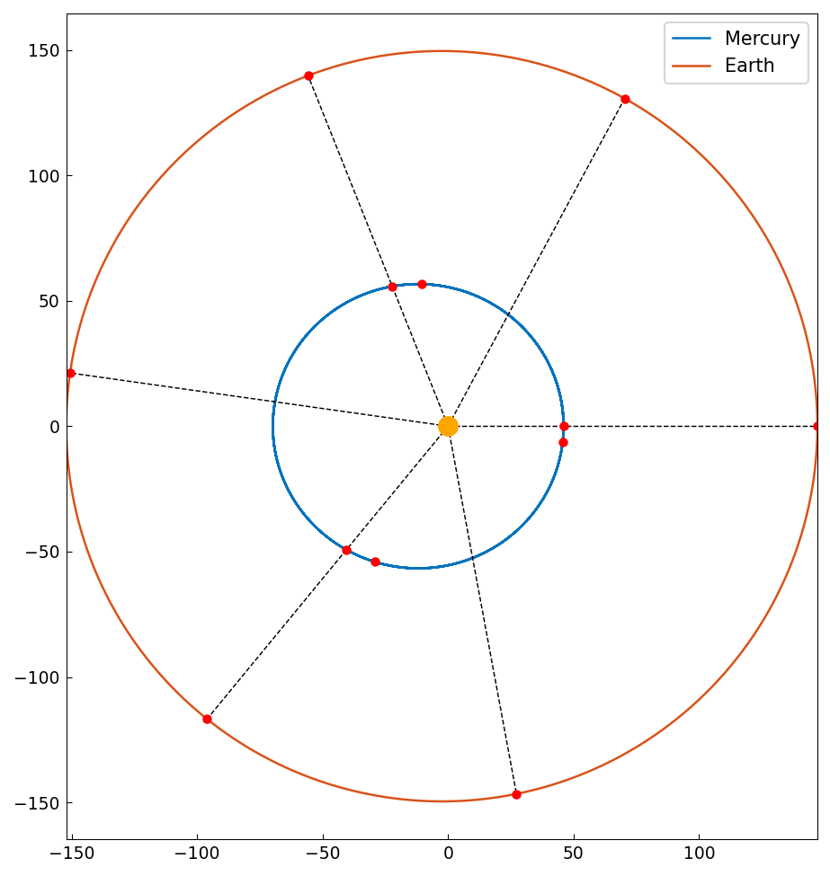

# Mercury-Earth conjunctions via determinants

*Nikhil Chaudhary, June 2014*

[Original MATLAB Chebfun example](https://www.chebfun.org/examples/linalg/MercuryEarthConjunctions.html)

(Chebfun example linalg/MercuryEarthConjunctions.m)

A conjunction occurs when Mercury, Earth and the Sun are collinear —
that is, when the determinant of the 2x2 matrix whose rows are the
two heliocentric position vectors vanishes.  With elliptical-orbit
approximations for both planets, the determinant becomes a chebfun of
time and its roots are the conjunction times:

```python
f = chebfun(lambda t: det(M(t)), domain=(0, 600))
z = f.roots()
```



```text
first conjunction times (days):
   0.000000
   61.749083
   112.475730
   174.347590
   234.681810
   285.568125
   348.553584
   408.632295
   459.986275
   523.013648
```

The alternation of inferior and superior conjunctions is visible in
the sight-line diagram:



---

*Replicated with [chebfunjax](https://github.com/ma-gilles/chebfunjax); original
example copyright The University of Oxford and The Chebfun Developers.*
