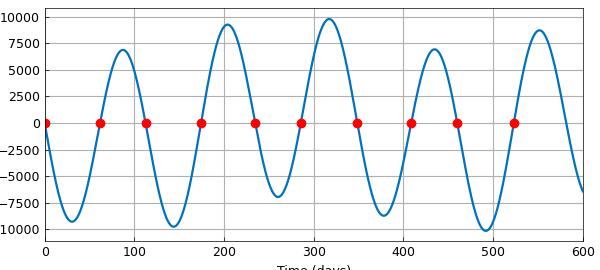

# Mercury-Earth conjunctions

*Tonatiuh Sanchez-Vizuet and Matthew Moye, June 2012*

[Original MATLAB Chebfun example](https://www.chebfun.org/examples/linalg/MercuryEarthConjunctions.html)

Python translation: [`examples/linalg/mercury_earth_conjunctions.py`](https://github.com/ma-gilles/chebfunjax/blob/main/examples/linalg/mercury_earth_conjunctions.py)

In an example in [1] the positions of Earth and Mercury are given, relative to the sun at one foci of their elliptical orbits at $(0,0)$, by the parametric equations

$$ x_M(t) = -11.9084+57.9117\cos(2\pi t/87.97), $$

$$ y_M(t) = 56.6741\sin(2\pi t/87.97), $$

$$ x_E(t) = -2.4987+149.6041\cos(2\pi t/365.25), $$

$$ y_E(t) = 149.5832\sin(2\pi t/365.25). $$

Conjunctions occur when Mercury is in a straight line configuration with the Earth and the Sun. A solution for the times of conjunctions can then be determined by the zeros of the cross product of the planets' position vectors on a time interval.

```matlab
M = @(t) [-11.9084 + 57.9117 * cos(2*pi*t/87.97),...
           56.6741 * sin(2*pi*t/87.97);
          -2.4987 + 149.6041 * cos(2*pi*t/365.25),...
           149.5832 * sin(2*pi*t/365.25)];

f = chebfun(@(t) det(M(t)),[0 600],'vectorize');
```

The roots of the determinant give the days at which a conjunction occurs.

```matlab
z = roots(f);
```

To get a visual interpretation of the roots, one can plot the determinant and then plot *zeros* all at value $0$. The following figure depicts the times of the first ten conjunctions.

```matlab
figure
plot(f,'linewidth',1.6), hold on, grid on
plot(z(1:10),0,'.r','markersize',20)
xlabel('Time (days)')
```



## References

1. Charles F. Van Loan, *Introduction to Scientific Computing*, Prentice-Hall, 1997, p. 274.

---

*Translated with [chebfunjax](https://github.com/ma-gilles/chebfunjax); prose and MATLAB code from the original example, copyright The University of Oxford and The Chebfun Developers.  Printed outputs and figures are chebfunjax's.*
