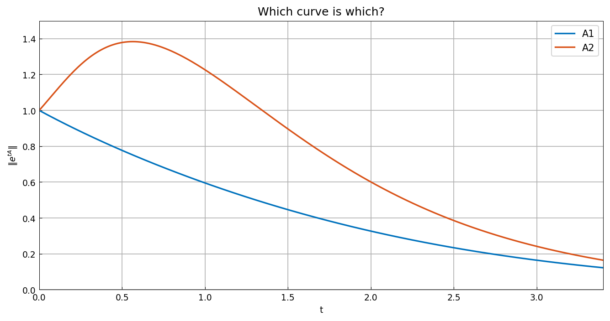

# A quiz about nonnormal matrices

*Nick Trefethen, March 2015*

[Original MATLAB Chebfun example](https://www.chebfun.org/examples/linalg/NonnormalQuiz.html)

(Chebfun example linalg/NonnormalQuiz.m)

Here are two stable upper-triangular matrices:

```text
A1 =
    -1     1
     0    -1
A2 =
    -1     5
     0    -2
```

$A_2$ has the entry 5 where $A_1$ has a 1 — surely it is the more
dangerous of the two?  Build chebfuns of $\|e^{tA}\|$ and see:



```text
maxnorm1 =
     1
maxt1 =
     0
maxnorm2 =
   1.383621941609019
maxt2 =
   0.564256565401324
```

(Digit-for-digit with MATLAB.)  Indeed $A_2$ shows transient growth
up to 1.38 — but $A_1$, whose norm curve *never* exceeds 1, is
actually the more delicate case: it is a Jordan block, defective, and
its resolvent behaves worse near the eigenvalue.  Norm curves alone
don't tell the whole nonnormality story.

---

*Replicated with [chebfunjax](https://github.com/ma-gilles/chebfunjax); original
example copyright The University of Oxford and The Chebfun Developers.*
