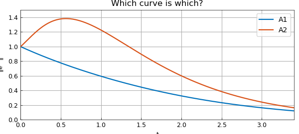

# Nonnormality quiz from Trefethen and Embree

*Nick Trefethen, October 2010*

[Original MATLAB Chebfun example](https://www.chebfun.org/examples/linalg/NonnormalQuiz.html)

Python translation: [`examples/linalg/nonnormal_quiz.py`](https://github.com/ma-gilles/chebfunjax/blob/main/examples/linalg/nonnormal_quiz.py)

The frontispiece of the book *Spectra and Pseudospectra* presents a quiz involving two matrices:

```matlab
format compact, format long
A1 = [-1 1; 0 -1],  A2 = [-1 5; 0 -2]
```

```text
A1 =
      -1     1
       0    -1
A2 =
      -1     5
       0    -2
```

The quiz is about the behavior of solutions to the differential equation $u' = Au$, where $A$ is one of these matrices. The solution of this equation is $u(t) = e^{tA}u(0)$, where $e^{tA}$ is the exponential of the matrix $tA$, computed in MATLAB by the command `expm`. The maximum possible value of the quotient $|u(t)|/|u(0)|$ is equal to the matrix norm of `expm(tA)`.

We first present the plot, then explain what it means and how we computed it with Chebfun.

```matlab
e1 = chebfun(@(t) norm(expm(t*A1)),[0 3.4]);
e2 = chebfun(@(t) norm(expm(t*A2)),[0 3.4]);
plot([e1 e2])
ylim([0 1.5]), grid on, legend('A1','A2')
xlabel('t')
ylabel('||e^{tA}||')
title('Which curve is which?')
```



The plot shows two curves, one with a hump and one without. The book asks, "Which curve is which?", and doesn't reveal the answer, but here you can see that `A2` is the matrix with the hump. This is surprising to some people, for one might expect the hump to correspond to `A1` since it is nondiagonalizable. In fact, the nondiagonalizability of `A1` is less important than the large entry $5$ in the upper-right corner of `A2`.

This is a natural problem for Chebfun because Chebfun is good at working with functions that don't have representations by explicit formulas. Here the function we are concerned with is `norm(expm(tA))`, a function of time `t`. Chebfun is happy to sample that function at various values of `t` and construct a corresponding chebfun.

Once we have the chebfuns, we can do things with them. For example, here are the maximum values of the two curves and the locations where they occur:

```matlab
[maxnorm1, maxt1] = max(e1)
[maxnorm2, maxt2] = max(e2)
```

```text
maxnorm1 =
     1
maxt1 =
     0
maxnorm2 =
   1.383621941609019
maxt2 =
   0.564256565401324
```

## References

1. L. N. Trefethen and M. Embree, *Spectra and Pseudospectra: The Behavior of Nonnormal Matrices and Operators*, Princeton U. Press, 2005.

---

*Translated with [chebfunjax](https://github.com/ma-gilles/chebfunjax); prose and MATLAB code from the original example, copyright The University of Oxford and The Chebfun Developers.  Printed outputs and figures are chebfunjax's.*
