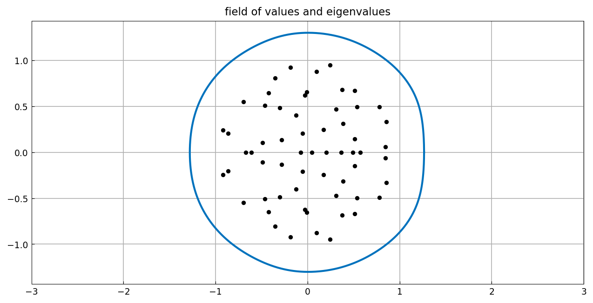
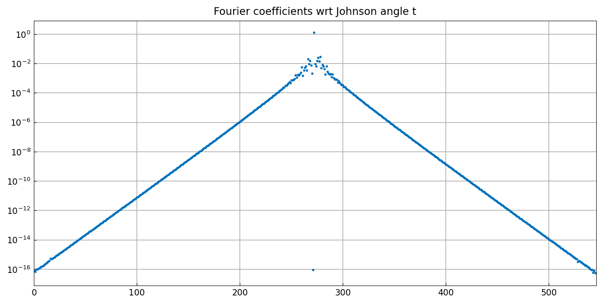
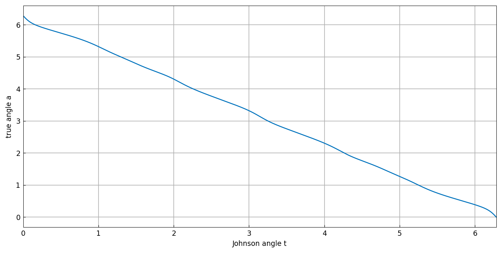
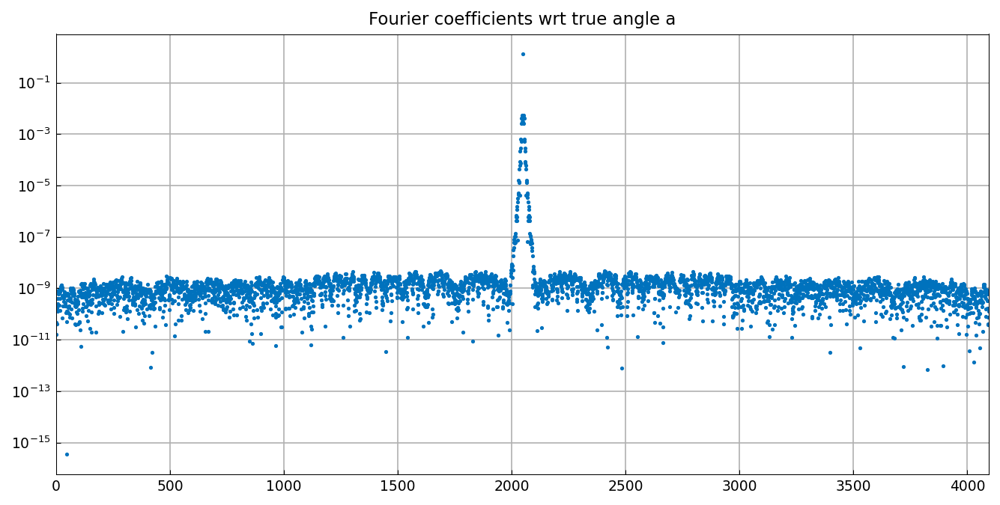
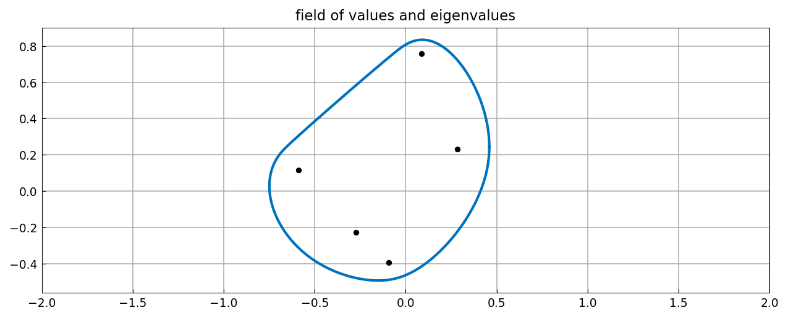
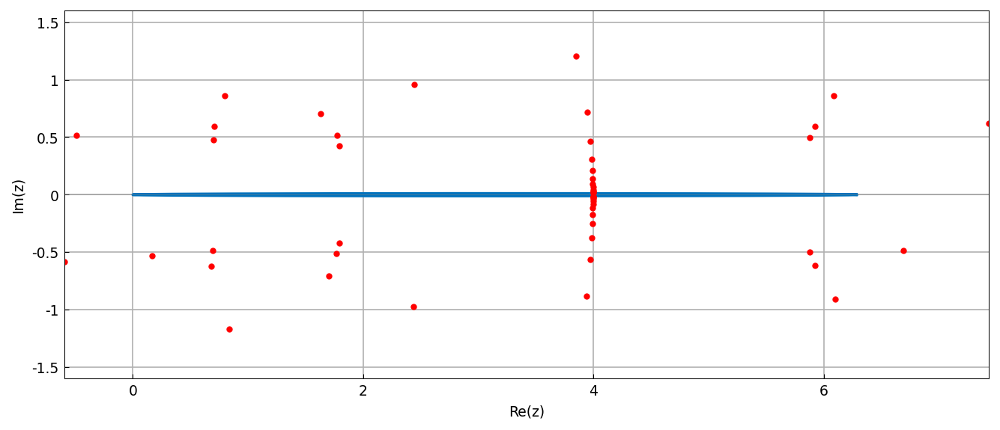

# Nonsmoothness of the field of values boundary

*Nick Trefethen, March 2019*

[Original MATLAB Chebfun example](https://www.chebfun.org/examples/linalg/NonsmoothFOV.html)

(Chebfun example linalg/NonsmoothFOV.m)

How smooth is the boundary of the field of values?  For a random
60x60 matrix (our own `randn` draw), the boundary chebfun with
respect to the Johnson angle needs several hundred points:



```text
ans =
   492
ans =
   547
```

(MATLAB's draw: 803 Chebyshev / 563 Fourier — same scale.)  The
coefficient decay and the Chebfun-ellipse plot with AAA poles reveal
a narrow strip of analyticity around the parameter interval:



The derivative of $|c(t)|$ shows rapid but smooth variation.  The
mapping from Johnson angle to *true* boundary angle is monotone:



Reparametrizing by the true angle (sampling at equispaced true
angles, the analogue of MATLAB's `c(inv(a))` composition) gives a
smoother curve, visible in its faster Fourier coefficient decay:



The second half of the example repeats the analysis for a 5x5 complex
matrix of Caldwell, Greenbaum and Li whose field of values is much
less smooth — the boundary needs thousands of points (ours 5585/3661
vs MATLAB's 5704/3781), and the derivative of $|c|$ reveals
near-corners:





---

*Replicated with [chebfunjax](https://github.com/ma-gilles/chebfunjax); original
example copyright The University of Oxford and The Chebfun Developers.*
