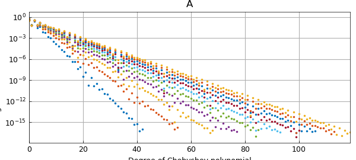
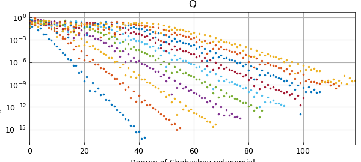

# Backward stability of quasimatrix QR factorization

*Nick Hale and Nick Trefethen, March 2022*

[Original MATLAB Chebfun example](https://www.chebfun.org/examples/linalg/QuasiQR.html)

Python translation: [`examples/linalg/quasi_qr.py`](https://github.com/ma-gilles/chebfunjax/blob/main/examples/linalg/quasi_qr.py)

Wilkinson invented backward error analysis to explain the behavior of matrix algorithms. Here is a nice example of how his ideas apply also to the continuous analogue, namely quasimatrix algorithms.

We start from a quasimatrix whose columns are Runge functions with varying scale parameters. A call to `plotcoeffs` shows that that each column is resolved by an exponentially decreasing Chebyshev series.

```matlab
x = chebfun('x');
A = 1/(1 + (1:10).*(x-.1)^2);
plotcoeffs(A), title A
```



This quasimatrix is highly ill-conditioned, as we can see by computing its condition number:

```matlab
cond(A)
```

```text
ans =
     8.080635919919465e+09
```

What's interesting now is to compute the quasimatrix QR factorization of $A$ and to look at the Chebyshev coefficients of the columns of $Q$:

```matlab
[Q,R] = qr(A);
plotcoeffs(Q), title Q
```



Rounding errors are affecting these results fundamentally. The first column of $Q$ has a Chebyshev series that converges down to machine precision, but with each successive column, about one more digit is lost. Mathematically, all these columns should be smooth, so clearly rounding errors have messed things up. The computed $Q$ probably matches the mathematical ideal to about 6 digits, not 16.

But here comes Wilkinson. Wilkinson's startling discovery was that even though $Q$ is far from accurate, and so is $R$, the errors in these two objects are "diabolically correlated" so that when you take the product, it matches $A$ to full precision:

```matlab
norm(A-Q*R)
```

```text
ans =
     1.624470620832953e-15
```

As he would have put it, though $Q$ and $R$ are far from the correct factors of $A$, they are the exactly (or almost exactly) correct factors of a slightly perturbed matrix.

To learn more, see Lecture 16 of Trefethen and Bau, *Numerical Linear Algebra*, SIAM 1997 and 2022.

---

*Translated with [chebfunjax](https://github.com/ma-gilles/chebfunjax); prose and MATLAB code from the original example, copyright The University of Oxford and The Chebfun Developers.  Printed outputs and figures are chebfunjax's.*
