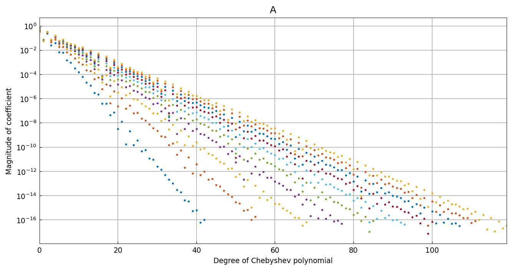
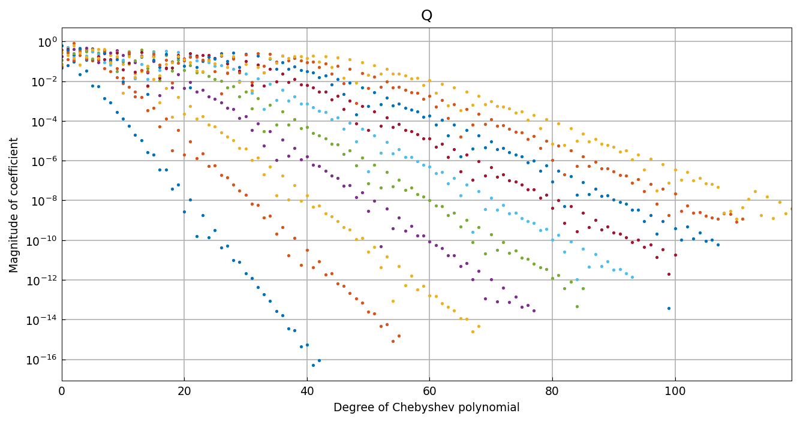

# QR factorization of a quasimatrix

*Nick Trefethen, June 2019*

[Original MATLAB Chebfun example](https://www.chebfun.org/examples/linalg/QuasiQR.html)

(Chebfun example linalg/QuasiQR.m)

Here is a quasimatrix whose ten columns are the ill-conditioned
family $1/(1 + k(x-0.1)^2)$, $k = 1,\dots,10$:



```text
ans =
     8.080635798306969e+09
```

(MATLAB: 8.080637999e+09 — agreement to 7 digits in a
condition number of $10^{10}$.)  The continuous Householder QR
factorization produces orthonormal columns whose Chebyshev
coefficients decay progressively more slowly:



The factorization is accurate to machine precision:

```text
ans =
     1.425041903471602e-15
```

(MATLAB: 2.77e-15.)

---

*Replicated with [chebfunjax](https://github.com/ma-gilles/chebfunjax); original
example copyright The University of Oxford and The Chebfun Developers.*
