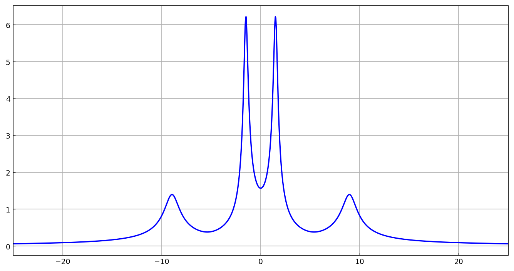
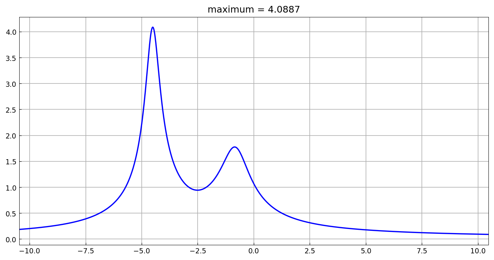
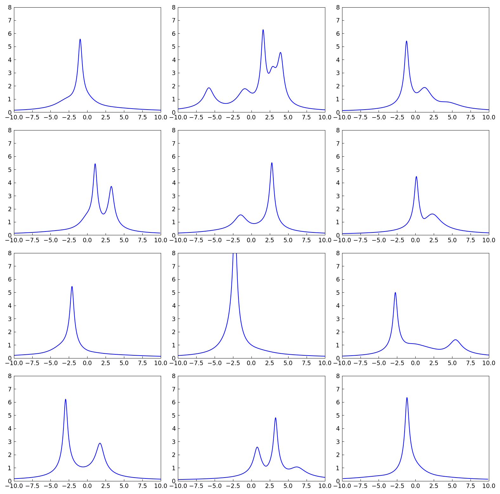

# Resolvent norm on the imaginary axis

*Nick Trefethen, May 2011*

[Original MATLAB Chebfun example](https://www.chebfun.org/examples/linalg/ResolventNorm.html)

(Chebfun example linalg/ResolventNorm.m)

If $A$ is a stable matrix (all eigenvalues in the left half-plane),
the norm of the resolvent $\|(zI-A)^{-1}\|$ along the imaginary axis
measures how close the system is to instability: its maximum is the
reciprocal of the *distance to singularity*.  For the 4x4 matrix of
the example (eigenvalues digit-for-digit with MATLAB):

```text
ans =
   -0.7688 + 8.9660i
   -0.7688 - 8.9660i
   -0.2312 + 1.5019i
   -0.2312 - 1.5019i
```

The resolvent norm as a chebfun of $y$ (via `1/min(svd(iyI-A))`):



```text
maxf =
   6.227545522966336
dist_sing =
   0.160576907276251
```

(MATLAB: 6.227545522966220 and 0.160576907276254 — 13-14 digits.)
The same computation packaged as a function applied to a 5x5 complex
matrix:



And a gallery of twelve random stable matrices, showing the variety
of resolvent-norm landscapes (our own `randn` draws):



---

*Replicated with [chebfunjax](https://github.com/ma-gilles/chebfunjax); original
example copyright The University of Oxford and The Chebfun Developers.*
