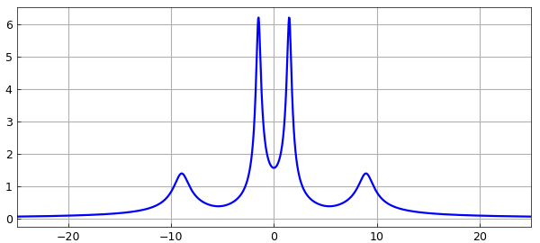
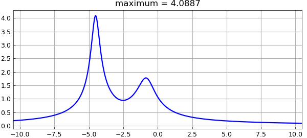
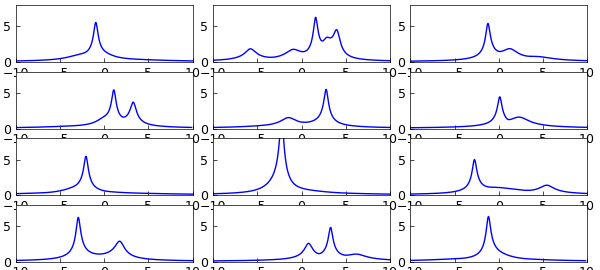

# Resolvent norm on the imaginary axis

*Nick Trefethen, May 2011*

[Original MATLAB Chebfun example](https://www.chebfun.org/examples/linalg/ResolventNorm.html)

Python translation: [`examples/linalg/resolvent_norm.py`](https://github.com/ma-gilles/chebfunjax/blob/main/examples/linalg/resolvent_norm.py)

If $A$ is a square matrix, the resolvent of $A$ for a particular complex number $z$ is the matrix $(zI-A)^{-1}$. The $2$-norm of the resolvent is a quantity of interest in many applications. For example, if $|(zI-A)^{-1}| = 1/\varepsilon$ for some quantity $\varepsilon$, then there is a matrix $E$ with norm $|E| = \varepsilon$ such that $z$ is an eigenvalue of $A+E$. This is the starting point of the theory of pseudospectra [1].

In particular, suppose all the eigenvalues of $A$ are in the left half of the complex plane, so that $A$ is stable in the sense that all solutions of the differential equation $\frac{du}{dt} = Au$ decay to zero as $t \to \infty$. How small a perturbation matrix $E$ might make $A$ unstable? The answer is $|E| = \varepsilon$, where $1/\varepsilon$ is the maximum of $|(zI-A)^{-1}|$ as $z$ ranges over the imaginary axis. Therefore in a number of fields such as control theory, there is special interest in the values taken by the norm of the resolvent on the imaginary axis.

Let's compute this function with Chebfun. As an example we take the matrix

```matlab
A = [-1 3 5 2; -3 -2 4 6; -5 -4 -2 1; -2 -6 -1 3]
```

```text
A =
      -1     3     5     2
      -3    -2     4     6
      -5    -4    -2     1
      -2    -6    -1     3
```

A has two pairs of eigenvalues near the imaginary axis:

```matlab
format short, format compact
eig(A)
```

```text
ans =
   -0.7688 + 8.9660i
   -0.7688 - 8.9660i
   -0.2312 + 1.5019i
   -0.2312 - 1.5019i
```

Suppose $z=x+iy$. It takes Chebfun a fraction of a second to compute a chebfun representing $|(zI-A)^{-1}|$ as a function of $y$, with $x=0$. Here is that calculation and a plot of the result:

```matlab
I = eye(size(A));
nr = @(y) 1/min(svd(1i*y*I-A));
f = chebfun(nr,[-25,25],'vectorize');
LW = 'linewidth';
plot(f,LW,1.6), grid on
```



The maximum of $f$ is this,

```matlab
format long
maxf = max(f)
```

```text
maxf =
   6.227545522966336
```

and the distance to instability is the reciprocal of this quantity,

```matlab
dist_sing = 1/maxf
```

```text
dist_sing =
   0.160576907276251
```

Let us consider another example matrix, and this time, let's make an anonymous function to construct the chebfun.

```matlab
normfun = @(A) chebfun(@(y) 1/min(svd(1i*y*eye(size(A))-A)),...
   1.5*norm(A)*[-1,1],'vectorize');
```

Here is a $5\times5$ matrix which we take to be complex, to break the symmetry:

```matlab
B =  [ -3-2i   1+1i    -1i      0   -1+1i
           0  -2-3i    -1i     1i   -2-1i
          1i      0  -2-4i  -2-1i    2-1i
           0      1     1i  -2-4i      1i
        1-2i      0      1      1   -2-3i ];
format short, eig(B)
```

```text
ans =
   -5.3054 - 3.2003i
   -0.6662 - 0.8209i
   -0.3296 - 4.5158i
   -2.9797 - 3.2972i
   -1.7191 - 4.1659i
```

And here is its resolvent norm plot:

```matlab
fB = normfun(B);
plot(fB,LW,1.6), grid on
title(['maximum = ' num2str(max(fB))]);
```



Here are 12 random $6\times6$ complex matrices, all with rightmost eigenvalue having real part $-0.25$:

```matlab
rng(1)
for j = 1:12
    N = 6;
    A = randn(N) + 1i*randn(N) + 2i*diag(randn(N,1));
    abscissa = max(real(eig(A)));
    A = A - (abscissa+0.25)*eye(N);
    subplot(4,3,j)
    plot(normfun(A),LW,1)
    axis([-10 10 0 8]), drawnow
end
```



## References

1. L. N. Trefethen and M. Embree, *Spectra and Pseudospectra: The Behavior of Nonnormal Matrices and Operators*, Princeton U. Press, 2005.

---

*Translated with [chebfunjax](https://github.com/ma-gilles/chebfunjax); prose and MATLAB code from the original example, copyright The University of Oxford and The Chebfun Developers.  Printed outputs and figures are chebfunjax's.*
