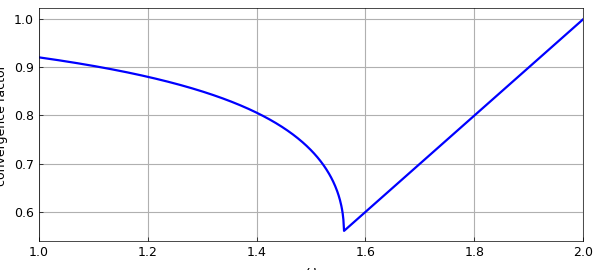

# Spectral radius of the SOR iteration matrix

*Nick Trefethen, October 2012*

[Original MATLAB Chebfun example](https://www.chebfun.org/examples/linalg/SOR.html)

Python translation: [`examples/linalg/sor.py`](https://github.com/ma-gilles/chebfunjax/blob/main/examples/linalg/sor.py)

The classic finite-difference 1D Laplacian discretization looks like this:

```matlab
N = 11;
A = toeplitz([2 -1 zeros(1,N-3)])
```

```text
A =
       2    -1     0     0     0     0     0     0     0     0
      -1     2    -1     0     0     0     0     0     0     0
       0    -1     2    -1     0     0     0     0     0     0
       0     0    -1     2    -1     0     0     0     0     0
       0     0     0    -1     2    -1     0     0     0     0
       0     0     0     0    -1     2    -1     0     0     0
       0     0     0     0     0    -1     2    -1     0     0
   ...
rho_opt =
   0.560387921218736
omega_opt =
   1.560387921218735
```

We may split $A$ into its lower-triangular, diagonal, and upper-triangular parts:

```matlab
L = tril(A,-1);
D = diag(diag(A));
U = triu(A,1);
```

From the beginning of the computer era, people studied solution of matrix problems with this kind of matrix by the method of *successive overrelaxation* or *SOR*. Here $\omega\in [1,2]$ is the overrelaxation parameter, and we iterate with the matrix defined like this: $$ G = M^{-1} N, \qquad M = D + \omega L, \quad N = (1-\omega)D- \omega U. $$ In MATLAB, that's

```matlab
G = @(om) (D+om*L)\((1-om)*D-om*U);
rho = @(om) max(abs(eig(G(om))));
```

Analysis of the SOR iteration was carried out by Frankel [1] and generalized by Young [4]; see also [3]. Details are given in innumerable books, such as Golub and Van Loan [2]. Supposing we didn't know the theory, Chebfun would give us an elegant way to draw the famous optimal-$\omega$ curve:

```matlab
f = chebfun(rho,[1 2],'splitting','on');
plot(f), grid on
xlabel('\omega')
ylabel('convergence factor')
```



Chebfun gives us the following optimal omega:

```matlab
[rho_opt,omega_opt] = min(f)
```

```text
(no matching output)
```

Here are the exact optimal values:

```matlab
omega_exact = 2/(1+sin(pi/N))
rho_exact = omega_exact - 1
```

```text
omega_exact =
   1.560387921274774
rho_exact =
   0.560387921274774
```

## References

1. S. Frankel, Convergence rates of iterative treatments of partial differential equations, *Mathematics of Computation*, 4 (1950), 56-75.
2. G. H. Golub and C. F. Van Loan, *Matrix Computations*, 4th ed., Johns Hopkins, 2012.
3. R. J. LeVeque and L. N. Trefethen, Fourier analysis of the SOR iteration, *IMA Journal of Numerical Analysis*, 8 (1988), 273-279.
4. D. M. Young, *Iterative Methods for Solving Partial Difference Equations of Elliptic Type*, PhD thesis, Harvard U., 1950.

---

*Translated with [chebfunjax](https://github.com/ma-gilles/chebfunjax); prose and MATLAB code from the original example, copyright The University of Oxford and The Chebfun Developers.  Printed outputs and figures are chebfunjax's.*
