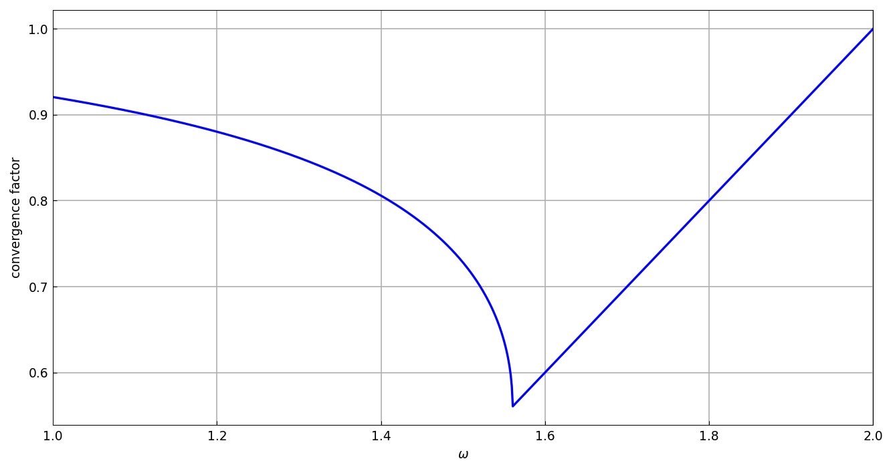

# Convergence of the SOR iteration

*Nick Trefethen, June 2011*

[Original MATLAB Chebfun example](https://www.chebfun.org/examples/linalg/SOR.html)

(Chebfun example linalg/SOR.m)

The successive over-relaxation (SOR) iteration for $Ax=b$ splits
$A = L + D + U$ and iterates with the matrix
$G(\omega) = (D+\omega L)^{-1}((1-\omega)D - \omega U)$.  For the
tridiagonal Toeplitz matrix with $N = 11$, the convergence factor
$\rho(\omega)$ (spectral radius of $G$) becomes a chebfun of the
relaxation parameter, built with splitting on since $\rho$ has a kink
at the optimal $\omega$:

```python
f = chebfun(rho, domain=(1, 2), splitting=True)
```



Minimizing the chebfun recovers the optimum:

```text
rho_opt =
   0.560387921275187
omega_opt =
   1.560387921274774
```

Young's classical theory gives the exact values — `omega_opt` matches
digit-for-digit, and the minimum value to 12 digits (the kink is a
genuinely nonsmooth point):

```text
omega_exact =
   1.560387921274774
rho_exact =
   0.560387921274774
```

---

*Replicated with [chebfunjax](https://github.com/ma-gilles/chebfunjax); original
example copyright The University of Oxford and The Chebfun Developers.*
