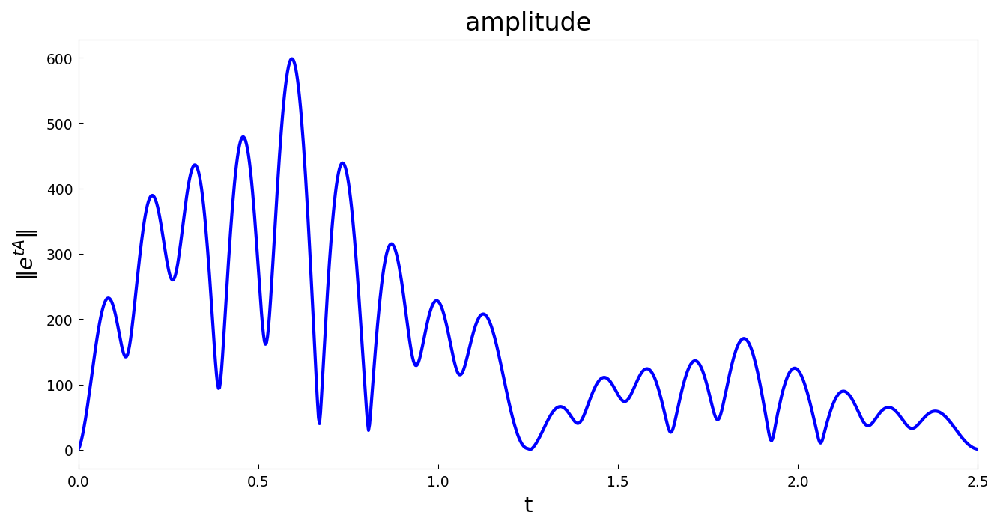
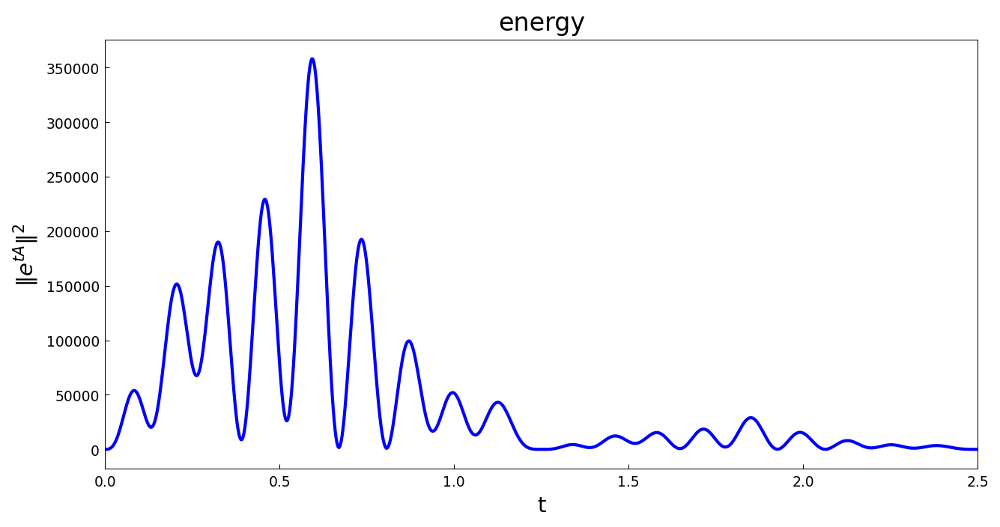

# Transient growth in linear systems

*Nick Trefethen, May 2011*

[Original MATLAB Chebfun example](https://www.chebfun.org/examples/linalg/TransientGrowth.html)

(Chebfun example linalg/TransientGrowth.m)

This 7x7 matrix, from a laser-physics application of Kestutis
Staliunas, is stable: every eigenvalue has real part $-1$.  Yet
$\|e^{tA}\|$ grows enormously before decaying — the hallmark of
nonnormal transient growth:

```python
e = chebfun(lambda t: norm(expm(t*A)), domain=(0, 2.5),
            splitting=True)
```



The energy is the square of the amplitude:



```text
Maximum energy = 358147.98785177
```

(MATLAB: 358147.98785176 — agreement to the last printed digit.)  An
initially unit-energy state can be amplified by a factor of over
350,000 before the eventual exponential decay takes hold.

---

*Replicated with [chebfunjax](https://github.com/ma-gilles/chebfunjax); original
example copyright The University of Oxford and The Chebfun Developers.*
