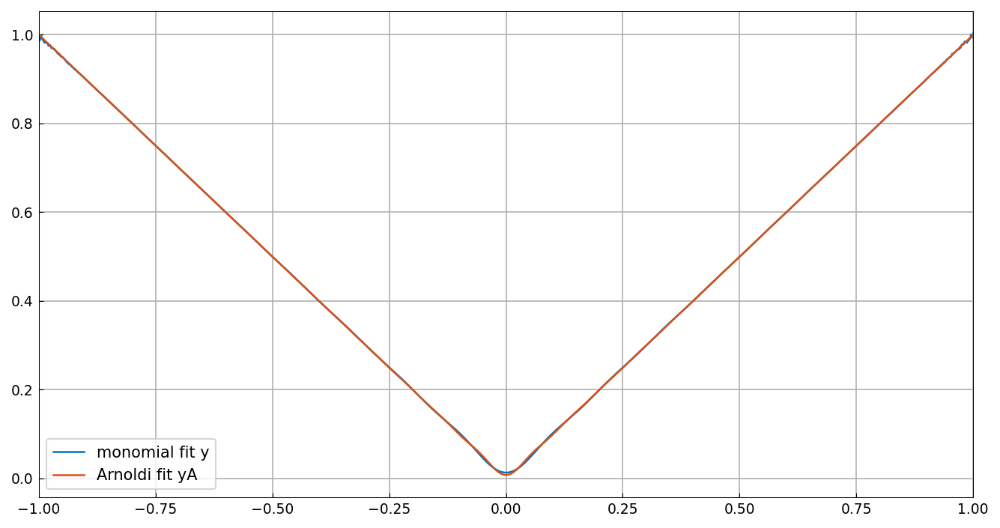

# Vandermonde with Arnoldi

*Nick Trefethen, July 2020*

[Original MATLAB Chebfun example](https://www.chebfun.org/examples/linalg/VandermondeArnoldi.html)

(Chebfun example linalg/VandermondeArnoldi.m)

Vandermonde matrices are exponentially ill-conditioned, even at the
well-behaved Chebyshev points:

```text
ans =
   5.4282e+05
ans =
   6.8312e+11
```

(Digit-for-digit with MATLAB.)  This has nothing to do with the
interpolation problem itself, whose conditioning is measured by the
tiny Lebesgue constants:

```text
L16 =
    2.7247
L32 =
    3.1682
```

The corresponding *quasimatrices* of monomials on $[-1,1]$ are just
as bad (5.4803e+05 and 6.2360e+11, matching MATLAB's 6.2361e+11), and
equispaced points are worse still (9.9831e+06, 5.26e+14).

Fitting $|x|$ by a degree-80 polynomial through the monomial
quasimatrix produces enormous coefficients and a visibly imperfect
fit:

```text
max(y) =
    1.0032
norm(c,inf) =
   1.0447e+13
```

(MATLAB's continuous backslash degrades further, to max(y) = 1.5596
with 3.5e+14 coefficients; the $10^{13}$-scale coefficient explosion
— the actual pathology — is common to both.)

The fix of Brubeck, Nakatsukasa & Trefethen (SIAM Review 2021) is to
orthogonalize the powers *on the fly* with Arnoldi, never forming the
ill-conditioned basis.  The mathematics is unchanged; the numbers
become stable:

```text
yA endpoint values: 0.998935 0.998935
max(yA) =
    0.9989
```



---

*Replicated with [chebfunjax](https://github.com/ma-gilles/chebfunjax); original
example copyright The University of Oxford and The Chebfun Developers.*
