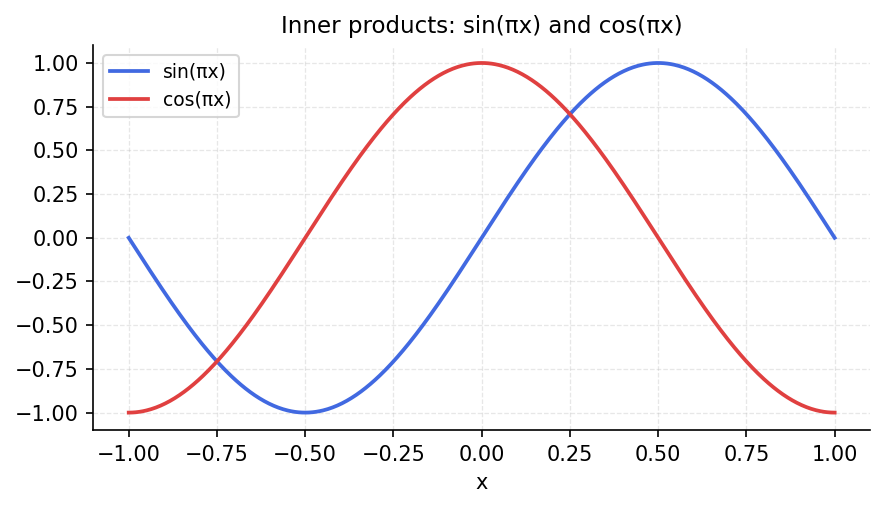

# Chebfun Inner Products

*Original: [chebfun.org/examples/linalg/ChebfunInnerProducts](https://www.chebfun.org/examples/linalg/ChebfunInnerProducts.html)*

---

The inner product of two Chebfuns is computed via `f.inner(g)`, which evaluates
$\langle f, g \rangle = \int_{-1}^1 f(x)\,g(x)\,dx$ exactly using the
Chebyshev expansion.

## Legendre orthogonality

The Legendre polynomials $P_n(x)$ are orthogonal with respect to the standard
$L^2$ inner product:

$$\langle P_m, P_n \rangle = \frac{2}{2n+1}\,\delta_{mn}.$$

```python
import chebfunjax as cj
import jax.numpy as jnp
import scipy.special
import numpy as np

def legendre(n):
    """Return chebfun for P_n(x)."""
    return cj.chebfun(lambda x: jnp.array(scipy.special.eval_legendre(n, np.array(x))))

# Check orthogonality
for m in range(4):
    for n in range(4):
        Pm = legendre(m)
        Pn = legendre(n)
        ip = float(Pm.inner(Pn))
        exact = (2/(2*n+1)) if m == n else 0.0
        print(f"<P_{m}, P_{n}> = {ip:+.2e}  (exact: {exact:.4f})")
```

## Generating functions as inner products

The $n$-th coefficient in the Chebyshev expansion of $f$ is:

$$c_n = \frac{2}{\pi} \langle f, T_n \rangle_w = \frac{2}{\pi}
\int_{-1}^1 \frac{f(x) T_n(x)}{\sqrt{1-x^2}}\,dx,$$

where $\langle \cdot, \cdot \rangle_w$ is the weighted inner product.



## References

1. G. Szego, *Orthogonal Polynomials*, American Mathematical Society, 1939.
