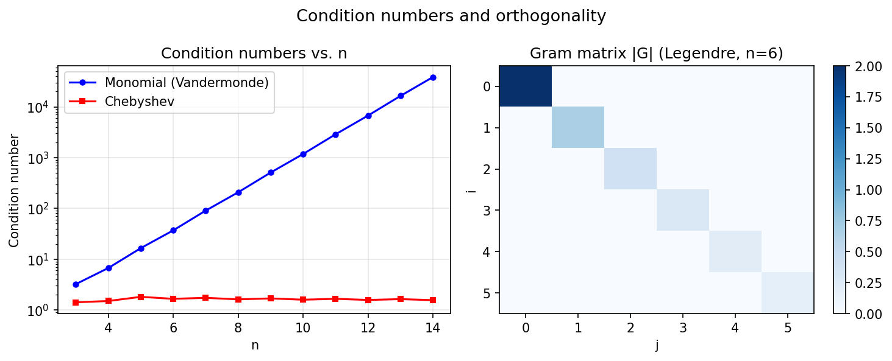
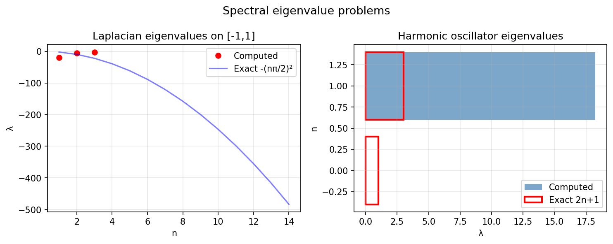

# Linear Algebra Examples

Chebfunjax supports infinite-dimensional analogues of linear algebra:
quasimatrix QR and SVD, eigenvalue problems, and condition numbers of bases.

---

## Condition numbers of bases

**Source:** `linalg/CondNos.m` — Nick Trefethen, September 2010

The monomial basis `{1, x, x², ...}` on `[-1,1]` has an exponentially large
condition number, but the Chebyshev basis `{T₀, T₁, T₂, ...}` has condition
number `O(√n)`.

```python
from chebfunjax.utils.polynomials import chebpoly
from chebfunjax.utils.quadrature import chebpts
import numpy as np

n = 20
xs, _ = chebpts(n)
T = np.column_stack([np.array(chebpoly(j, xs)) for j in range(n)])
print(f"cond(Chebyshev): {np.linalg.cond(T):.2e}")

V = np.vander(np.array(xs), n, increasing=True)
print(f"cond(Vandermonde): {np.linalg.cond(V):.2e}")
```



---

## Eigenvalue problems

**Source:** `linalg/LevelRepulsion.m` — Trefethen, October 2010;
`linalg/TransientGrowth.m` — Trefethen, July 2011

```python
from chebfunjax.operators.chebop import Chebop

# Laplacian eigenvalues: -(nπ/2)²
N = Chebop(domain=[-1.0, 1.0])
N.op = lambda x, u: u.diff().diff()
N.lbc = lambda u: u(-1.0)
N.rbc = lambda u: u(1.0)
lam, V = N.eigs(6)
print(sorted(lam.real))  # ≈ [-2.47, -9.87, -22.21, ...]
```



---

## Other linear algebra examples

| MATLAB example | Description |
|---|---|
| `linalg/AnalyticSVD.m` | Computing the analytic SVD |
| `linalg/CondVandermonde.m` | Condition numbers of Vandermonde quasimatrices |
| `linalg/ConstrainedLeastSquares.m` | Generalised QR and constrained least squares |
| `linalg/Crouzeix.m` | Crouzeix's conjecture |
| `linalg/FieldOfValues.m` | Field of values and numerical abscissa |
| `linalg/NonnormalQuiz.m` | Nonnormality quiz |
| `linalg/ResolventNorm.m` | Resolvent norm on the imaginary axis |
| `linalg/SOR.m` | Spectral radius of the SOR iteration matrix |
| `linalg/VandermondeArnoldi.m` | Vandermonde with Arnoldi |
