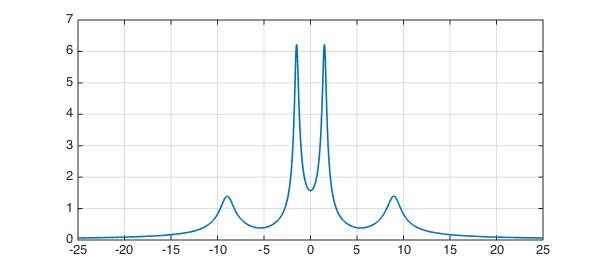
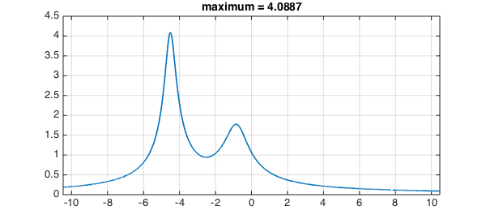
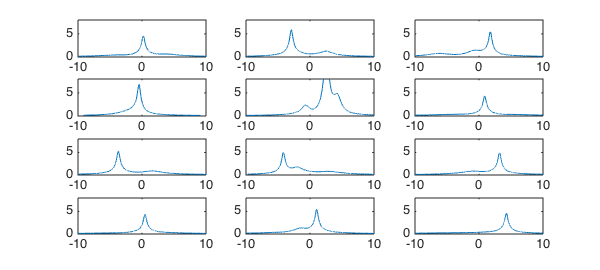

<!-- Generated by scripts/sync_chebfun_examples.py. -->
<!-- Source: https://www.chebfun.org/examples/linalg/ResolventNorm.html -->

<h1>Resolvent norm on the imaginary axis</h1>
<h2>Nick Trefethen, May 2011 in <a href='../'>linalg</a><a href='/examples/linalg/ResolventNorm.m'>download</a>&middot;<a href='//github.com/chebfun/examples/blob/master/linalg/ResolventNorm.m'>view on GitHub</a></h2>

If $A$ is a square matrix, the resolvent of $A$ for a particular complex number $z$ is the matrix $(zI-A)^{-1}$.  The $2$-norm of the resolvent is a quantity of interest in many applications.  For example, if $|(zI-A)^{-1}| = 1/\varepsilon$ for some quantity $\varepsilon$, then there is a matrix $E$ with norm $|E| = \varepsilon$ such that $z$ is an eigenvalue of $A+E$.  This is the starting point of the theory of pseudospectra [1].

In particular, suppose all the eigenvalues of $A$ are in the left half of the complex plane, so that $A$ is stable in the sense that all solutions of the differential equation $\frac{du}{dt} = Au$ decay to zero as $t \to \infty$.  How small a perturbation matrix $E$ might make $A$ unstable? The answer is $|E| = \varepsilon$, where $1/\varepsilon$ is the maximum of $|(zI-A)^{-1}|$ as $z$ ranges over the imaginary axis. Therefore in a number of fields such as control theory, there is special interest in the values taken by the norm of the resolvent on the imaginary axis.

Let's compute this function with Chebfun.  As an example we take the matrix

<pre class="mcode-input">A = [-1 3 5 2; -3 -2 4 6; -5 -4 -2 1; -2 -6 -1 3]</pre>

<pre class="mcode-output">A =
    -1     3     5     2
    -3    -2     4     6
    -5    -4    -2     1
    -2    -6    -1     3
</pre>

A has two pairs of eigenvalues near the imaginary axis:

<pre class="mcode-input">format short, format compact
eig(A)</pre>

<pre class="mcode-output">ans =
  -0.7688 + 8.9660i
  -0.7688 - 8.9660i
  -0.2312 + 1.5019i
  -0.2312 - 1.5019i
</pre>

Suppose $z=x+iy$.  It takes Chebfun a fraction of a second to compute a chebfun representing $|(zI-A)^{-1}|$ as a function of $y$, with $x=0$. Here is that calculation and a plot of the result:

<pre class="mcode-input">I = eye(size(A));
nr = @(y) 1/min(svd(1i*y*I-A));
f = chebfun(nr,[-25,25],'vectorize');
LW = 'linewidth';
plot(f,LW,1.6), grid on</pre>

The maximum of $f$ is this,

<pre class="mcode-input">format long
maxf = max(f)</pre>

<pre class="mcode-output">maxf =
   6.227545522966220
</pre>

and the distance to instability is the reciprocal of this quantity,

<pre class="mcode-input">dist_sing = 1/maxf</pre>

<pre class="mcode-output">dist_sing =
   0.160576907276254
</pre>

Let us consider another example matrix, and this time, let's make an anonymous function to construct the chebfun.

<pre class="mcode-input">normfun = @(A) chebfun(@(y) 1/min(svd(1i*y*eye(size(A))-A)),...
   1.5*norm(A)*[-1,1],'vectorize');</pre>

Here is a $5\times5$ matrix which we take to be complex, to break the symmetry:

<pre class="mcode-input">B =  [ -3-2i   1+1i    -1i      0   -1+1i
           0  -2-3i    -1i     1i   -2-1i
          1i      0  -2-4i  -2-1i    2-1i
           0      1     1i  -2-4i      1i
        1-2i      0      1      1   -2-3i ];
format short, eig(B)</pre>

<pre class="mcode-output">ans =
  -5.3054 - 3.2003i
  -0.6662 - 0.8209i
  -0.3296 - 4.5158i
  -2.9797 - 3.2972i
  -1.7191 - 4.1659i
</pre>

And here is its resolvent norm plot:

<pre class="mcode-input">fB = normfun(B);
plot(fB,LW,1.6), grid on
title(['maximum = ' num2str(max(fB))]);</pre>

Here are 12 random $6\times6$ complex matrices, all with rightmost eigenvalue having real part $-0.25$:

<pre class="mcode-input">rng(1)
for j = 1:12
    N = 6;
    A = randn(N) + 1i*randn(N) + 2i*diag(randn(N,1));
    abscissa = max(real(eig(A)));
    A = A - (abscissa+0.25)*eye(N);
    subplot(4,3,j)
    plot(normfun(A),LW,1)
    axis([-10 10 0 8]), drawnow
end</pre>

<h3 id="references">References</h3>
<ol>
<li>L. N. Trefethen and M. Embree, <em>Spectra and Pseudospectra: The Behavior of    Nonnormal Matrices and Operators</em>, Princeton U. Press, 2005.</li>
</ol>

        

    

