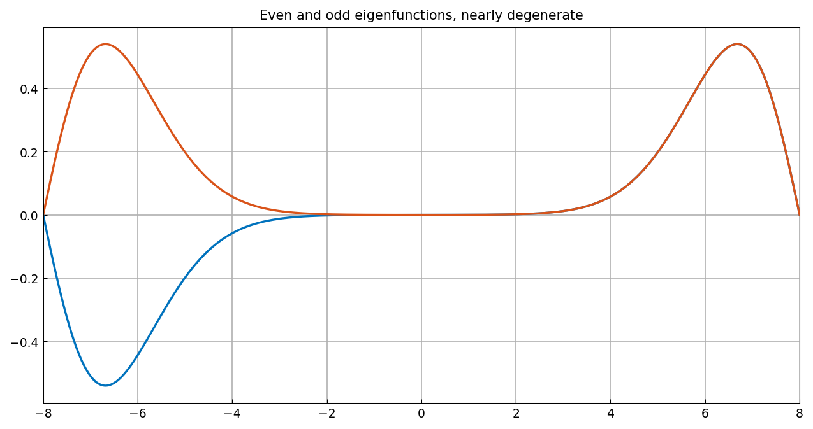
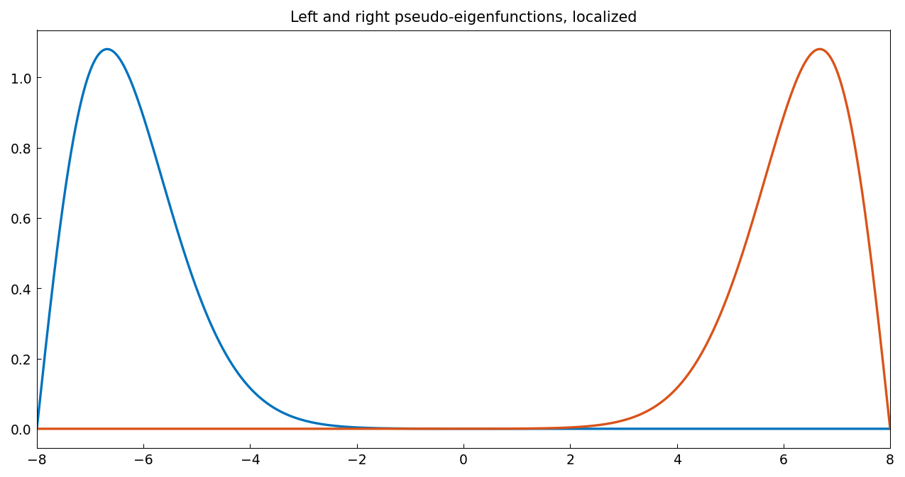

# Continuous analogue of Wilkinson matrix

*Abi Gopal and Nick Trefethen, March 2017*

[Original MATLAB Chebfun example](https://www.chebfun.org/examples/ode-eig/ContinuousWilkinson.html)

(Chebfun example ode-eig/ContinuousWilkinson.m)

Wilkinson's classic tridiagonal matrix — 1 on the sub- and
superdiagonals, $N, N-1, \dots, 1, 0, 1, \dots, N-1, N$ on the
diagonal — has extreme eigenvalues that are extremely close to one
another, even at $N = 8$:

```text
ans =
   7.210678529322860
   7.210678766818167
   8.746194182598282
   8.746194183210452
```

*(chebfunjax reproduces all four to the last printed digit —
`numpy.linalg.eigvalsh` and MATLAB `eig` agree exactly here.)*

A theorem says the eigenvalues of a real symmetric tridiagonal matrix
with nonzero subdiagonal entries must be distinct; what is going on is
that the two ends of the matrix are exponentially decoupled.

## The Sturm–Liouville analogue

$$ L u = u'' + |x|\,u, \quad -N \le x \le N, $$

with Dirichlet boundary conditions:

```python
L = Chebop(lambda x, u: u.diff(2) + abs(x) * u, domain=(-N, 0, N))
L.bc = "dirichlet"
lam, V = L.eigs(k=4, sigma="LR", return_eigenfunctions=True)
```

Again the eigenvalues must be distinct, but they are exponentially
close to degenerate:

```text
e =
   3.912042616399447
   3.912059036621475
   5.661892584504485
   5.661892594766943
```

MATLAB publishes `3.912042616399311, 3.912059036621295,
5.661892584504002, 5.661892594767715` — agreement to **12–13 digits**
on all four, including the $10^{-5}$ and $10^{-8}$ splittings of the
two pairs.

The leading eigenfunction is even and the second is almost the same
except for a sign flip:



Sums and differences give a true localized left/right pair:



## Pseudo-eigenfunctions

The eigenfunctions are eigenfunctions,

```text
ans =
   1.4978e-11
```

(MATLAB: `5.6730e-12`), while `left` is only *nearly* an
eigenfunction:

```text
ans =
   7.2571e-09
```

MATLAB gets `7.2576e-09` — the same number to four digits, because
this residual is physical: it is set by the eigenvalue splitting of
the near-degenerate pair, not by discretization error. As we say in
the pseudospectra business, $v$ is not "near" an eigenfunction, but it
is "nearly" an eigenfunction.

---

*Replica script: [`examples/ode-eig/continuouswilkinson_replica.py`](https://github.com/ma-gilles/chebfunjax/blob/main/examples/ode-eig/continuouswilkinson_replica.py).
Original example copyright by The University of Oxford and The Chebfun
Developers.*
