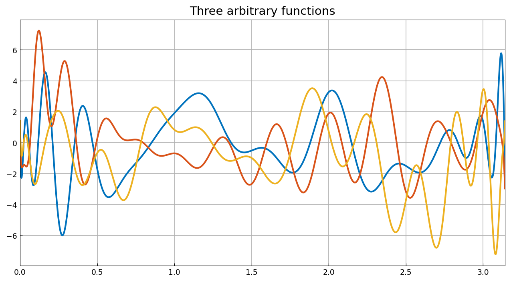
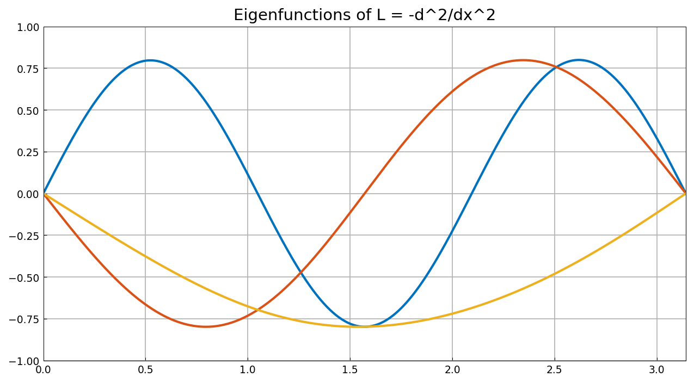

# Eigenvalues of Differential Operators by Contour Integral Projection

*Anthony Austin, May 2013*

[Original MATLAB Chebfun example](https://www.chebfun.org/examples/ode-eig/ContourProjEig.html)

(Chebfun example ode-eig/ContourProjEig.m)

A FEAST-like algorithm computes all eigenvalues of a differential
operator inside a region by projecting arbitrary functions onto the
corresponding eigenspace with the contour integral

$$ W = PY = \int_\gamma (zI - A)^{-1} Y \, dz, $$

then solving a small Rayleigh–Ritz problem. Here
$L = -d^2/dx^2$ on $[0, \pi]$ with Dirichlet conditions, whose three
eigenvalues in $[0, 10]$ are $1, 4, 9$.

Three "arbitrary functions" built from random data at 32 Chebyshev
points (MATLAB's `rng(67714070); 2*randn(32,3)`, inlined verbatim
since numpy's `randn` stream differs):



The contour is a circle of radius 5 about $z = 5$, discretized by the
8-point midpoint rule; self-adjointness halves the number of BVP
solves. Each quadrature node costs one *complex shifted differential
equation solve* $[z_k + d^2/dx^2]\,w = y_j$. The projected $3\times 3$
Rayleigh–Ritz problem gives

```text
ans =
   9.000022136839052
   4.001071254847706
   1.000904202687515
```

MATLAB publishes `9.000022136839711, 4.001071254848362,
1.000904202687470` — **12–13 digit agreement**, because with identical
random data and quadrature the two systems commit the *same*
discretization error of the 8-point contour rule. The eigenfunctions:



## Comparison with `eigs`

```text
ans =
   0.999999999999894
   3.999999999999872
   8.999999999999835
```

(MATLAB: `1.000000000000424, 4.000000000001219, 9.000000000001151` —
both accurate to about 13 digits, far better than the projection
method's 4–5.) The published timings are 5.6 s for the projection and
1.03 s for `eigs`; ours are 35.9 s and 0.31 s — slower on the six BVP
solves, faster on `eigs`.

---

*Replica script: [`examples/ode-eig/contourprojeig_replica.py`](https://github.com/ma-gilles/chebfunjax/blob/main/examples/ode-eig/contourprojeig_replica.py).
Original example copyright by The University of Oxford and The Chebfun
Developers.*
