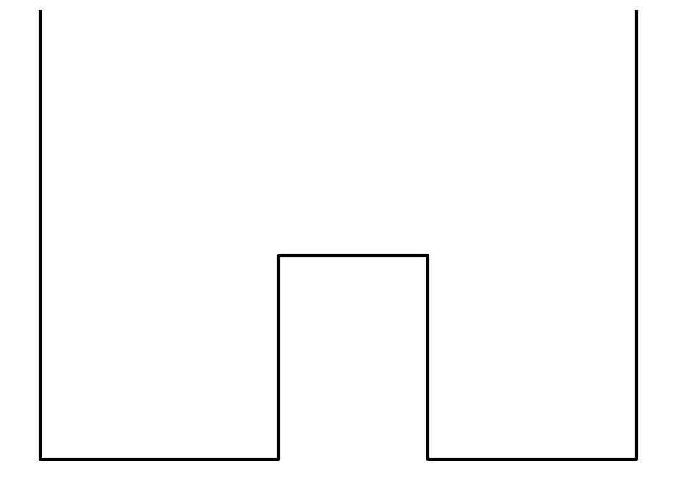
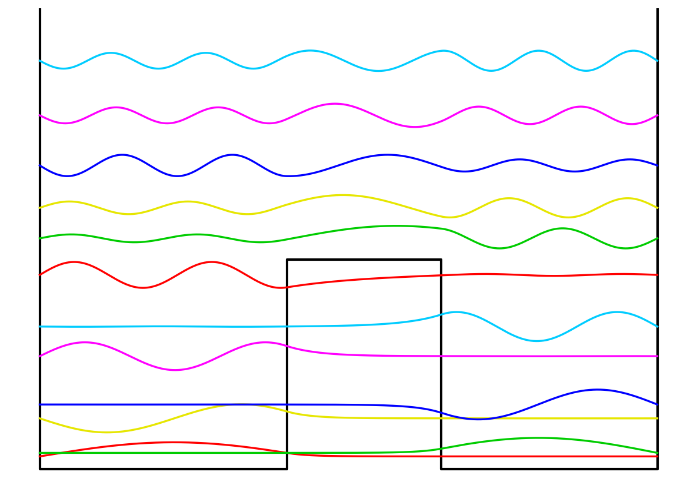
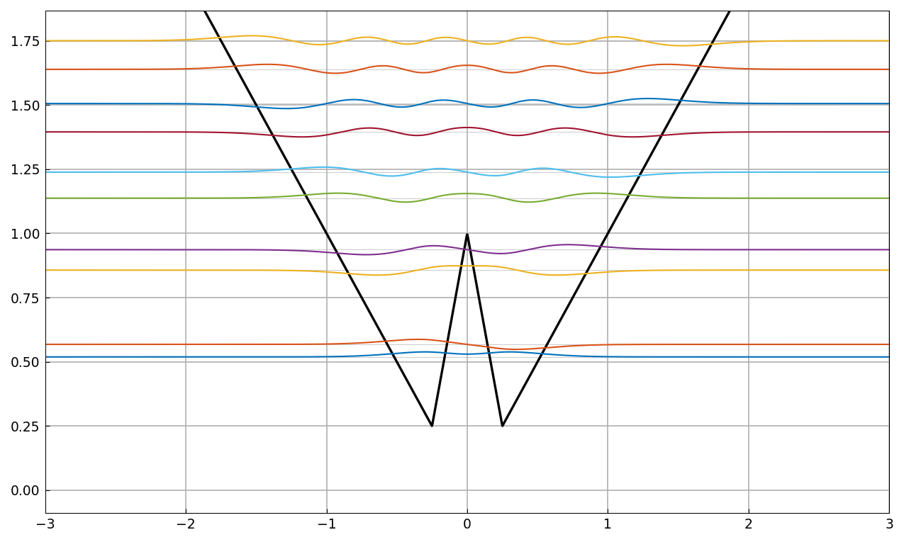

# Double-well Schroedinger eigenstates

*Nick Trefethen, November 2010*

[Original MATLAB Chebfun example](https://www.chebfun.org/examples/ode-eig/DoubleWell.html)

(Chebfun Example ode-eig/DoubleWell.m)

Eigenstates of a "double well" potential: functions $u(x)$ with

$$ -0.007u''(x) + V(x)u(x) = \lambda u(x), \qquad u(-1)=u(1)=0, $$

where $V = 1.5$ on $[-0.2, 0.3]$ and zero otherwise.



The first 12 eigenvalues — the indicator-function potential routes
`Chebop.eigs` through its piecewise collocation branch:

```text
   0.091480998227849
   0.116757122003780
   0.363909308593628
   0.463167687388278
   0.808941736692962
   1.021145960779012
   1.390812031489582
   1.652575851338477
   1.871230031206010
   2.174488704523859
   2.533176595018460
   2.924094539785294
Elapsed time is 46.197826 seconds.
```

MATLAB publishes `0.091480998228306, 0.116757122005294, ...` —
**11-digit agreement on all twelve** (MATLAB's elapsed: 1.68 s; the
gap is our per-column boundary-row probing, a known cost).

Physicists' plot, eigenmodes shifted up by their eigenvalues — the
lower modes are particles trapped on one side or the other, decaying
exponentially within the barrier; at higher energies the particles are
not localized:



## quantumstates

The `quantumstates` command makes such explorations easy — here for
$V = \max(|x|, 1-3|x|)$:



---

*Replica script: [`examples/ode-eig/doublewell_replica.py`](https://github.com/ma-gilles/chebfunjax/blob/main/examples/ode-eig/doublewell_replica.py).
Original example copyright by The University of Oxford and The Chebfun
Developers.*
