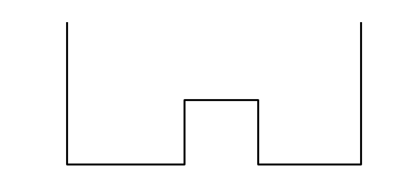
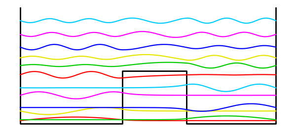
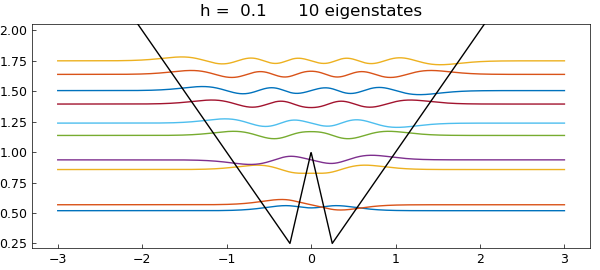

# Double-well Schroedinger eigenstates

*Nick Trefethen, November 2010*

[Original MATLAB Chebfun example](https://www.chebfun.org/examples/ode-eig/DoubleWell.html)

Python translation: [`examples/ode-eig/doublewell.py`](https://github.com/ma-gilles/chebfunjax/blob/main/examples/ode-eig/doublewell.py)

A well-known problem in quantum mechanics is the calculation of eigenstates of a potential with the shape of a "double well". Specifically, consider a potential function $V(x)$ defined on $[-1,1]$ by

$$ V(x) = 1.5, ~ x \in [-.2,.3], $$

and zero otherwise. We seek eigenmodes of the steady-state Schroedinger equation associated with this potential, specifically, functions $u(x)$ satisfying

$$ -0.007u''(x) + V(x)u(x) = \lambda u(x),~~ u(-1) = u(1) = 0 $$

for some constant $\lambda$.

We can sketch the potential like this:

```matlab
plot([-1 -1 -.2 -.2 .3 .3 1 1],[3.3 0 0 1.5 1.5 0 0 3.3],'k','linewidth',2)
axis([-1.1 1.1 -.05 3.3]), axis off, hold on
```



Let's compute the first 12 eigenvalues and eigenfunctions:

```matlab
tic
x = chebfun('x');
V = 1.5*(abs(x-0.05)<0.25);
L = chebop(-1,1);
L.op = @(x,u) -0.007*diff(u,2) + V*u;
L.bc = 0;
neigs = 12;
[EV,D] = eigs(L,neigs);
disp(diag(D)), toc
```

```text
   0.091480998228519
   0.116757122004885
   0.363909308597349
   0.463167687391686
   0.808941736699276
   1.021145960786894
   1.390812031498551
   1.652575851343460
   1.871230031211016
   2.174488704535170
   2.533176594994981
   2.924094539795404
Elapsed time is 13.458893 seconds.
```

Physicists like to plot the eigenmodes shifted up by an amount equal to the eigenvalue:

```matlab
colors = [1 0 0; 0 .8 0; .9 .9 0; 0 0 1; 1 0 1; 0 .8 1];
for j = 1:neigs
  v = EV(:,j)/15; d = D(j,j);
  if max(v)<-min(v), v = -v; end
  plot(d+v,'color',colors(1+mod(j-1,6),:))
end
```



There is a great deal of such physics in such pictures. The lower eigenmodes correspond to particles trapped on one side or the other, with a state function decreasing exponentially within the barrier. At higher energies the particles are not localized.

The Chebfun command `quantumstates` allows one to carry out explorations like these much more easily.

```matlab
clf, x = chebfun('x',[-3,3])
V = max(abs(x),1-3*abs(x));
quantumstates(V)
```

```text
x =
   chebfun column (1 smooth piece)
       interval       length     endpoint values
[      -3,       3]        2        -3        3
vertical scale =   3
ans =
   0.519275627846653
   0.568122999836146
   0.857289324399585
   0.936834938830695
   1.137321404211674
   1.238731857338259
   1.395322337058939
   1.505801742484373
   1.638922632403128
   1.750303602923925
```



For more information on problems like these, see chapter 6 of *Exploring ODEs*, freely available at `people.maths.ox.ac.uk/trefethen/ExplODE/`.

---

*Translated with [chebfunjax](https://github.com/ma-gilles/chebfunjax); prose and MATLAB code from the original example, copyright The University of Oxford and The Chebfun Developers.  Printed outputs and figures are chebfunjax's.*
