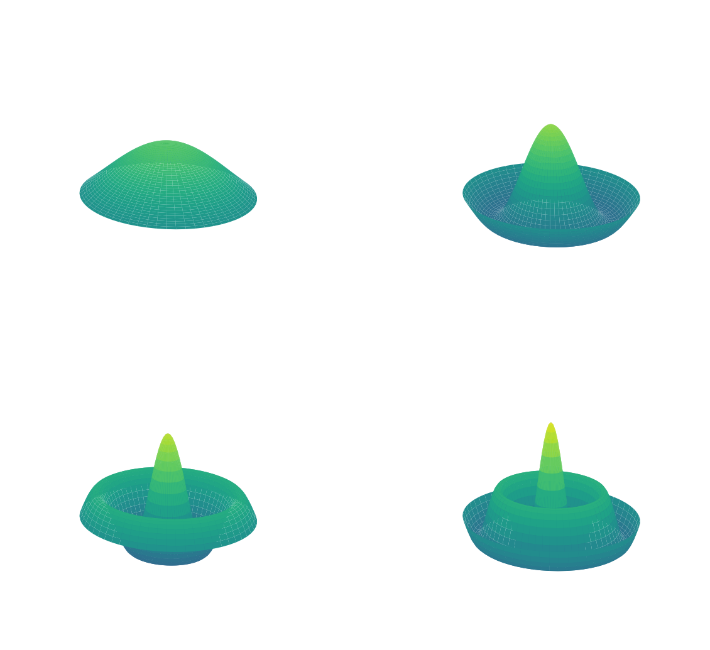
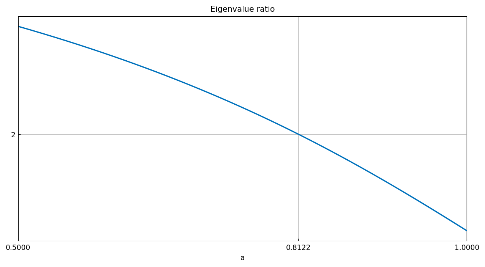
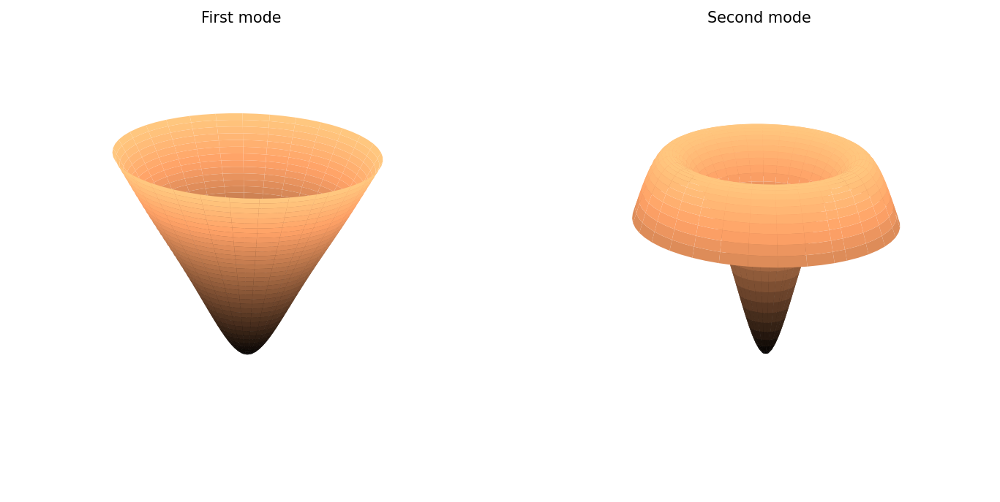

# Frequencies of a drum

*Toby Driscoll, November 2010*

[Original MATLAB Chebfun example](https://www.chebfun.org/examples/ode-eig/Drum.html)

(Chebfun example ode-eig/Drum.m)

The axisymmetric vibrations of a circular drum obey

$$ u''(r) + r^{-1}u'(r) = -\omega^2 u(r), \qquad u'(0)=0,\ u(1)=0. $$

Multiplying through by $r$ gives the generalized problem
$Au = \lambda Bu$, solved with `eigs_generalized`. The $\omega$ values
are zeros of $J_0$:

```text
omega =
  2.404825557759977
  5.520078110238842
  8.653727912896324
  11.791534439039447
  14.930917708481189
  18.071063967905658
err =
   6.421e-11
   -4.747e-11
   -1.469e-11
   2.517e-11
   -6.604e-12
   -5.265e-12
```

MATLAB publishes `2.404825557946273, 5.520078110504802, ...` (agreeing
to $2.7\times10^{-10}$), with errors versus the Bessel roots of up to
$2.5\times10^{-10}$ — ours are up to four times *smaller*.

The drum deflections for pure frequencies:



## Designing a perfect octave

Constant density gives $\omega_2/\omega_1 = 2.2954$. Searching among
densities $\rho(r) = 1 - a\sin(\pi r)$ with a chebfun of the
eigenvalue ratio over $a \in [0.5, 1]$:



```text
astar =
   0.812158808315378
residual =
    5.490141674613369e-11
```

MATLAB: `astar = 0.812158808552563` (10-digit agreement), residual
`-3.6e-12` — both at the rootfinding tolerance. The designed drum's
first two modes:



---

*Replica script: [`examples/ode-eig/drum_replica.py`](https://github.com/ma-gilles/chebfunjax/blob/main/examples/ode-eig/drum_replica.py).
Original example copyright by The University of Oxford and The Chebfun
Developers.*
