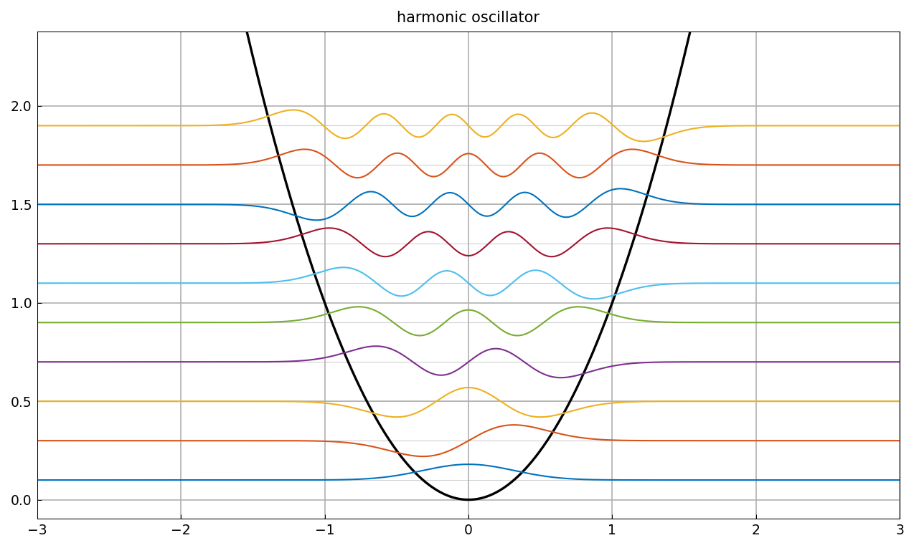
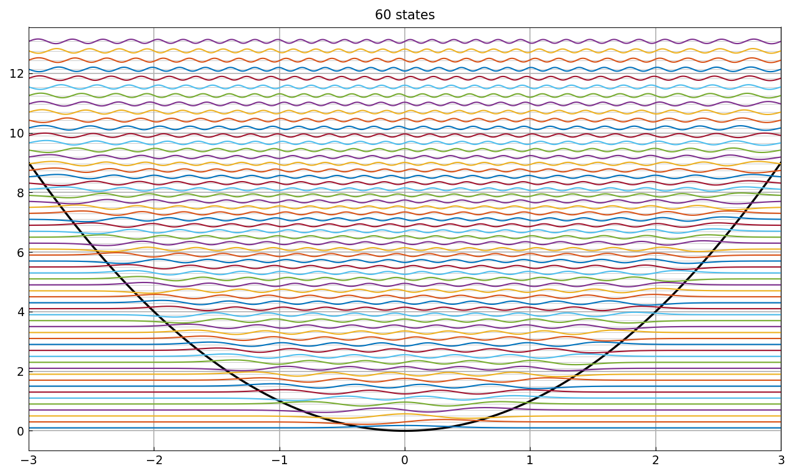
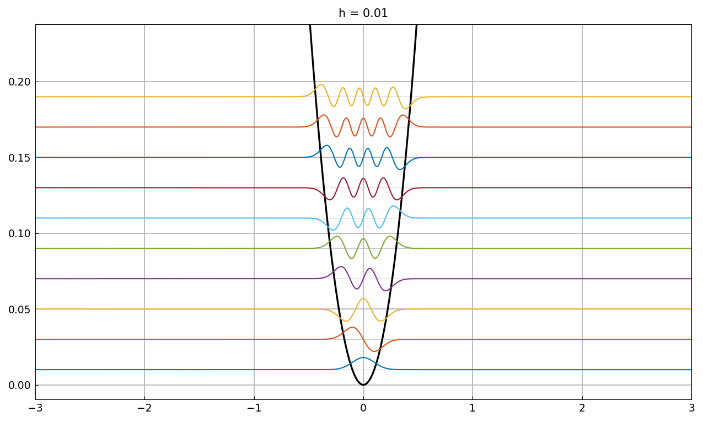
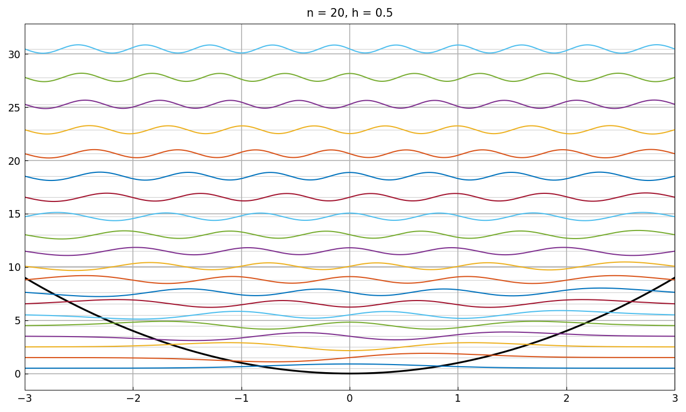
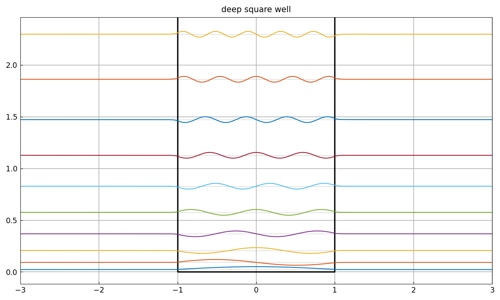
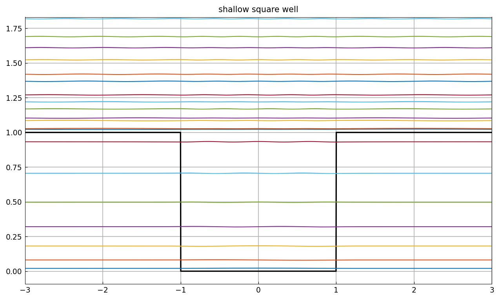
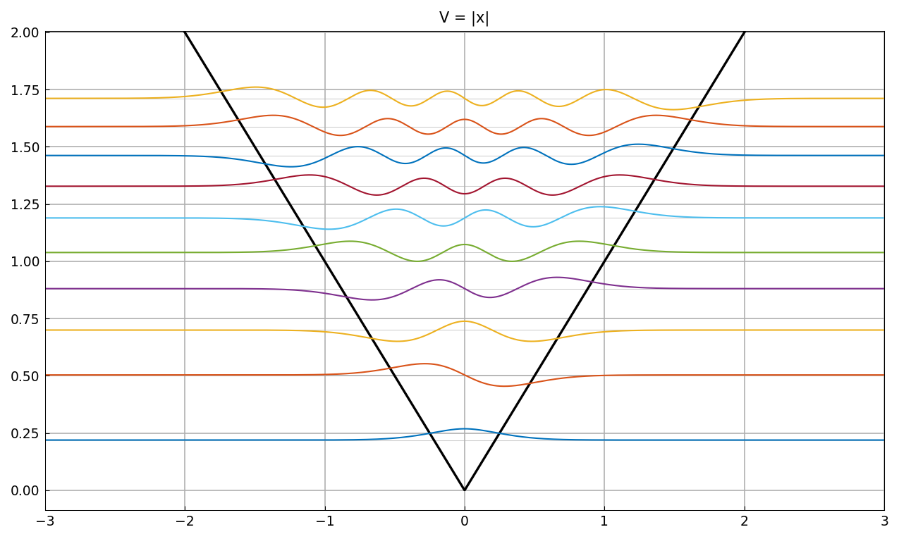
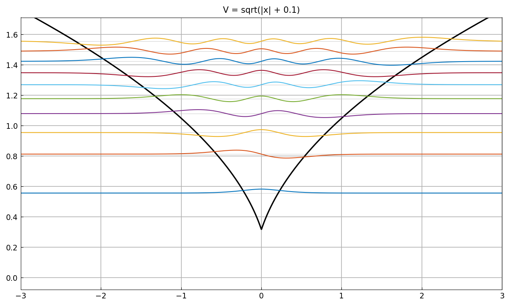
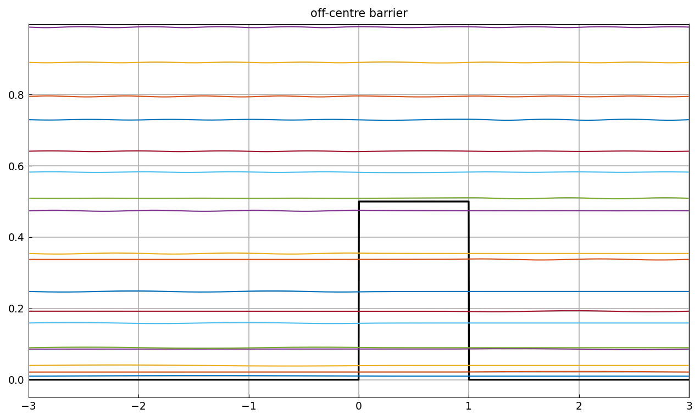

# Eigenstates of the Schroedinger equation

*Nick Trefethen, January 2012*

[Original MATLAB Chebfun example](https://www.chebfun.org/examples/ode-eig/Eigenstates.html)

(Chebfun example ode-eig/Eigenstates.m)

`quantumstates` computes and plots eigenstates of the time-independent
Schroedinger operator

$$ L u = -h^2 u'' + V(x)\,u, $$

with each eigenfunction drawn at the height of its energy level. The
default is ten states with $h = 0.1$.

## The harmonic oscillator

```python
x = chebfun(lambda x: x, domain=(-3, 3))
V = x**2
lam, funs = quantumstates(V)
```



The eigenvalues are $h\,(2k+1)$ exactly, and come out that way:

```text
ans =
   0.099999999999974
   0.300000000000026
   0.500000000000047
   0.700000000000080
   0.900000000000085
   1.100000000000099
   1.300000000000129
   1.500000000000139
   1.700000000000173
   1.900000000000208
```

against MATLAB's `0.099999999999985, 0.300000000000002, ...` —
thirteen digits on both sides of the comparison.

More states, a smaller $h$, or both:





## Square wells and other potentials

A deep square well confines the low states almost completely:



a shallow one lets the higher states spill over the top:



and non-smooth potentials pose no difficulty:




An off-centre barrier splits states into near-degenerate pairs:



> **Implementation note.** `quantumstates` previously hand-rolled a
> fixed 100-point collocation and reached only five digits on the
> harmonic oscillator. MATLAB's version simply builds a chebop and
> calls `eigs` — and our `Chebop.eigs` already reaches $10^{-14}$ on
> this problem at $n = 96$. `quantumstates` now delegates the same way,
> doubling the grid until the requested eigenvalues stabilise, which is
> where the thirteen digits above come from.

---

*Replica script: [`examples/ode-eig/eigenstates_replica.py`](https://github.com/ma-gilles/chebfunjax/blob/main/examples/ode-eig/eigenstates_replica.py).
Original example copyright by The University of Oxford and The Chebfun
Developers.*
