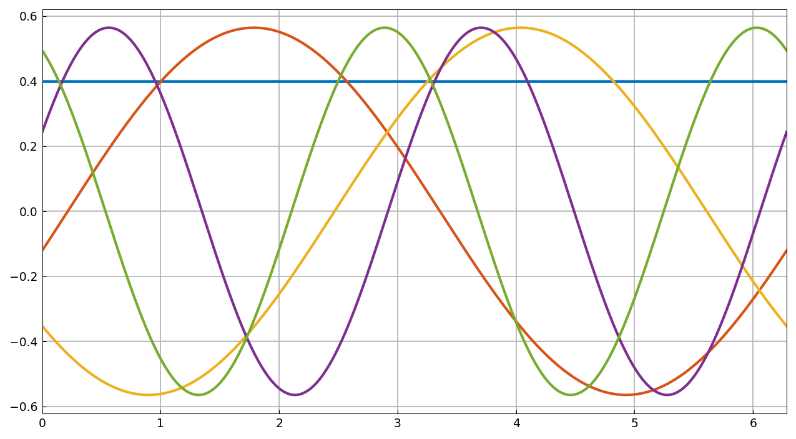
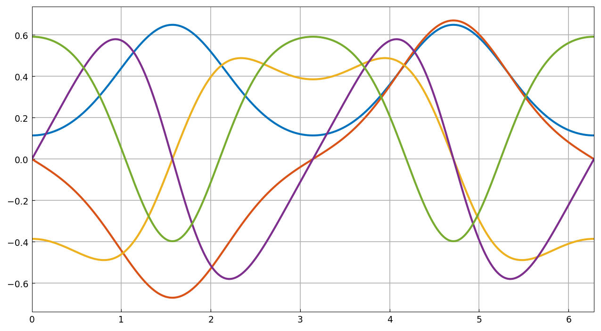

# Periodic ODE eigenvalue problems

*Hadrien Montanelli, December 2014*

[Original MATLAB Chebfun example](https://www.chebfun.org/examples/ode-eig/FourierEigs.html)

(Chebfun example ode-eig/FourierEigs)

Consider the periodic Sturm–Liouville eigenvalue problem

$$ -\frac{d}{dx}\Big[p(x)\frac{du}{dx}\Big]+q(x)u=\lambda w(x)u 
$$

on $[0,2\pi]$. With $p = w = 1$, $q = 0$ we get $-u'' = \lambda u$
with eigenvalues $\lambda_n = n^2$, double for $n \ge 1$:

```python
L = Chebop(lambda u: -u.diff(2), domain=(0, 2*np.pi))
L.bc = "periodic"
V, lam = L.eigs(k=5, return_eigenfunctions=True)
```



The computed eigenvalues are very close to the exact ones:

```text
ans =
     7.533804109018113e-14
```

(MATLAB: `1.274536032269680e-13`.) The eigenfunctions are trigonometric
chebfuns of lengths 1–7, and satisfy the differential equation to high
precision:

```text
ans =
     1.338121766771588e-13
```

(MATLAB: `1.374311367821037e-13`.)

## The Mathieu equation

With $q(x) = 2q\cos(2x)$, $q = 2$, we get the Mathieu equation

$$ -u'' + 2q\cos(2x)\,u = \lambda u. $$



The computed characteristic values match WolframAlpha's:

```text
ans =
     1.429967255717202e-13
```

(MATLAB: `8.526512829121202e-14`.) The Mathieu functions come out as
trig chebfuns of length 35–39 (MATLAB: 29), and satisfy the ODE to

```text
ans =
     8.361994791581482e-13
```

— four orders *tighter* than the published `6.625664957591112e-09`.

---

*Replica script: [`examples/ode-eig/fouriereigs_replica.py`](https://github.com/ma-gilles/chebfunjax/blob/main/examples/ode-eig/fouriereigs_replica.py).
Original example copyright by The University of Oxford and The Chebfun
Developers.*
