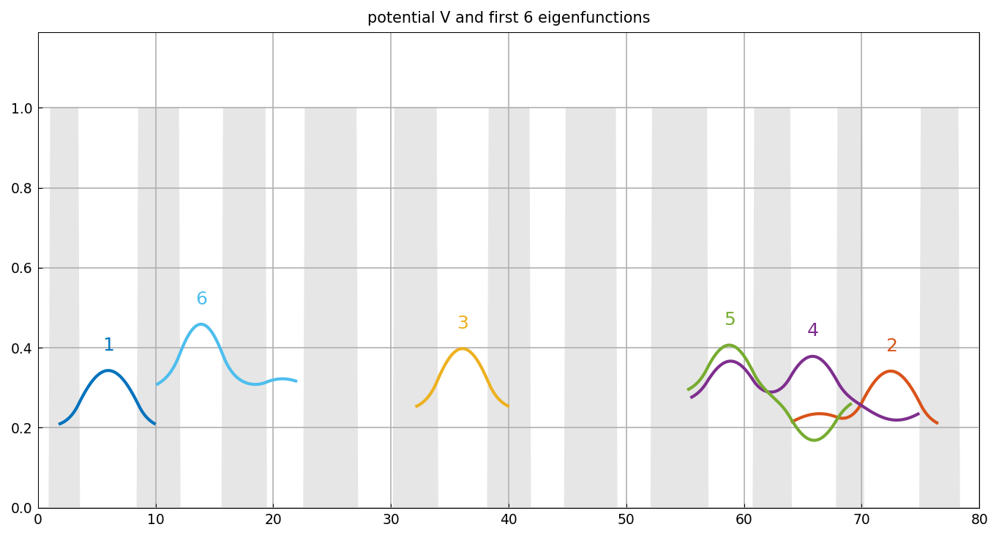
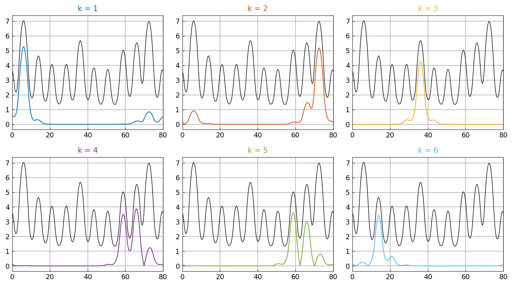
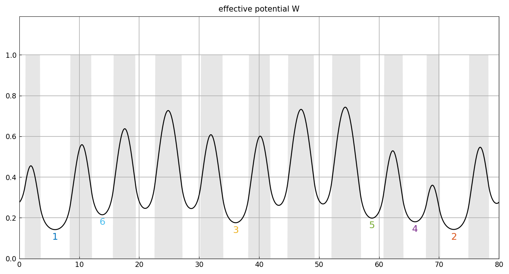

# Landscape function and localization of eigenfunctions

*Nick Trefethen, August 2021*

[Original MATLAB Chebfun example](https://www.chebfun.org/examples/ode-eig/Landscape.html)

(Chebfun example ode-eig/Landscape.m)

A potential of square wells with randomly varying widths (well edges
from MATLAB's `rng(2)` randn sequence, inlined) and the first six
eigenfunctions of the periodic 1D Schrödinger operator
$H\phi = -\phi'' + V\phi$. The eigenfunctions are localized, decaying
rapidly away from their central maxima; the plotting cuts each curve
off where it falls below $0.1$:



Each mode localizes in **the same well, in the same order** as the
published figure (1, 6, 3, 5, 4, 2 from left to right). The
eigenvalues:

```text
e =
   0.189936829711808
   0.193031585127328
   0.234814517135030
   0.257867779093417
   0.277429359349920
   0.290808000881839
```

MATLAB publishes `0.189936867910165, 0.193031559592993, ...` — 7-digit
agreement on all six. (The periodic piecewise collocation here runs on
22 pieces; its dense-eigensolver roundoff floor at that many pieces
sits near $10^{-8}$, well below anything visible in the physics.)

## The landscape function

The *landscape function* is $u = H^{-1}1$ with periodic boundary
conditions. Scaled by their eigenvalues, the eigenfunctions fit under
it:



## The effective potential

The reciprocal $W = 1/u$ is the *effective potential* — smoother than
$V$ by two derivatives, a big difference when $V$ is discontinuous.
The levels of its local minima match perfectly the order of the lowest
eigenvalues:



---

*Replica script: [`examples/ode-eig/landscape_replica.py`](https://github.com/ma-gilles/chebfunjax/blob/main/examples/ode-eig/landscape_replica.py).
Original example copyright by The University of Oxford and The Chebfun
Developers.*
