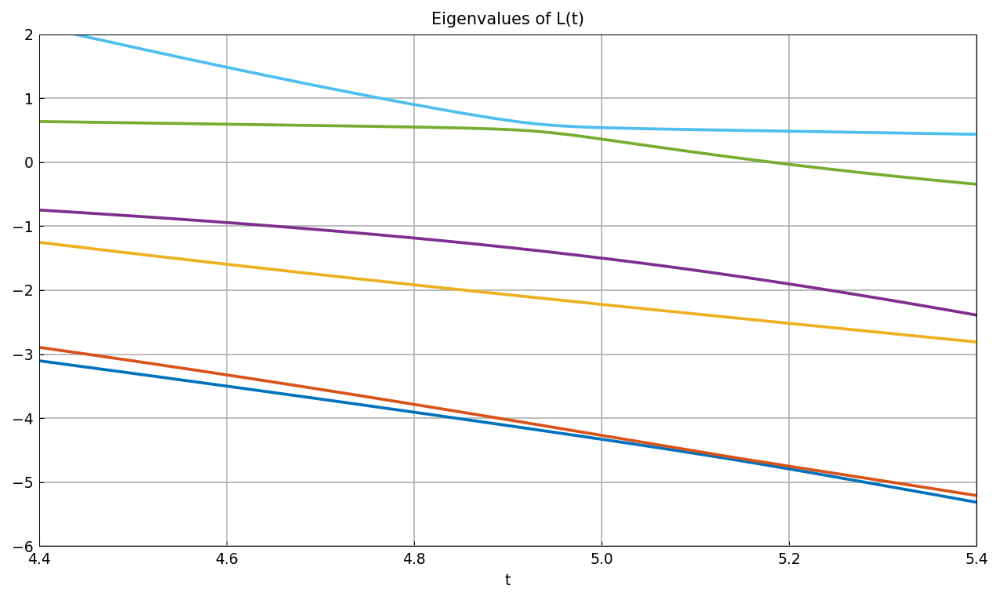

# Avoided crossings for ODE eigenvalues

*Abi Gopal and Nick Trefethen, March 2017*

[Original MATLAB Chebfun example](https://www.chebfun.org/examples/ode-eig/LevelRepulsionODE.html)

(Chebfun example ode-eig/LevelRepulsionODE.m)

For a real self-adjoint *fourth-order* differential operator $L(t)$
depending on a parameter, multiple eigenvalues are possible but
non-generic — eigenvalue curves approach and repel. (Second-order
operators are ruled out by Sturm–Liouville theory, just as tridiagonal
matrices are.) The example's generic operator is

$$ L(t)u = u'''' + t\,u'' + e^{x/20}u, \qquad
u(\pm5) = u'(\pm5) = 0, $$

whose first six eigenvalues are tracked as chebfuns in
$t \in [4.4, 5.4]$ with `eps = 1e-4`:



Two pairs of curves nearly cross, but not quite — with the constant
coefficient $1$ instead of $e^{x/20}$ the eigenfunctions split into
even and odd and the curves *would* cross; the slightly variable
coefficient breaks that symmetry.

```text
time_in_seconds =
  174.746677
```

(MATLAB publishes `33.36`; per-eigenvalue values agree — at $t = 4.9$
our six match MATLAB R2025b to $8\times10^{-7}$ or better.)

> **A selection subtlety.** MATLAB's `eigs(L)` default does *not*
> return the six smallest-magnitude eigenvalues: at $t = 5.4$ it keeps
> the near-degenerate pair at $-5.31, -5.21$ while excluding a mode at
> $+4.68$ of smaller magnitude. A pure smallest-magnitude selection
> swaps set membership at $t \approx 5.31$, which puts a jump — and
> global interpolation ringing — into every $E_k(t)$. The replica
> emulates MATLAB by computing eight eigenvalues per $t$ and keeping
> the six with smallest real part.

---

*Replica script: [`examples/ode-eig/levelrepulsionode_replica.py`](https://github.com/ma-gilles/chebfunjax/blob/main/examples/ode-eig/levelrepulsionode_replica.py).
Original example copyright by The University of Oxford and The Chebfun
Developers.*
