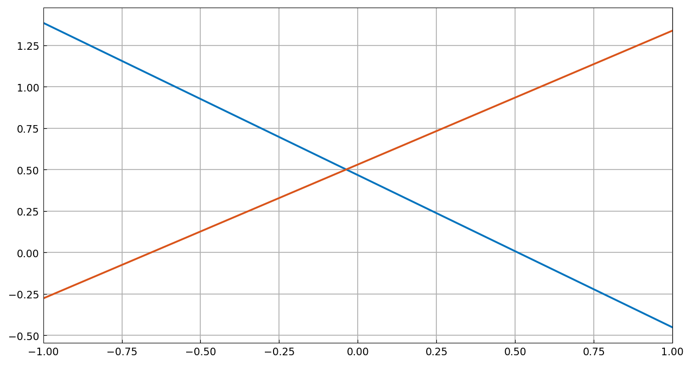
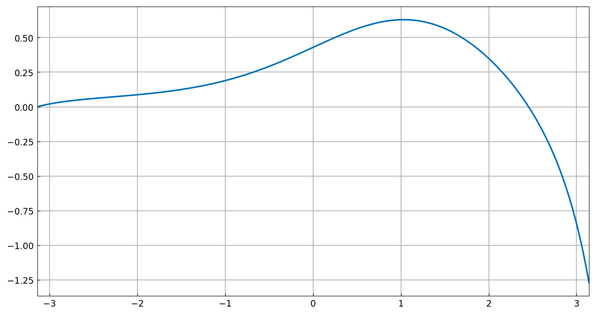
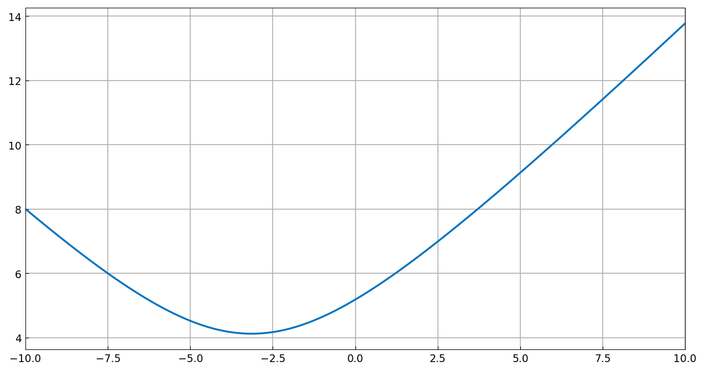
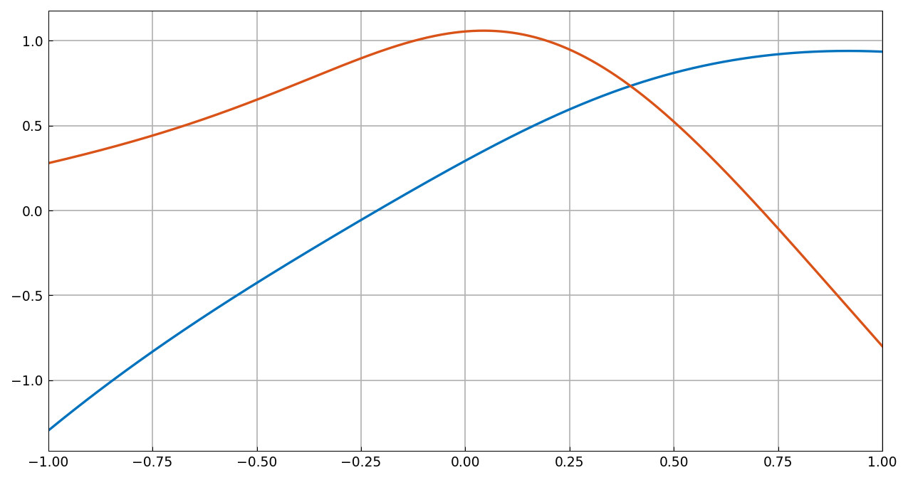

# The nullspace of a linear operator

*Nick Hale and Stefan Guettel, December 2011*

[Original MATLAB Chebfun example](https://www.chebfun.org/examples/ode-eig/NullSpace.html)

(Chebfun example ode-eig/NullSpace.m)

## 1. Simple example

For $(Lu)(x) = u''(x)$ on $[-1,1]$ the nullspace is spanned by $1$
and $x$ — `norm(L(v))` returns `0.0000e+00` on that pair. The `null`
method computes an orthonormal basis:

```python
L = Chebop(lambda u: u.diff(2))
V = L.null()
```



```text
ans =
[[ 1.0000000e+00 -7.3985053e-17]
 [-7.3985053e-17  1.0000000e+00]]
ans =
     3.1319e-11
```

$V^TV = I$ and $LV \approx 0$ as required. `V` doesn't correspond
directly to $\{1, x\}$ — there is freedom in how the basis is
orthogonalised — but the `subspace` angle between the two spans is

```text
ans =
     8.0035e-13
```

## 2. Incomplete boundary conditions

$$ Lu = u'' + 0.1x(1-x^2)u' + \sin(x)u, \quad x\in[-\pi,\pi] $$

has a rank-2 nullspace ($V^TV = I$, $\|L V\| = 8.5\times10^{-11}$).
Imposing one Dirichlet condition at the left removes one degree of
freedom:



```text
ans =
     6.8999e-11
v(-pi) =
     3.5250e-15
```

## 3. An application

Which inhomogeneous right Dirichlet condition minimizes the 2-norm of
the solution of $Lu = 1$ with $u(-\pi) = 0$? Solve once with
$u(\pi) = 0$ and add multiples of the null-function:



```text
minE =
   4.121950420626803
c_star =
   -3.143771420943322
bc_star =
   3.989391428262367
```

MATLAB publishes `minE = 4.121950420615883` (10-digit agreement),
`c_star = 3.143771420957320` (same magnitude to 10 digits — the sign
reflects the opposite sign convention of our null-function, and
$u^* = u + c^* v$ is identical), and `bc_star = 3.989391428267542`
(11 digits).

## 4. Exotic constraints

The third-order operator $Lu = 0.1u''' + \sin(x)u'' + u$ with the
integral side condition $\int u = u(0)$ has a rank-2 nullspace; `null`
has no problems:



```text
ans (sum(V) - V(0,:)) =
['-1.793e-12', '1.446e-12']
ans (norm(L(V),1)) =
     3.3090e-08
```

MATLAB gets `~1e-15` and `9.37e-09`: like MATLAB, the side condition
is satisfied to near machine precision (constraints are eliminated
exactly before the SVD) while the ODE residual carries the
discretization error. The basis functions differ from the published
ones by an orthogonal rotation, as the example itself notes they may.

---

*Replica script: [`examples/ode-eig/nullspace_replica.py`](https://github.com/ma-gilles/chebfunjax/blob/main/examples/ode-eig/nullspace_replica.py).
Original example copyright by The University of Oxford and The Chebfun
Developers.*
