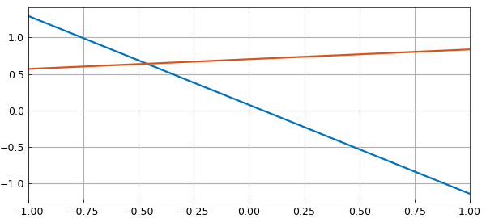
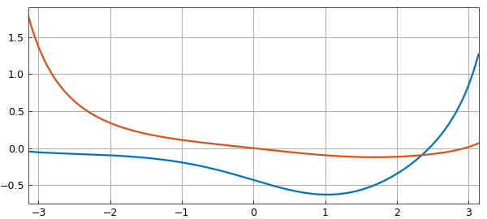
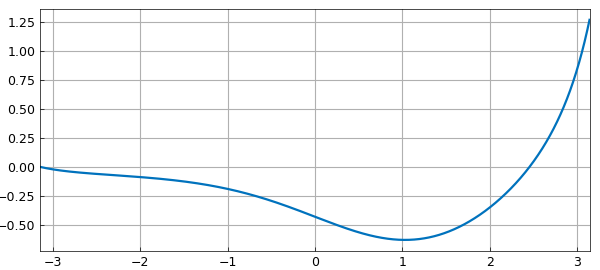
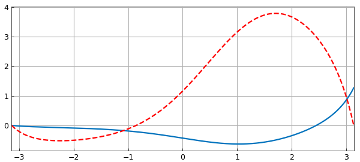
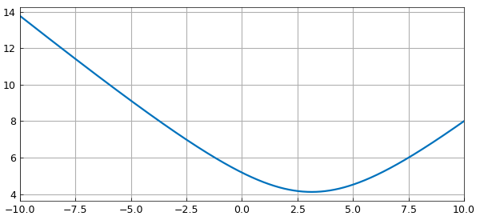
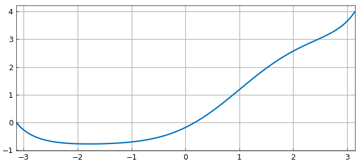
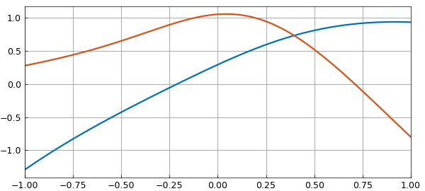

# The nullspace of a linear operator

*Nick Hale and Stefan Guettel, December 2011*

[Original MATLAB Chebfun example](https://www.chebfun.org/examples/ode-eig/NullSpace.html)

Python translation: [`examples/ode-eig/nullspace.py`](https://github.com/ma-gilles/chebfunjax/blob/main/examples/ode-eig/nullspace.py)

We've recently introduced some new functionality in Chebfun for computing the nullspace of differential operators. Let's explore this with a couple of simple examples.

## 1. Simple example #1

Let's start as simply as we can, and take

$$ (Lu)(x) := u''(x), \quad x\in [-1, 1]. $$

```matlab
L = chebop(@(u) diff(u, 2));
```

Clearly the nullspace of this operator -- that is, the space of functions $v$ for which $L(v)=0$ -- is spanned the two functions

```matlab
v = [1, chebfun('x')];
norm(L(v))
```

```text
ans =
     0.0000e+00
<Chebfun [-1.0, 1.0], length 2>
<Chebfun [-1.0, 1.0], length 3>
```

Supposing we didn't know this, we could compute a basis for the nullspace with the `null` method:

```matlab
LW = 'LineWidth'; lw = 1.6;
V = null(L)
plot(V, LW, lw)
V'*V
norm(L(V))
```

```text
(no matching output)
```



where we find that $V^T V = I$ and $LV \approx 0$ as required.

Clearly `V` doesn't correspond directly to $1$ and $x$, since there is some freedom in how we orthogonalise the basis. However, we can check that `V` and ${1, x}$ correspond to the same spaces by computing the angle between the spaces with the `subspace` command.

```matlab
subspace(v, V)
```

```text
ans =
[[1.00000000e+00 5.94348087e-17]
 [5.94348087e-17 1.00000000e+00]]
```

## 2. Incomplete boundary conditions

Now let's consider the more complicated 2nd-order operator

$$ Lu = u'' + 0.1x(1-x^2)u' + \sin(x)u, \quad x\in [-\pi, \pi]. \qquad (*) $$

```matlab
dom = [-pi, pi];
L = chebop(@(x, u) diff(u, 2) + .1*x.*(1-x.^2).*diff(u) + sin(x).*u, dom);
```

As before, it has a nullspace of rank 2.

```matlab
V = null(L)
plot(V, LW, lw)
V'*V
norm(L(V))
```

```text
(no matching output)
```



However, now suppose we impose one boundary condition, say, a Dirichlet condition at the left. This removes one degree of freedom, and we are left with a rank 1 nullspace.

```matlab
L.lbc = 0;
L.rbc = [];
v = null(L)
plot(v, LW, lw), shg
v'*v
norm(L(v))
```

```text
(no matching output)
```



Clearly this null vector must satisfy the given condition $v(-\pi) = 0.$

```matlab
v(-pi)
```

```text
ans =
     1.6832e-13
ans (subspace angle) =
     2.4947e-14
<Chebfun [-3.141592653589793, 3.141592653589793], length 41>
<Chebfun [-3.141592653589793, 3.141592653589793], length 42>
ans =
[[1.00000000e+00 5.97931711e-17]
 [5.97931711e-17 1.00000000e+00]]
ans =
     1.2700e-10
<Chebfun [-3.141592653589793, 3.141592653589793], length 41>
ans = [[1.]]
ans =
     1.3209e-10
v(-pi) =
     0.0000e+00
```

## 3. An application

Where might these ideas be useful? Well, suppose we were interested in equation $(*)$ with a homogeneous Dirichlet condition at the left, and wanted to know what inhomogeneous Dirichlet condition gave the minimal 2-norm of the solution to $Lu = 1$. Rather than solving the linear system for a number of different boundary conditions (which would be computationally expensive) we could simply solve for one, say again a homogeneous Dirichlet condition,

```matlab
L.rbc = 0;
u = L\1;
hold on, plot(u, '--r', LW, lw), hold off
```



and compute the rest by adding a scalar multiple of the null-function $v$.

```matlab
E = chebfun(@(c) norm(u + c*v, 2), [-10, 10], 'vectorize', 'splitting', 'on');
plot(E,LW,lw)
```



We compute the 2-norm as a chebfun in the unknown variable $c$, which we can then minimise to obtain the minimal energy solution

```matlab
[minE, c_star] = min(E)
u_star = u + c_star*v
plot(u_star,LW,lw)
```

```text
minE =
   4.121950420615068
c_star =
   3.143771420955451
<Chebfun [-3.141592653589793, 3.141592653589793], length 42>
```



So the condition we require is that $u(\pi)$ = `bc_star`, where

```matlab
bc_star = u_star(pi)
```

```text
bc_star =
   3.989391428265411
<Chebfun [-1.0, 1.0], length 29>
<Chebfun [-1.0, 1.0], length 32>
```

## 4. Exotic constraints

The Chebfun `null` function can also handle the more exotic types of boundary conditions that can be imposed in Chebfun (see [1]). For example, suppose we wish to compute the nullspace of the 3rd-order piecewise-smoooth ODE

$$ Lu := 0.1u''' + \sin(x)u'' + u, \quad x\in[-1,1] $$

with the 'boundary' condition

$$ \int(u) = u(0). $$

```matlab
dom = [-1, 1];
L = chebop(@(x, u) .1*diff(u, 3) + sin(x).*diff(u, 2) + u, dom);
L.bc = @(x, u) sum(u) - u(0);
```

Here `null` has no problems!

```matlab
V = null(L)
plot(V, LW, lw), shg
V'*V
```

```text
(no matching output)
```



```matlab
sum(V) - V(0,:)
norm(L(V), 1)
```

```text
ans =
[[ 1.00000000e+00 -1.64312379e-16]
 [-1.64312379e-16  1.00000000e+00]]
ans (sum(V) - V(0,:)) =
['-7.938e-14', '1.243e-13']
ans (norm(L(V),1)) =
     2.0767e-08
```

## 5. References

1. Chebfun Example [ode-linear/NonstandardBCs](../ode-linear/NonstandardBCs.md)

---

*Translated with [chebfunjax](https://github.com/ma-gilles/chebfunjax); prose and MATLAB code from the original example, copyright The University of Oxford and The Chebfun Developers.  Printed outputs and figures are chebfunjax's.*
