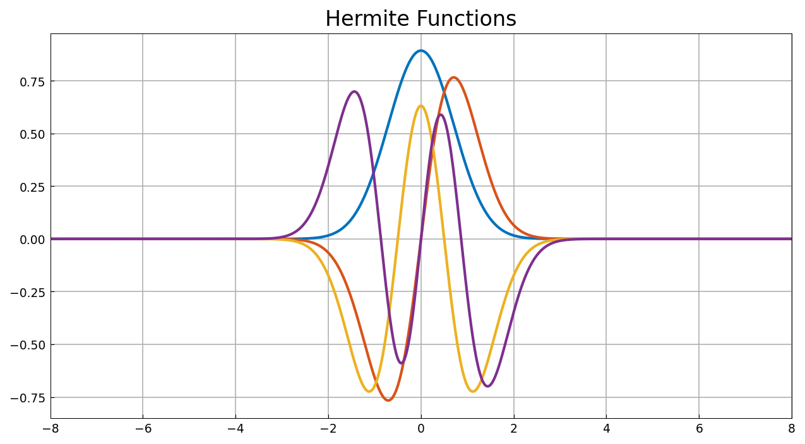
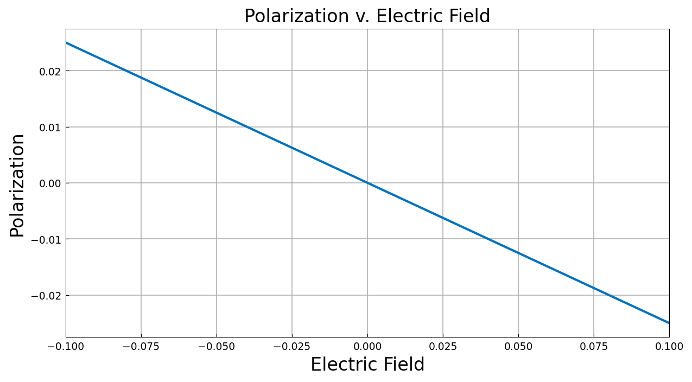

# The nonlinear optical response of a simple molecule

*Jared L. Aurentz and John S. Minor, September 2014*

[Original MATLAB Chebfun example](https://www.chebfun.org/examples/ode-eig/OpticalResponse.html)

(Chebfun example ode-eig/OpticalResponse.m)

The optical response of a material measures how the molecular
polarization $P$ changes with an applied electric field $E$:

$$ P(E) = P_0 + \alpha E + \beta E^2 + \gamma E^3 + \cdots $$

With the field included, the Hamiltonian of an electron bound by a
quadratic potential is

$$ H(E) = -\tfrac12 \frac{\partial^2}{\partial x^2} + 2x^2 + Ex, $$

and the polarization is computed from the ground state,

$$ P(E) = \frac{\int x\,|\psi_1(E,x)|^2\,dx}{\int |\psi_1(E,x)|^2\,dx}. $$

## The quantum harmonic oscillator

The solutions at $E = 0$ are the Hermite functions:

```python
H = lambda E: ...  # Chebop -0.5 u'' + 2x^2 u + E x u, Dirichlet on [-8, 8]
lam, PSI = H(0.0).eigs(k=4, sigma="SR", return_eigenfunctions=True)
```



## Polarization as a chebfun in the field

`polarization(E)` — one `eigs` ground-state solve per sample — is
handed to the chebfun constructor over $E \in [-0.1, 0.1]$ with
`eps=1e-10`, exactly as the MATLAB example does:



Differentiating at $E = 0$ gives the response coefficients:

```text
alpha =
   -0.250000000049570
beta =
   0.000000000000000
gamma =
   0.000000000000000
```

MATLAB publishes `alpha = -0.249999999934894`, `beta = 0`, `gamma = 0`
— both runs sit $\sim\!\!5\times10^{-11}$ from the analytic
$\alpha = -\tfrac14$, the accuracy class set by the `eps=1e-10`
construction tolerance, and both higher coefficients vanish
identically.

---

*Replica script: [`examples/ode-eig/opticalresponse_replica.py`](https://github.com/ma-gilles/chebfunjax/blob/main/examples/ode-eig/opticalresponse_replica.py).
Original example copyright by The University of Oxford and The Chebfun
Developers.*
