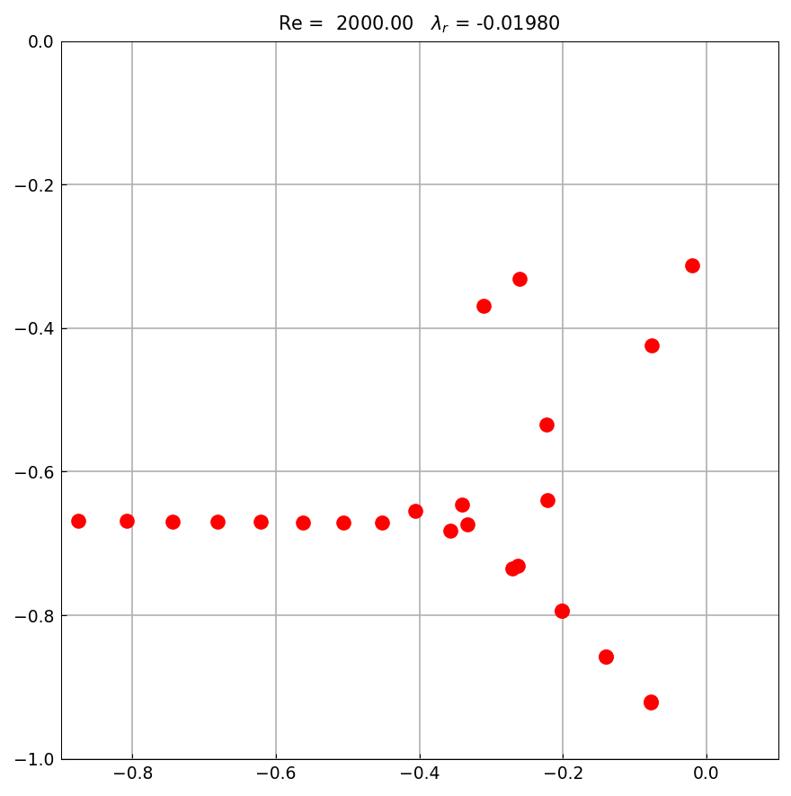
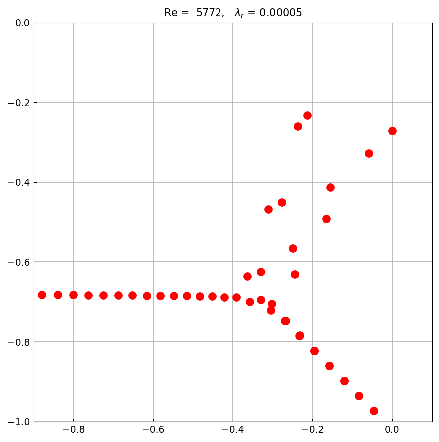

# Orr-Sommerfeld eigenvalues

*Toby Driscoll and Nick Trefethen, October 2010*

[Original MATLAB Chebfun example](https://www.chebfun.org/examples/ode-eig/OrrSommerfeld.html)

(Chebfun example ode-eig/OrrSommerfeld.m)

The Orr–Sommerfeld operator maps infinitesimal perturbations of
laminar channel flow to their growth rates; the flow is classically
stable if all eigenvalues lie in the left half-plane. The formulation
is a fourth-order complex generalized eigenvalue problem
$A u = \lambda B u$ with clamped conditions $u = u' = 0$ at both
walls.

## Re = 2000

```python
A.lbc = [0, 0]; A.rbc = [0, 0]        # clamped, as MATLAB's [0; 0]
V, e = A.eigs_generalized(B, k=50, n=140, sort="LR")
```



The classic Y-shaped branch structure, with
$\lambda_r = -0.01980$. The published 2010 title shows $-0.01981$;
MATLAB Chebfun R2025b today computes $-0.0197990279$ (ours:
$-0.0197987$), which rounds to $-0.01980$ — the published last digit
is a 2010-era discretization artifact.

## The critical Reynolds number

At $Re = 5772.22$, $\alpha = 1.02$, an eigenvalue first crosses into
the right half-plane:



```text
lambda_r = 0.0000517
```

MATLAB R2025b: `0.0000516160` (published title: `0.00006`) — 3-digit
agreement on a $5\times10^{-5}$ quantity.

> **A faithful quirk.** The original script defines
> `B.op = diff(u,2) - alph^2*u` once with $\alpha = 1$ and does *not*
> update it when $\alpha$ becomes 1.02 for the critical case. This
> replica reproduces that exactly. With a matched-$\alpha$ $B$, both
> MATLAB and chebfunjax place the rightmost eigenvalue at
> $\sim\!10^{-7}$ instead of $+5\times10^{-5}$.

---

*Replica script: [`examples/ode-eig/orrsommerfeld_replica.py`](https://github.com/ma-gilles/chebfunjax/blob/main/examples/ode-eig/orrsommerfeld_replica.py).
Original example copyright by The University of Oxford and The Chebfun
Developers.*
