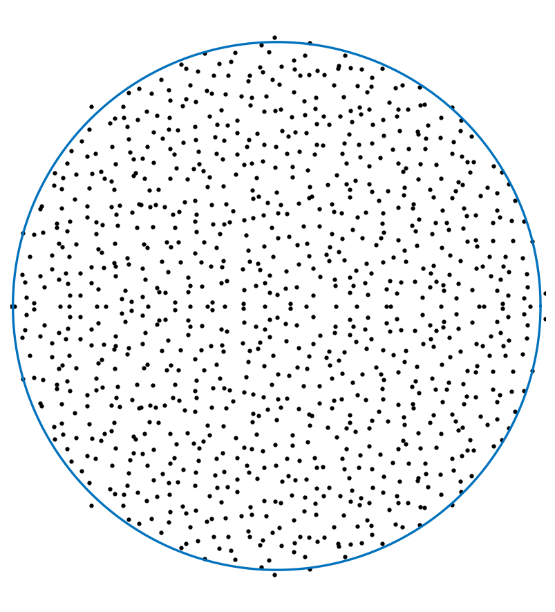
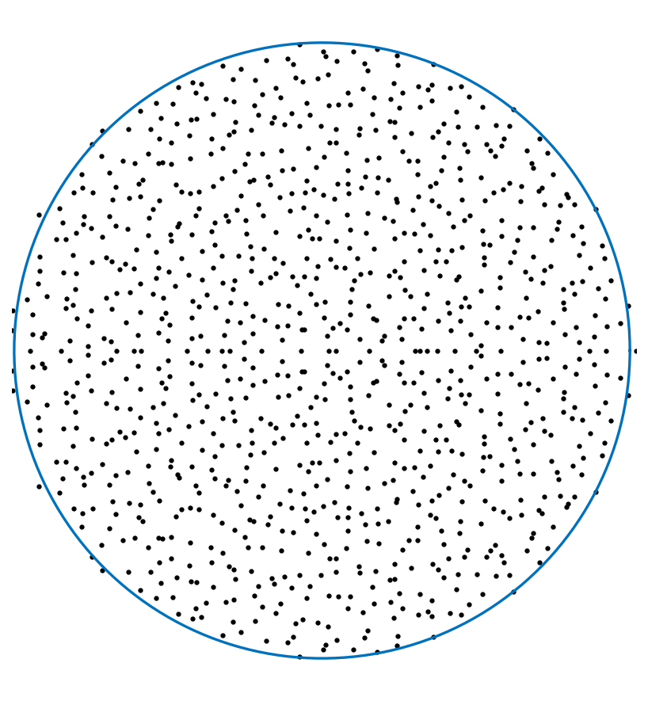
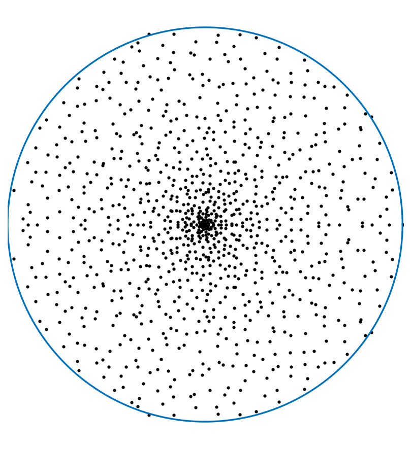
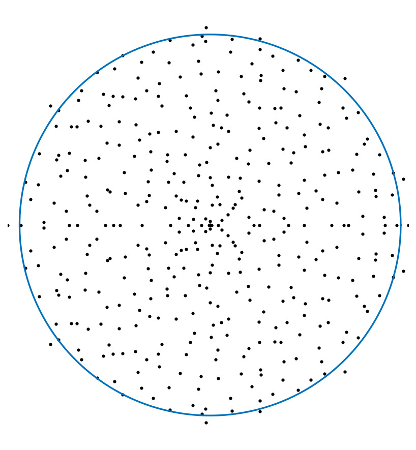
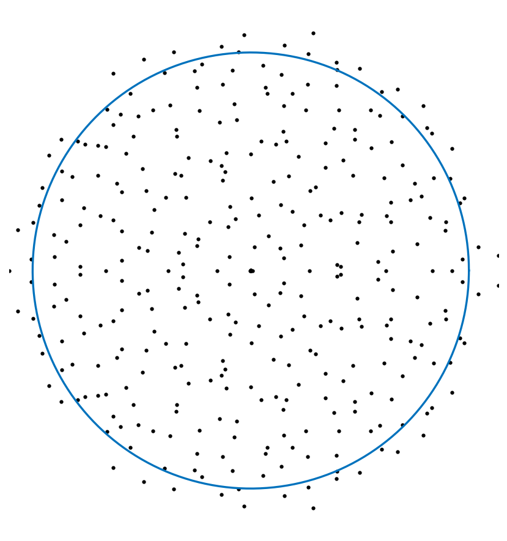

# Eigenvalues of random operators

*Yuji Nakatsukasa, April 2017*

[Original MATLAB Chebfun example](https://www.chebfun.org/examples/ode-eig/Randfuneig.html)

(Chebfun example ode-eig/Randfuneig.m)

*(Random draws use numpy's generator — MATLAB's randn stream cannot be
reproduced, and these are statistical illustrations: each figure is one
sample of the same law as the published one.)*

## 1. Eigenvalues of random matrices

The circular law: eigenvalues of an $n \times n$ Gaussian random
matrix scaled by $1/\sqrt{n}$ fill the unit disk uniformly.



## 2. Eigenvalues of random low-rank matrices

For $B^T\!A$ with tall skinny random $A, B$ (aspect ratio 10), the
nonzero eigenvalues again appear uniform on the disk — asymptotically
the density at radius $r$ is $g(r,k) = k/\sqrt{(1-k)^2+4kr^2}$ with
$k = m/n$, which tends to $1$ as $k \to \infty$:



## 3. Product of two square random matrices

With $m = n$ the same formula predicts marked clustering near the
origin:



## 4. A Fredholm operator with a random kernel

The continuous analogue: eigenvalues of the Fredholm integral operator
whose kernel is a random bivariate function from `randnfun2`
(`eig(chebfun2)` computes the nonzero spectrum through the identity
$\mathrm{eig}(AB) = \mathrm{eig}(BA)$ on the CDR factors):

```text
Number of nonzero eigenvalues: 416
```

(published: 484 — sample-dependent.)



Changing the coefficient support from a disc (2-norm bound) to a
square (max-norm bound) gives a more convincingly uniform
distribution, aside from some clustering along the real axis — an
open problem to explain:

```text
Number of nonzero eigenvalues: 348
```

(published: 401.)



---

*Replica script: [`examples/ode-eig/randfuneig_replica.py`](https://github.com/ma-gilles/chebfunjax/blob/main/examples/ode-eig/randfuneig_replica.py).
Original example copyright by The University of Oxford and The Chebfun
Developers.*
