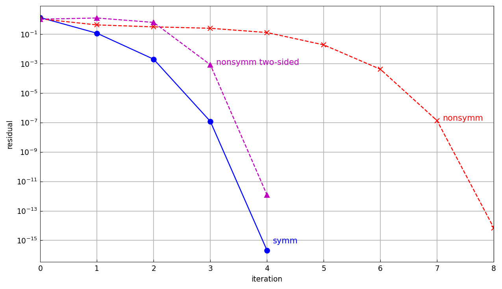
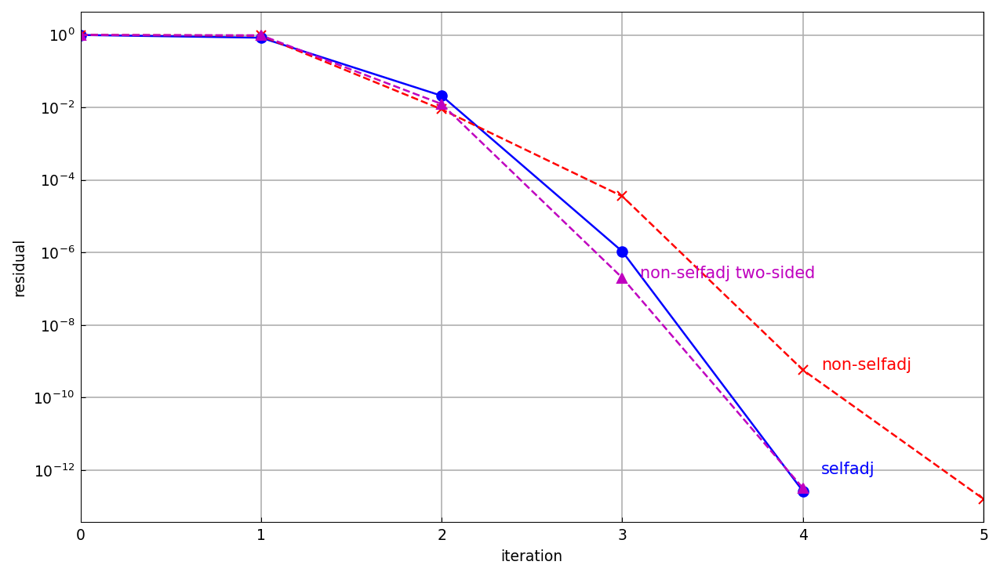

# Rayleigh quotient iteration for an operator

*Nick Hale and Yuji Nakatsukasa, March 2017 (revised July 2019)*

[Original MATLAB Chebfun example](https://www.chebfun.org/examples/ode-eig/RayleighQuotient.html)

(Chebfun example ode-eig/RayleighQuotient.m)

Rayleigh quotient iteration — shift-invert power steps with the
Rayleigh quotient as the shift — converges cubically for symmetric
problems and quadratically otherwise; the two-sided variant (using the
adjoint) restores cubic convergence. All random data (matrices and
`randnfun` initial guesses) is MATLAB's `rng(10)` stream, dumped and
inlined, so the printed iterates match the published ones digit for
digit.

## Matrices

Symmetric $10\times10$ (cubic — converged in 4 steps):

```text
lam:
   3.290604172428599
   3.147338430697157
   3.125420718374709
   3.125374676595397
   3.125374676595200
```

*(Identical to the published sequence through the 15th digit.)* The
nonsymmetric case takes 8 quadratic steps to
`1.697010850611261 - 0.550367641360019i`, and the two-sided iteration
recovers cubic convergence to `-0.087102840853371` in 4 — every
iterate and every residual matching the published output.



## Chebops

For $Au = -u''$ with Dirichlet conditions on $[-\pi/2,\pi/2]$, the RQI
code is almost identical — `(A - lam*I)\u` becomes a chebop solve:

```text
lam:
   3.800000000000000
   4.296285626613152
   4.000206922868336
   3.999999999998058
   3.999999999999980
```

(published: `4.296285626621022, 4.000206922867877,
3.999999999996782, 4` — 9–12 digits per iterate). The
non-selfadjoint $Au = -u'' + u' + u$ converges quadratically to
$\lambda = 2.25$ exactly as published, and the two-sided iteration
with `adjoint(A)` restores cubic convergence:

```text
lam:
   1.000000000000000
   2.366600934050413
   2.250150291473662
   2.250000000000312
   2.249999999999999
```

(published: `2.366600934214430, 2.250150291437780,
2.249999999999692, 2.249999999999999`.)



---

*Replica script: [`examples/ode-eig/rayleighquotient_replica.py`](https://github.com/ma-gilles/chebfunjax/blob/main/examples/ode-eig/rayleighquotient_replica.py)
(data: `_rayleighquotient_data.py`).
Original example copyright by The University of Oxford and The Chebfun
Developers.*
