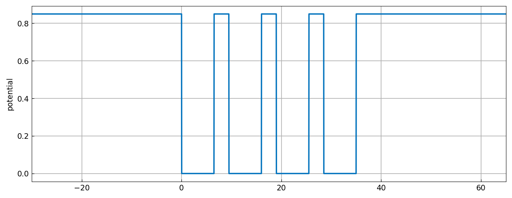
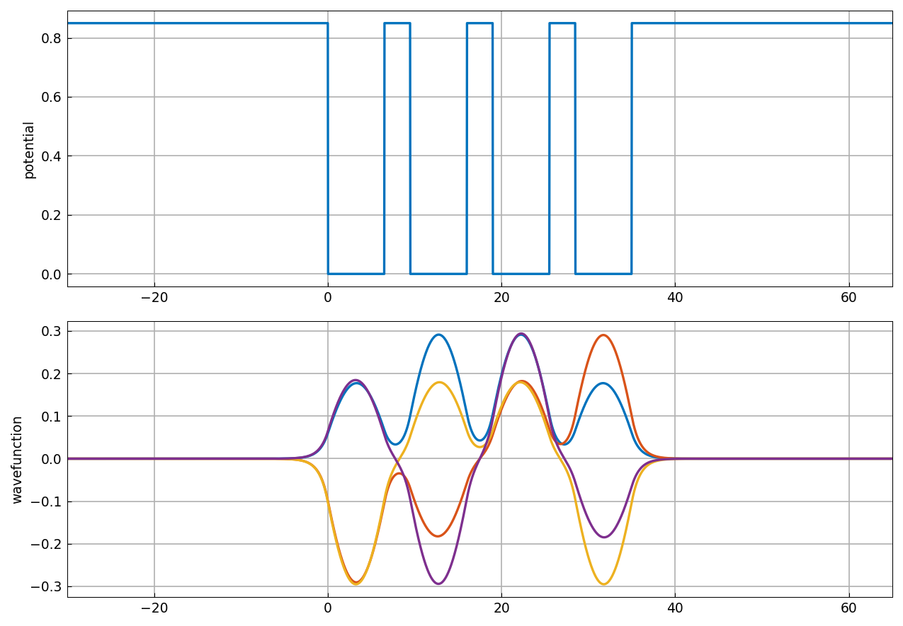
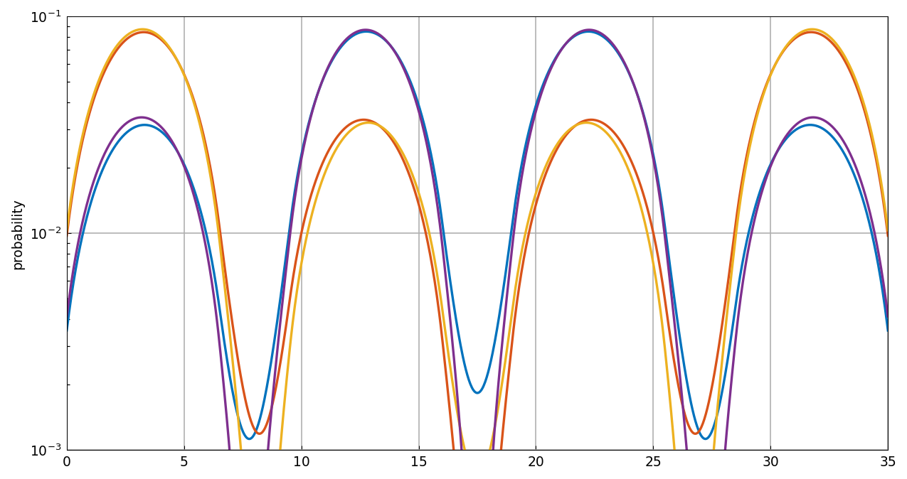
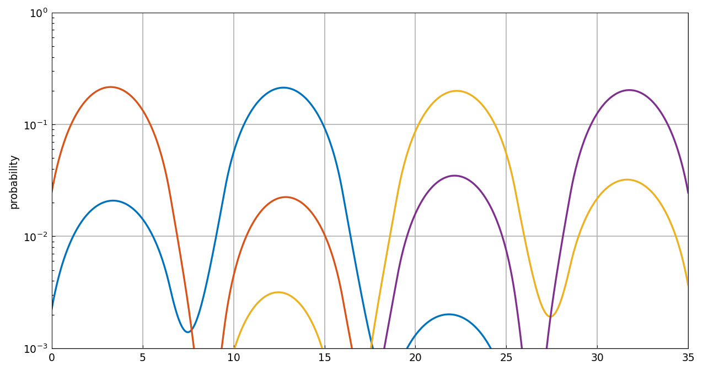

# Model of a quantum dot array for solar energy

*Toby Driscoll, May 2011*

[Original MATLAB Chebfun example](https://www.chebfun.org/examples/ode-eig/SolarQDA.html)

(Chebfun example ode-eig/SolarQDA.m)

A quantum dot array modeled as a 1D Schrödinger eigenvalue problem,

$$ -\frac{\hbar^2}{2m(x)}\psi'' + U(x)\psi = E\psi, $$

with a piecewise-constant four-well potential $U$ *and* a
piecewise-constant effective mass $m$ (InAs / GaAs):



The four lowest allowed energies and wavefunctions (`eigs(N, 4, 0)` —
piecewise collocation over the ten subintervals):

```text
energies =
   0.237600942561337
   0.241689420342724
   0.246929983906837
   0.251332910854779
```

MATLAB publishes `0.237600942577894, 0.241689420351228,
0.246929983909500, 0.251332910862716` — 10–11 digit agreement.



The probability shows all four modes extending significantly over all
wells — delocalization, meaning the device can conduct electricity:



## Imperfect fabrication

Perturbing the well depths by 2% variance (MATLAB's `rng(1138)`
values, inlined) destroys the delocalization — the wavefunctions now
extend over just one or two wells:

```text
energies =
   0.218256274765264
   0.232110036468575
   0.256879388724144
   0.269586365142145
```

(MATLAB: `0.218256274770184, 0.232110036472121, 0.256879388748077,
0.269586365175261`.)



---

*Replica script: [`examples/ode-eig/solarqda_replica.py`](https://github.com/ma-gilles/chebfunjax/blob/main/examples/ode-eig/solarqda_replica.py).
Original example copyright by The University of Oxford and The Chebfun
Developers.*
