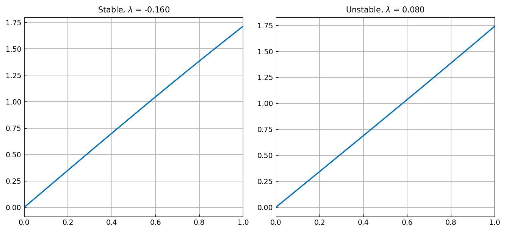
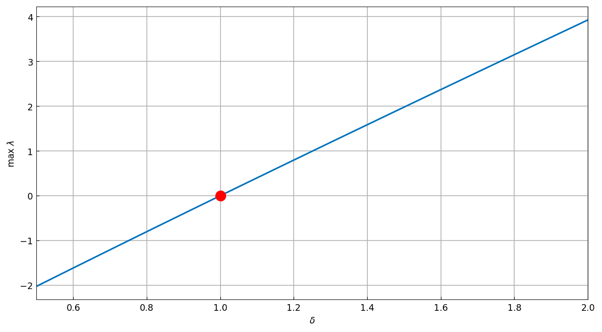

# Stability of a thermoelastic rod

*Toby Driscoll, November 2011*

[Original MATLAB Chebfun example](https://www.chebfun.org/examples/ode-eig/ThermoelasticRod.html)

(Chebfun example ode-eig/ThermoelasticRod.m)

A thermoelastic rod is fixed to a wall at one end and may expand to
contact a wall at the other. Barber's boundary condition models the
transition between thermal insulation and perfect contact. The
stability eigenvalue problem is

$$ \phi'' = \lambda\phi, \qquad 0 < x < 1, $$

$$ \phi(0) = 0, \qquad \phi'(1) + \phi(1) = 4\delta \int_0^1 \phi\,dx, $$

whose integral term is just another linear boundary condition from the
Chebfun point of view — `Chebop.eigs` probes the general `.bc`
functional into a constraint row.

## A stable and an unstable case

$\delta = 0.96$ (stable — all eigenvalues negative):

```text
ans =
  -1.234915472723403  (x 1e2)
  -0.626486098334564  (x 1e2)
  -0.251462532660753  (x 1e2)
  -0.001601435701604  (x 1e2)
```

$\delta = 1.02$ (unstable — the top eigenvalue crosses zero):

```text
ans =
  -1.235278901227933  (x 1e2)
  -0.625884455969491  (x 1e2)
  -0.252000055361314  (x 1e2)
   0.000799646113604  (x 1e2)
```

MATLAB publishes `-1.234915472724630, -0.626486098335608,
-0.251462532662759, -0.001601435706946` and `-1.235278901227600,
-0.625884455974818, -0.252000055363520, 0.000799646105231` — 10–11
digit agreement on all eight values.

The least stable / unstable perturbations:



## Locating the transition by rootfinding

Parameterizing the maximum eigenvalue as a chebfun in $\delta$ over
$[0.5, 2]$ with `eps=1e-11` (each sample an `eigs` solve):

```text
stability =
<Chebfun [0.5, 2.0], length 9>
dstar =
   0.999999999134813
```

MATLAB gets length 11 and `dstar = 1.000000000023135`; both runs place
the stability transition at $\delta = 1$ to about $10^{-9}$ — the
accuracy class of the `eps=1e-11` construction.



---

*Replica script: [`examples/ode-eig/thermoelasticrod_replica.py`](https://github.com/ma-gilles/chebfunjax/blob/main/examples/ode-eig/thermoelasticrod_replica.py).
Original example copyright by The University of Oxford and The Chebfun
Developers.*
