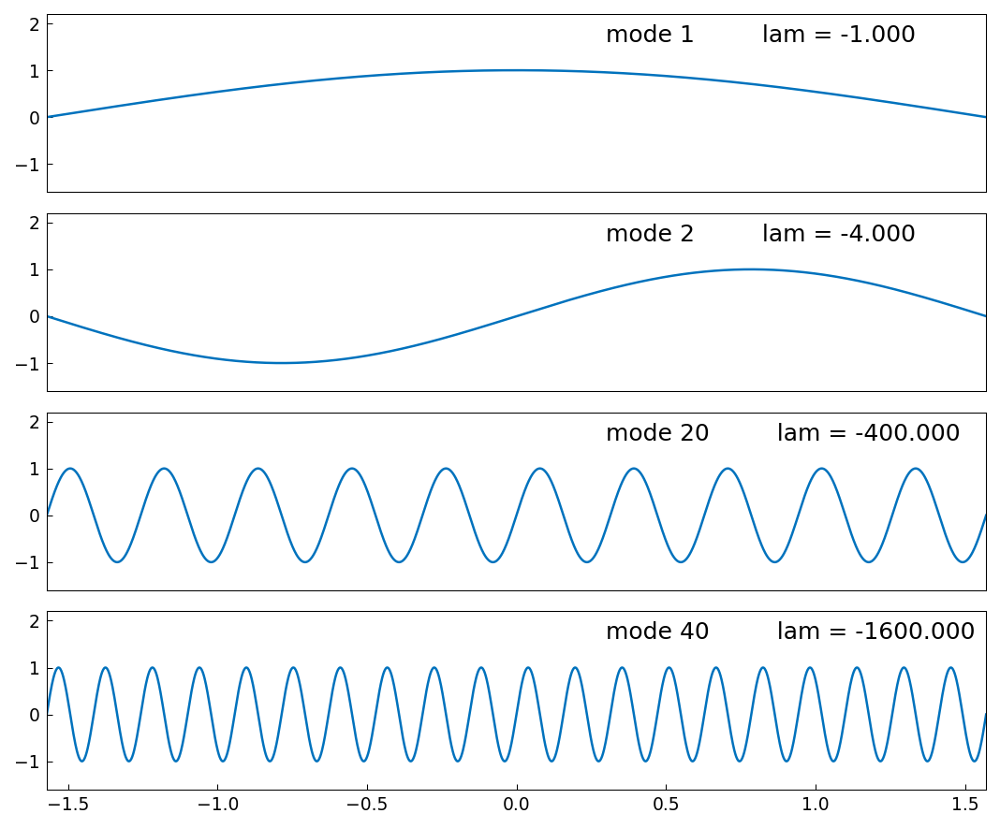
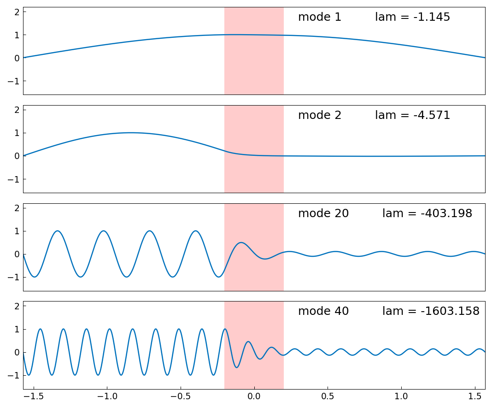

# Wave equation with decay band

*Nick Trefethen, November 2010*

[Original MATLAB Chebfun example](https://www.chebfun.org/examples/ode-eig/WaveDecay.html)

(Chebfun example ode-eig/WaveDecay.m)

Here are eigenmodes $1$, $2$, $20$, $40$ of the wave equation on
$[-\pi/2, \pi/2]$ — eigenvalues $-n^2$ exactly:

Here are the same, but for the wave equation with a decay band,

$$ L u = u'' + \frac{2}{a}\,\chi_{[-a,a]}\,u', \qquad a = 0.2, $$

whose indicator coefficient routes the discretization through the
piecewise collocation branch of `Chebop.eigs`:

Modes that pass through the band are damped and emerge with reduced
amplitude; the eigenvalues shift from $-n^2$ accordingly.

> **Parity.** MATLAB Chebfun R2025b gives $-1.1453886706$,
> $-4.5714257163$, $-403.1975529970$, $-1603.1581753087$ for the four
> displayed modes; we compute $-1.1453886703$, $-4.5714257114$,
> $-403.1975522423$, $-1603.1581757019$ — 8–9 digit agreement, and
> every figure label matches. (An earlier draft of this port
> under-converged mode 20 by $6\times10^{-5}$: the adaptive refinement
> loop kept doubling past the dense-eig roundoff floor, where the
> $(m^2/L)^2$ differentiation-matrix norms amplify machine epsilon and
> the eigenvalues move *apart* again. The loop now detects the
> divergence and keeps the cleaner resolution.)

---

*Replica script: [`examples/ode-eig/wavedecay_replica.py`](https://github.com/ma-gilles/chebfunjax/blob/main/examples/ode-eig/wavedecay_replica.py).
Original example copyright by The University of Oxford and The Chebfun
Developers.*
