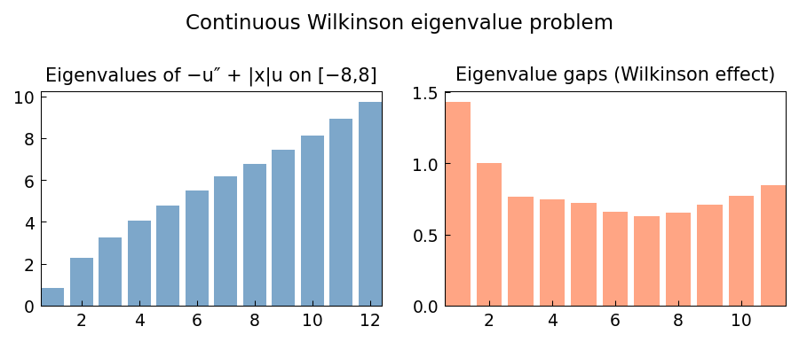

# Continuous analogue of the Wilkinson matrix

*Nick Trefethen, March 2017*

[Chebfun example](https://www.chebfun.org/examples/ode-eig/continuouswilkinson.html)

## Overview

Studies the Sturm-Liouville eigenvalue problem

$$-u'' + |x| u = \lambda u, \quad u(\pm N) = 0$$

which is a continuous version of Wilkinson's tridiagonal matrix.
The eigenvalues near the top come in near-equal pairs, analogous to the
classical matrix case.

```python
from chebfunjax.operators.chebop import Chebop

N_val = 8.0
dom = (-N_val, N_val)
L = Chebop(lambda x, u: -u.diff(2) + jnp.abs(x) * u, domain=dom)
L.lbc = 0.0; L.rbc = 0.0
lams = L.eigs(k=12)
```



