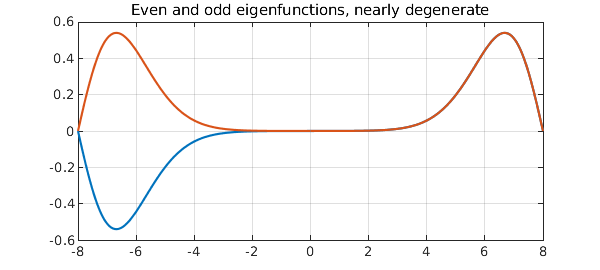
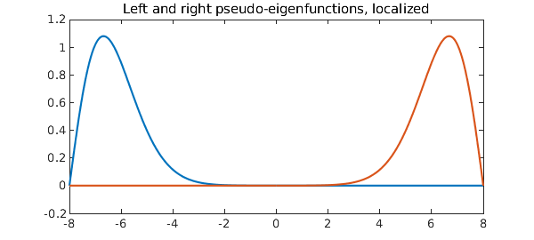

<!-- Generated by scripts/sync_chebfun_examples.py. -->
<!-- Source: https://www.chebfun.org/examples/ode-eig/ContinuousWilkinson.html -->

<h1>Continuous analogue of Wilkinson matrix</h1>
<h2>Nick Trefethen, March 2017 in <a href='../'>ode-eig</a><a href='/examples/ode-eig/ContinuousWilkinson.m'>download</a>&middot;<a href='//github.com/chebfun/examples/blob/master/ode-eig/ContinuousWilkinson.m'>view on GitHub</a></h2>

A classic example of Wilkinson's was the tridiagonal matrix with 1 in the sub- and superdiagonal positions and $N,N-1, \dots, 1,0,1,\dots ,N-1,N$ along the diagonal. The extreme eigenvalues of this matrix are extremely close to one another, as we see even with a choice of $N$ as small as 8:

<pre class="mcode-input">format long
N = 8;
A = diag([N:-1:1 0:N]) + toeplitz([0 1 zeros(1,2*N-1)]);
e = eig(A);
e(end-3:end)</pre>

<pre class="mcode-output">ans =
   7.210678529322860
   7.210678766818167
   8.746194182598282
   8.746194183210452
</pre>

What makes this interesting is that there is a theorem that the eigenvalues of a real symmetric tridiagonal matrix with nonzero subdiagonal entries must be distinct.  What is going on is that the two ends of the matrix are exponentially decoupled.  The top two eigenvectors are even and odd, respectively, but apart from the sign flip are almost identical.

Here is an analogue involving a self-adjoint Sturm-Liouville differential operator, $$ L u = u'' + |x| u, \quad -N \le x \le N , $$ with Dirichlet boundary conditions.  Again, Sturm-Liouville theory tells us the eigenvalues must be distinct, but they are exponentially close to degenerate:

<pre class="mcode-input">L = chebop(@(x,u) diff(u,2) + abs(x)*u, [-N 0 N], 'dirichlet');
[V,D] = eigs(L,4,'LR');
format long
e = diag(D)</pre>

<pre class="mcode-output">e =
   3.912042616399311
   3.912059036621295
   5.661892584504002
   5.661892594767715
</pre>

A plot shows that as with the matrix, we have an even leading eigenfunction and a second eigenfunction that is almost the same except for a sign flip.

<pre class="mcode-input">plot(V(:,3:4)), grid on, shg
title('Even and odd eigenfunctions, nearly degenerate')</pre>

For both our matrix and our differential operator problems, mathematically one eigenmode is even and the next is odd.  However, the real effect going on here is that the two ends of the domain are virtually decoupled.  By taking the sum and the difference of of the two eigenmodes, one gets a true even-odd pair:

<pre class="mcode-input">right = V(:,4) + V(:,3);
left = V(:,4) - V(:,3);
plot([left right])
title('Left and right pseudo-eigenfunctions, localized')</pre>

Let's confirm that these are pseudo-eigenfunctions.  First we confirm that the eigenfunctions are eigenfunctions:

<pre class="mcode-input">v = V(:,4); lambda = e(4); format short
norm( L*v - lambda*v )</pre>

<pre class="mcode-output">ans =
   5.6730e-12
</pre>

Now we do a similar calculation with "left":

<pre class="mcode-input">v = left; lambda = mean(e(3:4));
norm( L*v - lambda*v )</pre>

<pre class="mcode-output">ans =
   7.2576e-09
</pre>

As we say in the pseudospectra business, $v$ is not "near" an eigenfunction, but it is "nearly" an eigenfunction.

        

    

