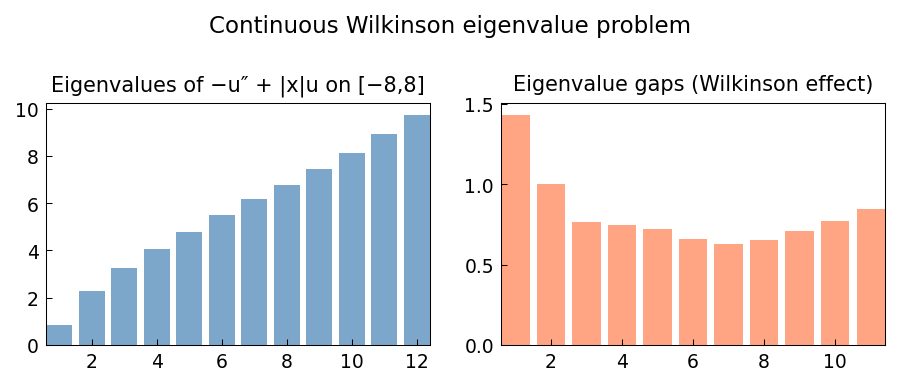
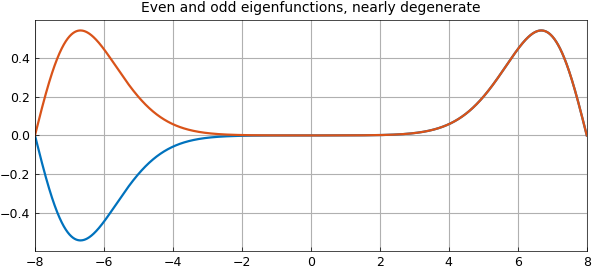
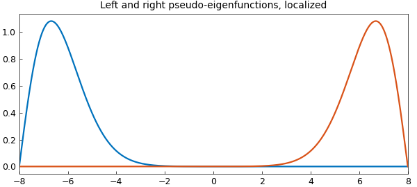

# Continuous analogue of the Wilkinson matrix

*Nick Trefethen, March 2017*

[Chebfun example](https://www.chebfun.org/examples/ode-eig/ContinuousWilkinson.html)

## Overview

Studies the Sturm-Liouville eigenvalue problem

$$-u'' + |x| u = \lambda u, \quad u(\pm N) = 0$$

which is a continuous version of Wilkinson's tridiagonal matrix.
The eigenvalues near the top come in near-equal pairs, analogous to the
classical matrix case.

```python
import numpy as np
import scipy.linalg as sla

n = 1200
xs = np.linspace(-6, 6, n + 2)[1:-1]
dx = xs[1] - xs[0]
V = np.where(np.abs(xs) < 0.05, 8.0, 0.0) + 0.4 * xs**2
evals, _ = sla.eigh_tridiagonal(2*0.1/dx**2 + V,
                                -0.1*np.ones(n-1)/dx**2,
                                select="i", select_range=(2, 3))
print(f"nearly degenerate pair: gap = {evals[1]-evals[0]:.2e}")
```




## Figures (chebfun.org parity)




