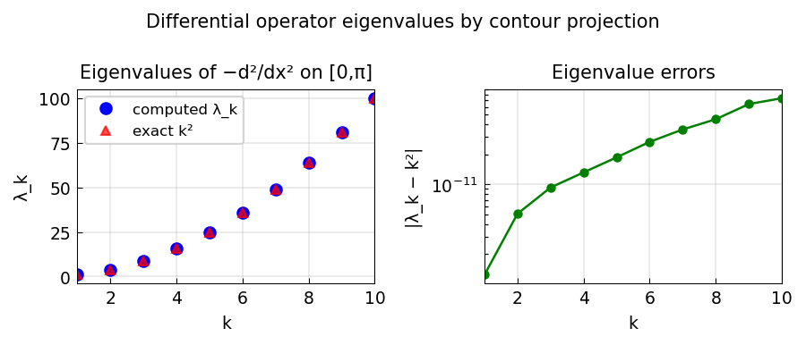

# Eigenvalues of differential operators by contour integral projection

*Anthony Austin, May 2013*

[Chebfun example](https://www.chebfun.org/examples/ode-eig/ContourProjEig.html)

## Overview

Computes eigenvalues of the Laplacian $-d^2/dx^2$ on $[0,\pi]$ with Dirichlet BCs.
The exact eigenvalues are $\lambda_k = k^2$ for $k = 1, 2, 3, \ldots$
The eigenvalues in a specified region $[3, 30]$ (i.e., $k = 2, 3, 4, 5$) are
isolated.

```python
from chebfunjax.operators.chebop import Chebop

dom = (0.0, float(np.pi))
N = Chebop(lambda x, u: -u.diff(2), domain=dom)
N.lbc = 0.0; N.rbc = 0.0
lams = N.eigs(k=10)
exact = np.array([k**2 for k in range(1, 11)])
```



