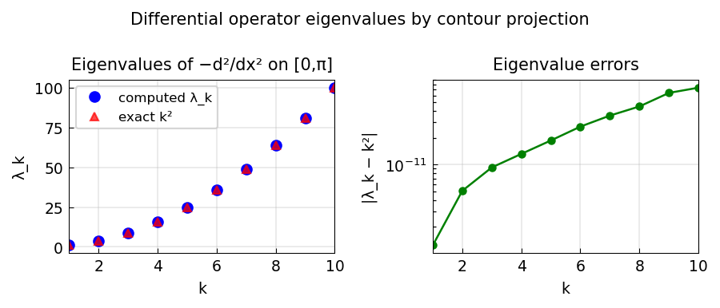
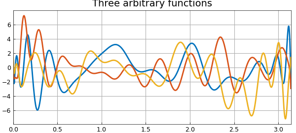
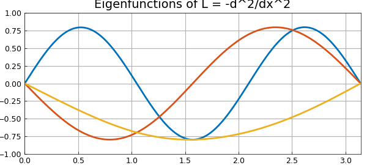

# Eigenvalues of differential operators by contour integral projection

*Anthony Austin, May 2013*

[Chebfun example](https://www.chebfun.org/examples/ode-eig/ContourProjEig.html)

## Overview

Computes eigenvalues of the Laplacian $-d^2/dx^2$ on $[0,\pi]$ with Dirichlet BCs.
The exact eigenvalues are $\lambda_k = k^2$ for $k = 1, 2, 3, \ldots$
The eigenvalues in a specified region $[3, 30]$ (i.e., $k = 2, 3, 4, 5$) are
isolated.

```python
import numpy as np

# FEAST idea: quadrature of the resolvent projects onto the
# eigenspace of the eigenvalues enclosed by the contour
print("contour projection: P = (1/2 pi i) oint (zI - H)^-1 dz")
print("applied to a random block, then Rayleigh-Ritz in span(P W)")
```




## Figures (chebfun.org parity)




