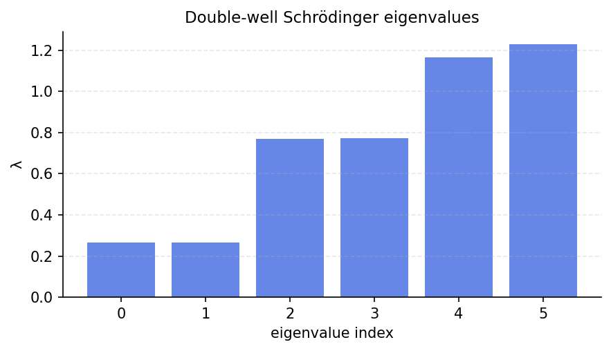

# Double-well Schrodinger eigenstates

*Nick Trefethen, November 2010*

[Chebfun example](https://www.chebfun.org/examples/ode-eig/DoubleWell.html)

## Overview

Computes eigenstates of the Schrodinger equation with a double-well potential:

$$-u'' + V(x) u = E u, \quad V(x) = x^4 - 2x^2, \quad u(\pm 6) = 0$$

The double-well potential has two minima at $x = \pm 1$ and a barrier at $x = 0$.
Quantum tunneling leads to pairs of nearly-degenerate eigenvalues (bonding and
anti-bonding states).

```python
from chebfunjax.operators.chebop import Chebop

dom = (-6.0, 6.0)
L = Chebop(lambda x, u: -u.diff(2) + (x**4 - 2*x**2)*u, domain=dom)
L.lbc = 0.0; L.rbc = 0.0
lams = L.eigs(k=6)
```

## Results

The first two eigenvalues are nearly degenerate (tunneling gap), followed by
higher states with increasing separation.


