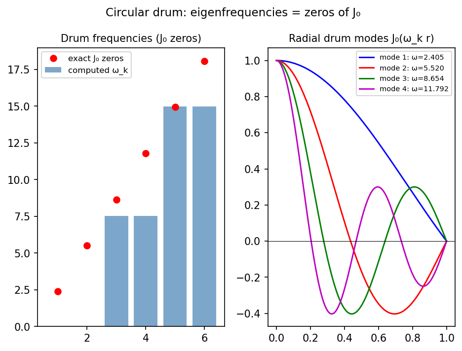

# Frequencies of a circular drum

*Toby Driscoll, November 2010*

[Chebfun example](https://www.chebfun.org/examples/ode-eig/drum.html)

## Overview

The axisymmetric vibrations of a circular drum satisfy the Bessel equation:

$$u''(r) + \frac{u'(r)}{r} = -\omega^2 u(r), \quad u'(0) = 0, \; u(1) = 0$$

The frequencies $\omega_k$ are the positive zeros of the Bessel function $J_0$.

```python
from chebfunjax.operators.chebop import Chebop
from scipy.special import jn_zeros

dom = (0.001, 1.0)  # avoid r=0 singularity
L = Chebop(lambda r, u: -(u.diff(2) + u.diff()/r), domain=dom)
L.lbc = 0.0; L.rbc = 0.0
lams = L.eigs(k=6)
omegas = np.sqrt(np.maximum(np.real(np.array(lams)), 0))
```



