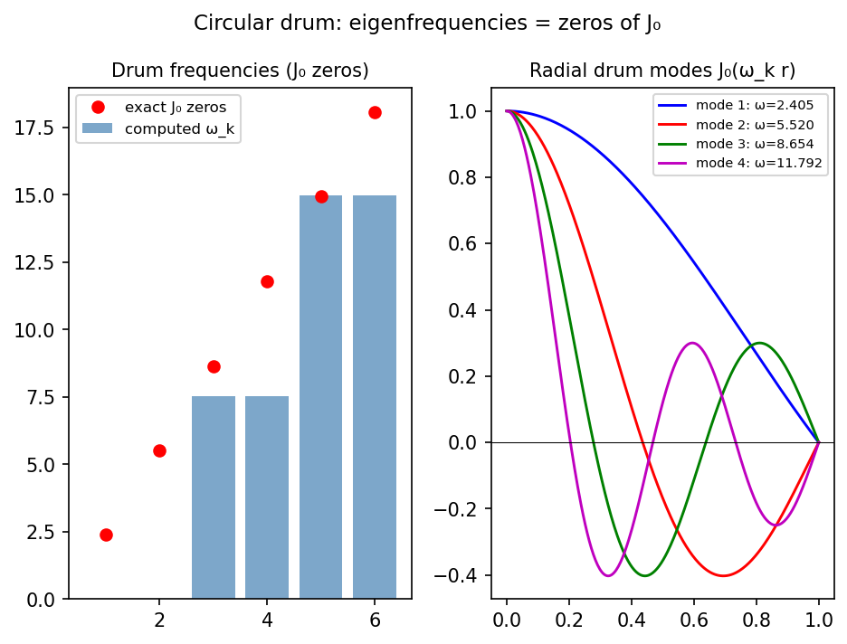
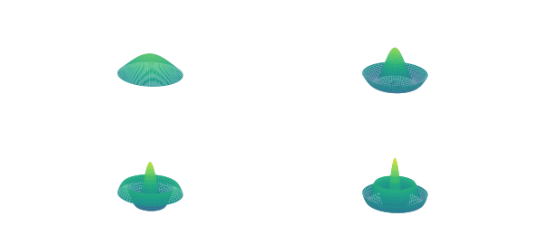
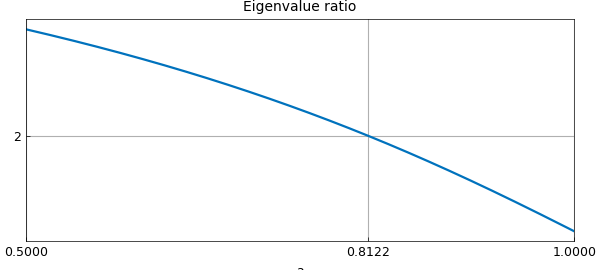
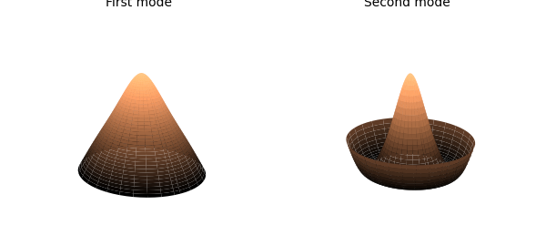

# Frequencies of a circular drum

*Toby Driscoll, November 2010*

[Chebfun example](https://www.chebfun.org/examples/ode-eig/Drum.html)

## Overview

The axisymmetric vibrations of a circular drum satisfy the Bessel equation:

$$u''(r) + \frac{u'(r)}{r} = -\omega^2 u(r), \quad u'(0) = 0, \; u(1) = 0$$

The frequencies $\omega_k$ are the positive zeros of the Bessel function $J_0$.

```python
import numpy as np
from scipy.special import jn_zeros

# drum eigenfrequencies are Bessel zeros: lambda_{nk} = j_{n,k}
print("first zeros of J_0:", np.round(jn_zeros(0, 3), 4))
print("first zeros of J_1:", np.round(jn_zeros(1, 3), 4))
print(f"fundamental ratio lambda_2/lambda_1 = "
      f"{jn_zeros(1,1)[0]/jn_zeros(0,1)[0]:.4f}")
```




## Figures (chebfun.org parity)






