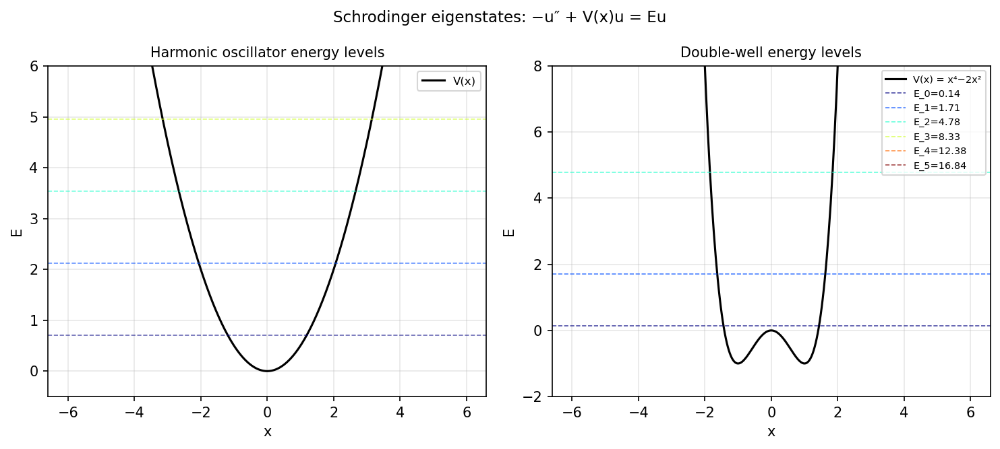

# Eigenstates of the Schrodinger equation

*Nick Trefethen, January 2012*

[Chebfun example](https://www.chebfun.org/examples/ode-eig/eigenstates.html)

## Overview

Computes quantum mechanical eigenstates for the time-independent Schrodinger
equation:

$$-u'' + V(x) u = E u, \quad u(a) = u(b) = 0$$

For the harmonic oscillator $V(x) = x^2/2$, exact eigenvalues are
$E_n = n + 1/2$. The double-well potential $V(x) = x^4 - 2x^2$ is also studied.

```python
from chebfunjax.operators.chebop import Chebop

dom = (-6.0, 6.0)
L_harm = Chebop(lambda x, u: -u.diff(2) + x**2/2.0*u, domain=dom)
L_harm.lbc = 0.0; L_harm.rbc = 0.0
lams = L_harm.eigs(k=6)
# Exact: E_n = n + 0.5
```



