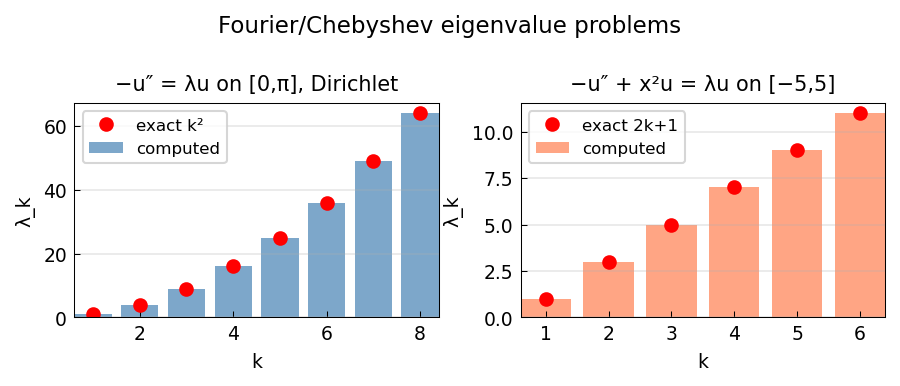

# Periodic ODE eigenvalue problems

*Hadrien Montanelli, December 2014*

[Chebfun example](https://www.chebfun.org/examples/ode-eig/FourierEigs.html)

## Overview

Solves periodic Sturm-Liouville eigenvalue problems using Fourier spectral
collocation:

$$-(p(x) u')' + q(x) u = \lambda w(x) u, \quad u \text{ periodic on } [0, 2\pi]$$

For the pure Laplacian $p = w = 1$, $q = 0$, the eigenvalues are
$0, 1, 1, 4, 4, 9, 9, \ldots$ (the squares of integers, with multiplicity 2).

```python
from chebfunjax.operators.chebop import Chebop

dom = (0.0, 2.0 * np.pi)
L = Chebop(lambda x, u: -u.diff(2), domain=dom)
L.bc = "periodic"
lams = L.eigs(k=9)
# Exact: 0, 1, 1, 4, 4, 9, 9, 16, 16
```



