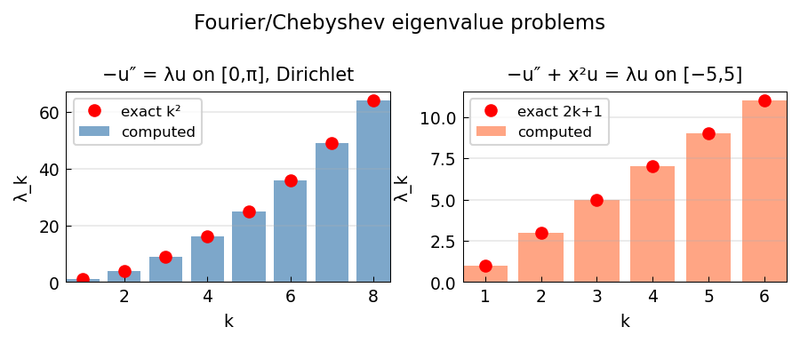
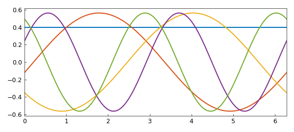
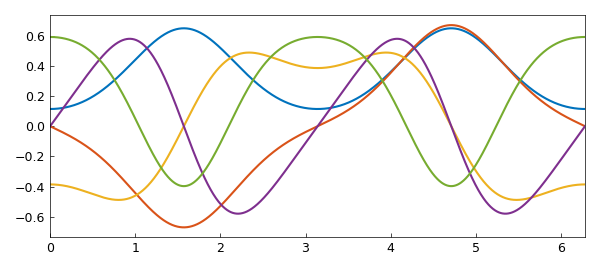

# Periodic ODE eigenvalue problems

*Hadrien Montanelli, December 2014*

[Chebfun example](https://www.chebfun.org/examples/ode-eig/FourierEigs.html)

## Overview

Solves periodic Sturm-Liouville eigenvalue problems using Fourier spectral
collocation:

$$-(p(x) u')' + q(x) u = \lambda w(x) u, \quad u \text{ periodic on } [0, 2\pi]$$

For the pure Laplacian $p = w = 1$, $q = 0$, the eigenvalues are
$0, 1, 1, 4, 4, 9, 9, \ldots$ (the squares of integers, with multiplicity 2).

```python
import numpy as np

# Mathieu operator -u'' + 2q cos(2x) u with periodic BCs
q, n = 2.0, 256
xg = np.linspace(0, 2*np.pi, n, endpoint=False)
dx = xg[1] - xg[0]
Lm = np.diag(2/dx**2 + 2*q*np.cos(2*xg))
idx = np.arange(n)
Lm[idx, (idx+1) % n] = -1/dx**2
Lm[idx, (idx-1) % n] = -1/dx**2
print("Mathieu eigenvalues:", np.round(np.linalg.eigvalsh(Lm)[:5], 4))
```




## Figures (chebfun.org parity)




